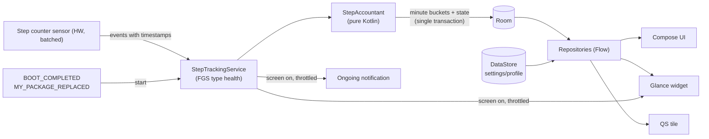

# Passo — Technical Planning

> Companion to [VISION.md](VISION.md). This document defines the architecture, the design of the tracking engine, and the delivery phases.
> It is written to be read by humans and by Claude Code.
>
> Keep the phase checklists up to date: tick the boxes as work is merged.

---

## 1. Tech stack

| Concern | Choice |
|---|---|
| Language | Kotlin (latest stable 2.x), with the Compose compiler Gradle plugin |
| Build | Gradle with Kotlin DSL; version catalog (`gradle/libs.versions.toml`); convention plugins in `build-logic/` |
| JDK | Toolchain 21, `jvmTarget` 21 |
| SDK levels | `minSdk 34`, `targetSdk 37`, `compileSdk 37` |
| UI | Jetpack Compose, Material 3 in Chiaro's design language (its generated schemes, dynamic color on request), edge-to-edge |
| Widget | Jetpack Glance (`glance-appwidget` + `glance-material3`), latest stable (1.2.x at the time of writing) |
| Architecture | MVVM with unidirectional data flow; coroutines and `Flow` |
| Dependency injection | Hilt (`hilt-work` only if WorkManager is ever introduced) |
| Persistence | Room for step data and tracker state; DataStore (Preferences) for settings and profile |
| Navigation | Navigation 3 if stable at setup time, otherwise Navigation Compose with type-safe routes |
| Charts | Custom Compose `Canvas` components in `core:designsystem` (no third-party chart library) |
| Time | `java.time` |
| Testing | JUnit 5 or JUnit 4, Turbine, Truth or AssertK, Robolectric (Room and receivers), Compose UI tests, Glance unit test utilities |
| Quality | Android Lint, ktlint (via Spotless) or detekt; Baseline Profiles in Phase 7 |
| CI | GitHub Actions: build, unit tests, lint, formatting, and a forbidden-permission check on the merged manifest. A release workflow on version tags builds the signed APK and publishes it to GitHub Releases |
| License | GPL-3.0. Every new dependency must have a GPL-3.0-compatible license (Apache-2.0, MIT, BSD are fine) |

Always pick the **latest stable** versions at setup time and record them in the version catalog. Avoid alpha versions unless a phase needs them.

---

## 2. Project structure

```
passo/
├── app/                    # Application, MainActivity, navigation, DI entry points
├── build-logic/            # Convention plugins (android-library, compose, hilt, room…)
├── core/
│   ├── model/              # Pure Kotlin data classes (no Android deps)
│   ├── domain/             # Pure Kotlin: StepAccountant, calculators, streaks/records
│   ├── data/               # Room DB, DAOs, DataStore, repositories
│   ├── tracking/           # StepTrackingService, sensor source, receivers, notification
│   └── designsystem/       # M3 theme, typography, shared components (ring, metric card)
├── feature/
│   ├── today/
│   ├── history/
│   ├── insights/           # records, streaks, totals
│   ├── settings/
│   └── onboarding/
├── widget/                 # Glance widget(s), receiver, update coordinator
├── docs/                   # ADRs, formulas, battery test notes
├── VISION.md
├── PLANNING.md
└── CLAUDE.md
```

Rules:

- `core:model` and `core:domain` are pure Kotlin/JVM modules. All business logic lives there and is unit-tested without Android.
- Feature modules depend on `core:*`, never on each other.
- `app` wires everything together.

---

## 3. Architecture overview



---

## 4. Step tracking engine (core design)

This is the riskiest part of the app. Build it first, test it in the field, and don't build UI on top of it until it is proven.

### 4.1 Why a foreground service

- `TYPE_STEP_COUNTER` is **cumulative since boot** and **resets to 0 at every boot**.
  - Steps taken while the app isn't running are still counted by the hardware. They're only lost if the device reboots before the app reads them.
- Since Android 9, `ACTION_SHUTDOWN` is delivered **only to receivers registered at runtime**, so a live process is needed to save the last value before power-off.
- Since Android 9, apps in the background don't receive sensor events. A worker waking up periodically can't reliably read the sensor.
- A foreground service of type `health` is the documented mechanism for continuous fitness tracking.
  - Prerequisites: the `FOREGROUND_SERVICE_HEALTH` permission in the manifest, and the runtime permission `ACTIVITY_RECOGNITION`.
  - The service can be started from `BOOT_COMPLETED`. `BOOT_COMPLETED` and `MY_PACKAGE_REPLACED` are exemptions from the background-start restriction, and `health` is not among the types Android 15 forbids from a `BOOT_COMPLETED` receiver (`dataSync`, `camera`, `mediaPlayback`, `phoneCall`, `mediaProjection`, `microphone`). `ACTIVITY_RECOGNITION` is not a while-in-use permission, so it does not block a start from the background either. Established from the documentation in Phase 1 (§15).

### 4.2 Service lifecycle

| Trigger | Action |
|---|---|
| App opened (activity in foreground) | Start the service if it isn't running and permissions are granted |
| `BOOT_COMPLETED` (manifest receiver) | Start the service |
| `MY_PACKAGE_REPLACED` (manifest receiver) | Start the service after an app update |
| Service `onStartCommand` | `startForeground(FOREGROUND_SERVICE_TYPE_HEALTH)` and register the sensor listener; return `START_STICKY` |
| `ACTION_SHUTDOWN`, `QUICKBOOT_POWEROFF` (runtime receiver) | `goAsync()`, then `sensorManager.flush()`, wait for `onFlushCompleted` (at most about 1.5 s), then persist synchronously |
| `ACTION_SCREEN_ON`, `ACTION_USER_PRESENT` (runtime) | Re-register with low latency, flush, refresh notification and widget |
| `ACTION_SCREEN_OFF` (runtime) | Persist the buffer, then re-register with high latency |
| `ACTION_TIME_CHANGED`, `ACTION_TIMEZONE_CHANGED` (runtime) | Persist the buffer, recompute today's local date, refresh the surfaces |
| User toggles "Pause tracking" | Persist, unregister, `stopSelf()` |

If the user or the OEM stops the service, no data is lost as long as the device doesn't reboot in the meantime, because the counter is cumulative. The UI and widget then show a "Tracking paused" state with tap-to-resume. The limitation is that a force-stopped app doesn't receive `BOOT_COMPLETED` until the user opens it again; this is documented in the FAQ.

### 4.3 Sensor registration strategy

| Screen state | Sensor | `samplingPeriodUs` | `maxReportLatencyUs` |
|---|---|---|---|
| Off | Non-wake-up `TYPE_STEP_COUNTER` | `SENSOR_DELAY_NORMAL` | High, `SCREEN_OFF_LATENCY` (default 10 min) |
| On | Same sensor | `SENSOR_DELAY_NORMAL` | Low, `SCREEN_ON_LATENCY` (default 0 to 2 s) |

- A non-wake-up sensor never wakes the application processor. Events wait in the hardware FIFO and are delivered the next time the processor is awake.
- If the FIFO overflows, intermediate events are dropped, but the **total stays correct** because the counter is cumulative. Only minute-level attribution gets coarser.
- **Non-wake-up, decided from the platform documentation** (`docs/adr/0002-sensor-reporting.md`): the wake-up variant would only bound the loss on an *abrupt* power loss, and would pay for it with a wakeup per report window, every day. A device that has only a wake-up step counter still gets it.
- `sensor.fifoMaxEventCount`, `fifoReservedEventCount`, vendor, name and wake-up mode are written to the diagnostics log at every service start.

### 4.4 Accounting algorithm (`StepAccountant`, pure Kotlin)

Input for each sensor event: `counterValue` (total since boot), `eventElapsedNanos` (the event timestamp), plus an injected `SystemSnapshot(bootCount, elapsedRealtimeNanos, wallClockMillis, zoneId)`.
`bootCount` comes from `Settings.Global.BOOT_COUNT`.

```
state = TrackerState(bootCount, lastCounterValue, lastSampleElapsedNanos, lastSampleWallMillis)   // persisted in Room

delta = when {
    state == null                       -> 0                   // first run ever: baseline, don't count steps from before install
    snapshot.bootCount != state.bootCount -> counterValue      // new boot session: counter restarted from 0
    counterValue < state.lastCounterValue -> counterValue      // sensor/HAL reset without reboot
    else                                -> counterValue - state.lastCounterValue
}

eventWall = snapshot.wallClockMillis - (snapshot.elapsedRealtimeNanos - eventElapsedNanos) / 1e6
if (eventWall is in the future or before the lower bound) eventWall = snapshot.wallClockMillis   // guard against buggy timestamps

lowerBound = if (same boot session) state.lastSampleWallMillis else bootWallMillis

// Attribute delta to minute buckets:
//  - gap ≤ 2 min           → all to the eventWall minute
//  - larger gap            → backward-fill from eventWall at DEFAULT_CADENCE (≈110 spm) per minute,
//                            never before lowerBound; remainder spread evenly over [lowerBound, eventWall]
// Sanity: if delta > MAX_CADENCE (250 spm) × gapMinutes + 50 → cap, log a diagnostics anomaly

newState = state.copy(bootCount, lastCounterValue = counterValue, lastSampleWallMillis = eventWall)
```

Output: a list of `(epochMinute, localEpochDay, steps)` increments, plus the new state.
All wall-clock and time-zone logic is injected, so the algorithm can be fully unit-tested.

### 4.5 Persistence rules

- Keep an in-memory buffer of minute increments in the service.
- Flush the buffer to Room in **one transaction** that also updates `TrackerState` and today's `DailySummary`. Flush when any of these happens:
  - a minute boundary is crossed while events are flowing
  - the screen turns off
  - shutdown
  - `onDestroy`
  - 100 or more buffered steps
- Invariant: the steps stored in Room plus the stored `lastCounterValue` are always consistent.
  - If the process dies with an unflushed buffer, the next sample recomputes the delta from the stored `lastCounterValue`. Nothing is double-counted and nothing is lost; only the minute attribution may shift.

### 4.6 Edge cases (all need unit tests)

| Case | Expected behavior |
|---|---|
| First install mid-day | Baseline at the current value. Today starts from 0 and the UI explains this once. |
| Nightly shutdown | The shutdown flush saves the last value. After boot, the first sample has a new `bootCount`, so `delta = counterValue`. |
| Abrupt power loss or crash | Steps since the last delivered batch are lost (bounded by the latency window). Documented. |
| Walking across midnight | Event timestamps split the steps between days. The gap rule splits long gaps proportionally. |
| Time-zone change | Buckets are stored in UTC `epochMinute` together with the `localEpochDay` computed at write time. Days already recorded are never re-bucketed. |
| Manual clock change | Same as a time-zone change. Timestamps come from elapsed realtime, so they are monotonic. |
| Sensor jumps (buggy HAL) | Capped by `MAX_CADENCE` and logged. |
| `ACTIVITY_RECOGNITION` revoked | The service stops. The UI, notification and widget show "Permission needed". |
| No step counter sensor | The APK from GitHub installs on any device, so a blocking explanation screen is **required**. `uses-feature required=true` stays in the manifest for a future Play listing, where it filters these devices. |
| Counter float precision | Values are `Float`; convert with `toLong()`. Exact up to 2^24 steps per boot session, which is far beyond realistic use. |

---

## 5. Data model

### Room

```kotlin
@Entity(tableName = "tracker_state")          // single row, id = 0
data class TrackerStateEntity(
    @PrimaryKey val id: Int = 0,
    val bootCount: Int,
    val lastCounterValue: Long,
    val lastSampleElapsedNanos: Long,           // monotonic: gaps are measured on this clock (§15)
    val lastSampleWallMillis: Long,
    val updatedAtMillis: Long,
)

@Entity(tableName = "minute_steps", indices = [Index("localEpochDay")])
data class MinuteStepsEntity(
    @PrimaryKey val epochMinute: Long,         // UTC minute
    val localEpochDay: Long,                    // local date at write time
    val steps: Int,
)

@Entity(tableName = "daily_summary")
data class DailySummaryEntity(
    @PrimaryKey val localEpochDay: Long,
    val steps: Int,
    val distanceMeters: Double,
    val activeKcal: Double,
    val activeMinutes: Int,
    val briskMinutes: Int,
    val goalSteps: Int,                         // goal in effect that day
    val finalized: Boolean,                     // true after the day is over
)

@Entity(tableName = "diagnostics_event")      // ring buffer, ~500 rows
data class DiagnosticsEventEntity(
    @PrimaryKey(autoGenerate = true) val id: Long = 0,
    val wallMillis: Long,
    val type: String,                           // BOOT, SHUTDOWN_FLUSH, ANOMALY, SERVICE_START…
    val detail: String,
)
```

- Size estimate: about 300 minute rows per day, roughly 110k rows per year, a few MB. Keep minute data indefinitely; it's needed for hourly charts and recalculation.
- Today's `DailySummary` is recomputed from today's minute rows at every flush.
- Past days are **frozen**, so changing the profile doesn't silently rewrite history. Settings offers **"Apply profile to past data"**, which recomputes every summary from the minute rows.
- Use Room auto-migrations with exported schemas (`room.schemaLocation`) committed to the repo.
- **No tables for walks or the typical day.** Both are computed on read from `minute_steps` (§6.1, §6.2). Add a cache table only if profiling shows a need.

### DataStore (Preferences)

- Profile: height, weight, sex (optional), step length mode (auto, manual or calibrated), walking step length, running step length.
- Goal, units, first day of week, theme, dynamic color, notification opt-ins, reminder time, tracking enabled.
- Walk detection enabled (default on), minimum walk duration (5, 10 or 15 min; default 10), typical-day line shown (default on).

---

## 6. Derived metrics (`core:domain`)

All constants live in one file (`MetricsConstants.kt`) with comments that cite their sources. All defaults are to be validated.

- **Default walking step length:** `height × 0.415` (`× 0.413` when the profile says female). If height is unknown, 0.70 m.
- **Running step length:** default `walking × 1.3`, user-editable. It applies to minutes with a cadence of at least `RUNNING_CADENCE` (140 spm).
- **Distance:** the sum over minutes of `steps × stepLength(cadence)`.
- **Active calories (net):** the sum over minutes of `distanceKm × weightKg × k(cadence)`.
  - `k_walk ≈ 0.5 kcal/kg/km`, rising slightly for brisk cadences: flat up to 100 spm, then linearly to 0.6 just below 140 spm (Phase 2, §15).
  - `k_run ≈ 1.0 kcal/kg/km`.
  - Default weight if not set: 70 kg.
  - Net means basal metabolism is not included. The UI calls this "active calories".
  - Alternative considered: MET-based tables by speed. Rejected because it is less robust for sparse minutes.
- **Active minutes:** count of minutes with at least `ACTIVE_MINUTE_THRESHOLD` (40) steps.
- **Brisk minutes:** count of minutes with at least 100 steps.
- **Average cadence:** steps in active minutes divided by the number of active minutes.
- **Streak:** consecutive finalized days with `steps ≥ goalSteps`, plus today if its goal is already met.
- **Records:** best day, ISO or locale week, month, and longest streak.

### 6.1 Walk detection (`WalkDetector`, pure Kotlin)

Input: the minute buckets of one local day, plus the settings. Output: a list of `Walk(start, end, steps, distanceM, activeKcal, avgCadence, type)`.

```
1. Mark each minute as "moving" if steps ≥ WALK_MINUTE_THRESHOLD (60).
2. Merge moving minutes into runs, bridging gaps of up to WALK_MAX_GAP_MINUTES (2) non-moving
   minutes (traffic lights, doors). Steps inside a bridged gap belong to the walk.
3. Discard runs shorter than the minimum duration setting (default 10 min).
4. For each remaining run compute the metrics with the same calculators as §6.
5. type = RUN if avgCadence ≥ RUNNING_CADENCE, else WALK.
   (Optional refinement: MIXED if both walking and running minutes exceed 30% of the walk.)
```

- A walk crossing midnight is split at midnight, like every other daily metric.
- Constants live in `MetricsConstants.kt` next to the others.
- Cost: one linear pass over at most 1,440 rows, only when the day detail or Today screen is visible. No background work.
- Accuracy depends on minute attribution (§4.4). With a working FIFO it's minute-accurate; after a FIFO overflow or a service restart, walk boundaries may be off by a few minutes. This is acceptable and documented.

### 6.2 Typical day curve (`TypicalDayCalculator`, pure Kotlin)

- Take the same weekday over the last `TYPICAL_DAY_WEEKS` (4) weeks, skipping days with fewer than 500 steps (phone left at home, tracking paused).
- For each day, build the cumulative curve in 15-minute slots (96 points).
- The typical curve is the mean of those curves, slot by slot. It is shown only if at least 2 valid days exist.
- "Ahead or behind" = today's cumulative value minus the typical value at the current slot. It is shown as a short label, for example "+1,240 vs usual".
- Computed when the Today screen opens and then once every 15 minutes while it stays visible. It never runs in the background.

---

## 7. Widget (Glance)

### Configuration

- `SizeMode.Responsive(setOf(...))` with one breakpoint per supported size.
- `resizeMode="horizontal|vertical"`; `targetCellWidth` and `targetCellHeight`; `minResizeWidth`, `minResizeHeight`, `maxResizeWidth`, `maxResizeHeight` spanning 1x1 to 4x2.
- Starting breakpoints, from Android's cell formula (width ≈ 73n − 16 dp, height ≈ 118n − 16 dp in portrait). Tune them on real launchers.
  - 1x1 ≈ 57×102
  - 2x1 ≈ 130×102
  - 2x2 ≈ 130×220
  - 3x1 ≈ 203×102
  - 4x1 ≈ 276×102
  - 4x2 ≈ 276×220

| Size | Content |
|---|---|
| 1x1 | Compact step count (e.g. "8.4k") and a small progress ring |
| 2x1 | Ring, steps, goal % |
| 2x2 | Large ring with steps in the center; distance and calories below |
| 3x1 / 4x1 | Horizontal: steps, distance, calories, active minutes, and a linear progress bar |
| 4x2 | Header with steps and progress, 4 metric chips, and a mini chart of today's steps by hour: 24 bars built from Glance `Box`es (no bitmaps), current hour highlighted |

### Rendering

- Colors come from `GlanceTheme`, using Material 3 dynamic color.
- **Android 17:** apps targeting API 37 get a hard memory cap on the bitmaps and icons in a RemoteViews parcel. Exceeding it throws `IllegalArgumentException` and crashes the process. Keep bitmaps tiny or avoid them.
  - Progress ring options, decided with a spike in Phase 4:
    - (a) a small bitmap sized to the widget, well under the cap
    - (b) pre-built vector drawables at 5% steps (21 levels)
- Previews: generated previews on API 35+ (if supported by the Glance version), plus a static `previewLayout` or `previewImage` fallback.
- Tapping the widget opens the Today screen. In the paused state, tapping opens the app, which restarts the service.

### Update strategy (battery-aware)

- Push-based from `StepTrackingService` through a `WidgetUpdateCoordinator`. There is **no periodic polling**, and `updatePeriodMillis = 0`.
  - Screen on or user present: flush the sensor, then update immediately.
  - While the screen is on: update at most every 60 s, and only if the steps changed.
  - Day rollover (detected by the screen-on ticker), goal reached, settings changed, tracking state changed: update immediately.
  - Screen off: no updates.
- The widget reads from the repository, so it always shows persisted truth.

---

## 8. Notifications and Quick Settings tile

- **Channel `tracking`** (low importance, silent, `setOnlyAlertOnce`): the ongoing foreground service notification.
  - Content: steps, goal progress bar, distance.
  - Updated only while the screen is on, at most every 5 s.
- **Channel `goals`** (default importance, opt-in): goal reached once per day, the evening reminder, the weekly summary.
  - Scheduled with inexact `AlarmManager.setWindow()`. No exact alarm permission.
- If `POST_NOTIFICATIONS` is denied, the foreground service still runs; its notification only shows in the system's task manager. Explain this in onboarding; don't block on it.
- **QS tile (`TileService`):** reads today's steps in `onStartListening()`. It costs nothing when the panel is closed.

---

## 9. Battery rules (non-negotiable)

1. No accelerometer. No continuous `TYPE_STEP_DETECTOR` unless measurements prove it's cheap.
2. No wakelocks held by the app, except inside `goAsync()` for the shutdown flush.
3. No exact alarms, no `REQUEST_IGNORE_BATTERY_OPTIMIZATIONS`, no periodic workers for tracking.
4. Nothing runs on a timer while the screen is off. All screen-on tickers are coroutines tied to the screen state.
5. Database writes are batched (§4.5).
6. Each phase that touches the service ends with a battery check:
   - `adb shell dumpsys batterystats --charged <pkg>`
   - `adb shell dumpsys sensorservice` (confirm batching is active)
   - Doze simulation: `adb shell dumpsys deviceidle force-idle`
   - Battery Historian for the longer field tests
7. OEM task killers: onboarding shows manufacturer-specific guidance (link to dontkillmyapp.com) only when `Build.MANUFACTURER` is on a known list.

---

## 10. Permissions and manifest

| Permission / element | Type | Why |
|---|---|---|
| `ACTIVITY_RECOGNITION` | Runtime | Read the step counter; prerequisite for the `health` foreground service |
| `POST_NOTIFICATIONS` | Runtime | Show the tracking and goal notifications (optional) |
| `FOREGROUND_SERVICE` | Normal | Foreground service |
| `FOREGROUND_SERVICE_HEALTH` | Normal | Foreground service of type `health` |
| `RECEIVE_BOOT_COMPLETED` | Normal | Restart tracking after boot |
| `<uses-feature android:name="android.hardware.sensor.stepcounter" android:required="true"/>` | Feature | Documents the requirement; filters devices on a future Play listing. It does not block APK installs, so the app also checks the sensor at runtime |

**Forbidden:** `INTERNET`, `ACCESS_*_LOCATION`, `REQUEST_IGNORE_BATTERY_OPTIMIZATIONS`, `SCHEDULE_EXACT_ALARM`, `USE_EXACT_ALARM`, `HIGH_SAMPLING_RATE_SENSORS`, `BODY_SENSORS`.

A CI task checks the merged release manifest and fails on any forbidden permission. Libraries that add one must be removed or patched with `tools:node="remove"`.

---

## 11. Delivery phases

Each phase ends with a merged PR, green CI and its acceptance criteria met.
Phases 1 and 4 need **field testing on a physical device**; an emulator is not enough for sensors or batching.

### Phase 0 — Foundations

- [x] Create the repo; add `README.md`, `LICENSE` (GPL-3.0 full text), `.gitignore`, `.editorconfig`
  - *Deviation:* the repo is `fiorenzobrioni/passo`, not `passo-android`: the sibling repos carry the bare app name.
- [x] Short GPL-3.0 notice in the README and in the app's About screen (added in Phase 3)
  - README in Phase 0; the About group of Settings in Phase 3.
- [x] Gradle setup: version catalog, `build-logic` convention plugins, module skeleton (§2)
- [x] Hilt, Compose, Material 3 theme with dynamic color, and an empty `MainActivity` with an edge-to-edge `Scaffold`
- [x] `strings.xml` for `values/` (English) and `values-it/`; `locales_config.xml` for per-app language
- [x] CI: build, unit tests, lint, formatting, forbidden-permission check
  - Plus the tag-triggered release workflow (Phase 8's, brought forward), so the signing path is exercised from the start.
- [ ] Generate the **release keystore** now; store it outside the repo with an offline backup, and add it to GitHub Actions secrets. Never commit it. This key signs every future release and must be reused if the app ever goes on Google Play.
  - *Pending (owner).* Until it exists, tag builds are signed with a committed **temporary** key (`keystore/temporary-release.keystore`) and forced to pre-release. `keystore/README.md` has the steps to create the real key and retire the temporary one.
- [x] `CLAUDE.md` (see §13)
- [x] `docs/adr/0001-foundations.md`: the Phase 0 decisions and their reasons

**Acceptance:**
- CI is green.
- The app launches.
- Adding `INTERNET` to any manifest fails CI.
  - Verified locally: `INTERNET` and `ACCESS_COARSE_LOCATION` added to `:core:tracking`'s manifest made `checkForbiddenPermissions` fail, naming both.

### Phase 1 — Tracking engine (highest risk)

- [x] `core:domain`: `StepAccountant` with test-driven unit tests covering every case in §4.6
  - Plus `StepLedger`, the service's buffer as pure Kotlin: the write triggers of §4.5 and the restore of a batch whose write failed, with its own tests.
- [x] `core:data`: Room schema v1 (§5), DAOs, `TrackingRepository` with the transactional flush
  - One `@Transaction` writes the minute increments, the tracker state, the summaries of the touched days and the log lines; Robolectric tests on an in-memory database.
- [x] `core:tracking`: `StepSensorSource` (wraps `SensorManager` and exposes a `Flow` of events plus `flush()`)
  - Samples and flush completions share one ordered channel, so a flush is complete only once every sample it delivered has been accounted.
- [x] `StepTrackingService` (`health` type): registration strategy (§4.3), screen, shutdown and time receivers (§4.2), in-memory buffer
- [x] `BootReceiver` and `PackageReplacedReceiver`
  - *Deviation:* the start from boot on Android 14 to 17 is established from the documentation, not on devices (§4.1, §15).
- [x] Minimal notification (static text plus today's steps)
- [x] Minimal permission request for `ACTIVITY_RECOGNITION` and `POST_NOTIFICATIONS`
  - With the blocking explanation for a phone without a step counter (§4.6). A placeholder screen in `feature:onboarding`, replaced by the real onboarding in Phase 3.
- *Removed from the plan (owner's decision, §15):* the diagnostics screen and the wake-up vs non-wake-up experiment. The sensor choice is made from the platform documentation (`docs/adr/0002-sensor-reporting.md`); the diagnostics **log** (§5) stays, with no screen.

**Acceptance:**
- [x] All accounting unit tests pass.
- [ ] A 3 to 5 day field test on at least one physical device, with nightly full shutdowns and without opening the app, shows no lost steps.
- [ ] `batterystats` shows no app wakelocks or alarms while the screen is off.
- [ ] Tracking resumes after a reboot without opening the app.
- *Pending (owner, on a device).* The three device checks are not run yet. By construction the service holds no wakelock and sets no alarm, and nothing in it runs on a timer with the screen off; the boot start follows the documented exemptions (§4.1). A measurement is still what closes them, whenever a phone is available.

### Phase 2 — Profile, settings, metrics

- [x] DataStore settings and profile repository
  - `UserPreferencesDataSource` stores only the fields that differ from their default and reads back anything out of range as the default; `SettingsRepository` is what the screens use. A profile or goal change goes through `TrackingRepository`, which freezes the past first (§15, `docs/adr/0003-daily-summaries.md`).
- [x] Calculators in `core:domain`: distance, calories, active and brisk minutes, cadence, with unit tests
  - `MetricsCalculator`, `StepLengths`, `ProfileLimits`, `DaySummaries`; every constant in `MetricsConstants.kt` with its source.
- [x] `DailySummary` recomputation for today; freezing past days; "Apply profile to past data"
  - Open days are recomputed at every write; the first write after midnight finalizes the day; late steps on a finalized day add only their own share. "Apply profile to past data" is `SettingsRepository.applyProfileToPastDays()`; its button comes with the Settings screen (Phase 3).
- [x] Units (metric and imperial) with formatting helpers, and locale-aware number formatting
  - `MeasureFormatter` and `UnitConversions` in `core:domain` (numbers only); the unit symbols are string resources in `core:designsystem` (`Measure.text()`, `Resources.format`).

**Acceptance:**
- [x] Calculator tests cover defaults, edge cases (0 steps, missing profile) and unit conversion.
- [x] Changing the weight updates today only, unless "Apply to past data" is used.
  - Both on a real Room database (`TrackingRepositoryTest`), including a day still open at the change and late steps after it.

### Phase 3 — Today screen and onboarding

Built in Chiaro's design language (owner's request): its colors, typefaces, shapes, motion and principles, `docs/adr/0004-design-language.md`.

- [x] Navigation shell: Today, History, Insights, Settings
  - *Deviation:* Today and Settings only (Navigation 3, Settings from the gear, Chiaro's page transition). The bottom bar arrives with its second tab in Phase 5: tabs that lead nowhere would be the screen lying about the app (Chiaro's rule).
- [x] Today: progress ring, metric cards, live updates while visible (low-latency sensor registration while the app is visible)
  - The ring also carries a notch where a usual day stands at this hour. Live: the service publishes today's stored-plus-buffered count to an in-process `LiveSteps`, read only while Today is collected; the sensor already reports within 1 s with the screen on (§4.3). Tiles: distance and calories (estimates, with what they rest on), active and brisk minutes (the brisk ones against the day's share of the WHO's 150 a week), average cadence with its bands (drawn only when there are active minutes).
- [x] Today: day trend sparkline (cumulative steps, goal line, dashed typical-day line, "ahead/behind" label), drawn with a small custom Compose `Canvas`
  - Read with a finger (tap to pin, drag to scrub, a haptic tick per hour); the rest of the day shaded; the usual line goes on past now; draws itself in along time. The "ahead/behind" is the headline sentence and the readout above the chart.
- [x] `TypicalDayCalculator` in `core:domain` with unit tests (§6.2)
  - With `DayCurve` and `TodayOverview` (the headline's choice, the pace, the brisk share, the cadence band), all unit-tested.
- [x] Tracking status banner: permission missing, paused, sensor missing
  - Missing permission and pause are cards on Today with the button that fixes them; a missing sensor is the blocking screen of §4.6, before anything else.
- [x] Onboarding: welcome, profile (skippable), goal, permissions, OEM tips
  - The OEM page only on the makers in `OemTips` (§9 rule 7), with the app's own settings page and the dontkillmyapp.com guide; never `REQUEST_IGNORE_BATTERY_OPTIMIZATIONS` (§10).
- [x] Settings screen (profile, goal, units, theme, language, typical-day line, pause tracking)
  - Plus palette, typeface and wallpaper colors (Chiaro's appearance group, with its live preview), "Apply profile to past data", privacy, the GPL-3.0 notice and the credits (Phase 0's pending About item). First day of the week, walk detection and notifications wait for the features they drive.
- [x] Complete Italian and English strings; plurals; content descriptions (the sparkline gets a spoken summary, e.g. "6,200 steps, 1,240 more than usual at this time")

**Acceptance:**
- [x] A fresh install through to tracking takes under 1 minute.
  - Confirmed by the owner on a Samsung Galaxy S24 Ultra. The shortest path: Get started, Skip, Continue, Allow (and the two system dialogs), Start counting.
- [x] Every state in the status banner can be reproduced and recovered from.
  - UI tests for permission and pause with their buttons; resuming forgets the baseline (§15).
- [x] The typical-day line is hidden with fewer than 2 valid days and appears automatically afterwards.
  - `TypicalDayCalculatorTest`; the line and the notch follow the value, and the caption says when it will appear.
- [x] UI tests cover onboarding and Today.
  - Compose tests on Robolectric for Today, onboarding and Settings; they also write screenshots to each module's `build/screenshots`.

### Phase 4 — Widget

- [ ] Glance widget, receiver and `appwidget-provider` XML (sizes from §7)
- [ ] Five responsive layouts (1x1, 2x1, 2x2, 3x1/4x1, 4x2) with `GlanceTheme`
- [ ] 4x2 hourly mini-bars (24 `Box`es, heights normalized to the day's busiest hour, current hour highlighted)
- [ ] Spike on the progress ring rendering (bitmap vs vector levels), within the Android 17 RemoteViews bitmap limit
- [ ] `WidgetUpdateCoordinator` wired to the service (§7 update strategy)
- [ ] Paused and "permission needed" states; tap actions
- [ ] Generated preview (API 35+) and a static fallback preview

**Acceptance:**
- All sizes are legible on at least 2 launchers (e.g. Pixel Launcher and One UI), in light and dark themes.
- The widget updates within about 5 s of the screen turning on.
- The logs show no widget updates while the screen is off.

### Phase 5 — History and insights

- [ ] `WalkDetector` in `core:domain` with unit tests (§6.1): gaps bridged, short runs discarded, walk vs run, midnight split, empty day
- [ ] Day detail: hourly bar chart, walks marked on the chart, list of walks with their metrics
- [ ] Settings: walk detection toggle and minimum duration
- [ ] Week, month and year charts with the goal line; swipe or paging between periods
- [ ] Calendar heatmap of goal completion
- [ ] Insights: averages, totals, lifetime distance, records, streaks
- [ ] Chart components in `core:designsystem`, built with Compose `Canvas`: bar chart (hourly, weekly, monthly, yearly) with goal line, calendar heatmap. Shared axis, label and accessibility helpers (each chart exposes a spoken summary and per-bar semantics)

**Acceptance:**
- The year view with 365 days of data renders in under 16 ms per frame on a mid-range device.
- Records and streak tests pass, including goal changes across days.
- Walks detected on field-test days match what the user remembers (start and end within a few minutes).
- With walk detection off, no walk UI appears anywhere.

### Phase 6 — Goals and system surfaces

- [ ] Goal-reached notification (opt-in, once per day, triggered from the service)
- [ ] Evening reminder (inexact window alarm, configurable time and threshold)
- [ ] Weekly summary notification (optional)
- [ ] Quick Settings tile
- [ ] Rich ongoing notification (progress bar, distance), throttled while the screen is on

**Acceptance:**
- No duplicate goal notifications across reboots or time-zone changes.
- The tile reads data only while the Quick Settings panel is open.

### Phase 7 — Data, calibration and polish

- [ ] Export to CSV and JSON, import from JSON (Storage Access Framework)
- [ ] `data_extraction_rules.xml` and `full_backup_content` for Auto Backup and device transfer
- [ ] Step length calibration wizard (walk a known distance, start/stop, compute and save)
- [ ] Accessibility pass (TalkBack, font scale 200%, contrast, touch targets)
- [ ] Adaptive layouts for tablets and foldables
- [ ] Baseline Profiles; R8 full mode; startup check

**Acceptance:**
- Export followed by import on a clean install reproduces the history exactly.
- The accessibility scanner reports no critical issues.

### Phase 8 — Release on GitHub

- [ ] App icon (adaptive + monochrome for themed icons), final package name
- [x] Versioning: semantic version tags `vX.Y.Z`; `versionCode` derived from the version (e.g. `major × 10000 + minor × 100 + patch`)
  - Done in Phase 0: `passo.versionName` in `gradle.properties`, code derived in `app/build.gradle.kts`, and `release.yml` refuses a tag that does not match.
- [ ] `CHANGELOG.md` ("Keep a Changelog" format); release notes in English and Italian
  - The file and its format exist since Phase 0; the Italian release notes are still to do.
- [x] Release workflow (GitHub Actions, triggered by a `v*` tag):
  - build the release APK with R8, signed with the keystore from secrets
  - attach the APK, its SHA-256 checksum and the R8 mapping file to the GitHub Release
  - mark `-beta`/`-rc` tags as pre-releases
  - Done in Phase 0, with the temporary-key fallback described in Phase 0 (a temporary-key release is always a pre-release).
- [ ] README: screenshots, features, install instructions (allowing installs from the browser or file manager), how to verify the checksum, and the **signing certificate SHA-256 fingerprint** so users can check the APK is genuine
- [ ] README: updates. The app has no network access, so it can't check for updates itself; point users to GitHub's "Watch → Releases" notifications or to Obtainium, an app that tracks GitHub releases
- [ ] Test the full install and update path: install v1.0.0 from the Release, then update to a newer build over it, with data preserved

**Acceptance:**
- Pushing a tag produces a signed release with APK, checksum and notes, with no manual steps.
- Installing a newer release over an older one keeps all data.

### Phase 9 — Google Play (optional, later)

Kept open, not planned yet. Notes to avoid closing the door:

- [ ] Enroll in Play App Signing **with the existing release key** (upload your own key during enrollment), so builds from GitHub and from Play share the same signature and users can move between them without reinstalling
- [ ] Build an AAB in addition to the APK
- [ ] Privacy policy (e.g. on GitHub Pages): no data collected or shared
- [ ] Play Console:
  - foreground service permission declaration (`health` use case, with a demo video)
  - health apps declaration, if required
  - Data safety form
  - content rating
- [ ] Store listing in Italian and English, with screenshots and a feature graphic
- [ ] Internal test track, then closed testing (check the current tester requirements for personal developer accounts), then production

---

## 12. Testing strategy

- **Unit (JVM):** `StepAccountant`, calculators, streaks and records, formatting. Use a fake clock and system snapshot. This is where most of the test effort goes.
- **Robolectric:** Room DAOs and transactions, receivers, the notification builder.
- **Compose UI tests:** onboarding, Today, Settings.
- **Glance:** unit tests for the layout chosen at each size.
- **Manual device protocol** (`docs/testing/device-protocol.md`):
  - reboot
  - full shutdown overnight
  - Doze
  - time-zone change
  - revoking the permission
  - stopping the app from the system's task manager
  - app update
  - low battery
- **Battery:** the §9 checks at the end of Phases 1, 4 and 6, with the numbers logged in `docs/battery/`.

---

## 13. Working with Claude Code

### `CLAUDE.md` (create in Phase 0; keep it short)

Include:

- A one-paragraph project summary and links to `VISION.md` and `PLANNING.md`.
- Commands:
  - `./gradlew assembleDebug`
  - `./gradlew test`
  - `./gradlew lint`
  - `./gradlew spotlessApply`
  - the forbidden-permission check task
- The module map and dependency rules (§2).
- **Invariants:**
  - Never add `INTERNET`, location or other forbidden permissions (§10).
  - Business logic goes in `core:domain`, with unit tests.
  - Never poll or run timers while the screen is off.
  - Don't change the tracking engine without updating the tests for the §4.6 edge cases.
  - All user-facing strings go in resources, in both English and Italian.
  - No new third-party dependency without approval; its license must be GPL-3.0-compatible. Charts are custom Compose `Canvas` code, never a chart library.
- Code style: Kotlin official style, no `!!`, `Flow` over `LiveData`, immutable UI state.

### Workflow

1. One phase at a time. Start each session in **plan mode**, pointing to the phase section: *"Read PLANNING.md §11 Phase 1 and §4, propose a plan."*
2. Use one branch and PR per coherent chunk (e.g. `phase-1/accountant`, `phase-1/service`). Keep PRs small.
3. Write tests first for `core:domain` logic, and ask Claude Code to run them before finishing.
4. After each merge, tick the checkboxes in this file and record decisions as ADRs in `docs/adr/`.
5. Field-test the device-dependent phases yourself; paste the diagnostics logs back to Claude Code when something is off.

---

## 14. Risks and mitigations

| Risk | Impact | Mitigation |
|---|---|---|
| OEM task killers stop the service | Steps lost if a reboot happens while the service is stopped | Onboarding guidance; paused state in the widget and UI; the counter is cumulative, so no loss without a reboot |
| Buggy sensor timestamps on some devices | Wrong minute or day attribution | Timestamp validation and fallback to the arrival time; diagnostics log |
| Small or zero FIFO on low-end devices | Coarser minute attribution | Totals stay correct; the gap distribution heuristic |
| Lost or leaked release signing key | Users can't update without uninstalling (and losing data); a future Play listing can't reuse the key | Keystore created in Phase 0, kept outside the repo with an offline backup, stored only in GitHub Actions secrets |
| Play policy review of the `health` foreground service (only if Phase 9 happens) | Delay of a Play release | Continuous step tracking is the documented use case; prepare the declaration and video early |
| Users dislike the persistent notification | Uninstalls | Low-importance, useful content (live steps); explain why in onboarding; the user can minimize the channel |
| Abrupt power loss | Steps since the last batch are lost | Bounded by the latency window (10 min with the screen off), and only for steps the processor has not been awake for since; the wake-up variant was weighed and rejected (`docs/adr/0002-sensor-reporting.md`) |
| Android 17 RemoteViews bitmap cap | Widget crash | Tiny or no bitmaps; test on API 37 |

---

## 15. Decisions log and open questions

### Decided

- Name: **Passo** (final).
- Package namespace: **`com.callbackdev.passo`**, the developer namespace of Chiaro and Saldo (Phase 0). Repository `fiorenzobrioni/passo`.
- Toolchain at setup (Phase 0, latest stable): Gradle 9.8.0, AGP 9.4.1 with built-in Kotlin, Kotlin 2.4.20, KSP 2.3.12, Compose BOM 2026.09.00, Hilt 2.60.1, Room 2.8.5, DataStore 1.2.1, Glance 1.2.0. Details and reasons in `docs/adr/0001-foundations.md`.
- Navigation: **Navigation 3** (1.2.0 was stable at setup), used from Phase 3.
- Java 21 as source/target level, **without** a Gradle toolchain: the JDK running Gradle already is a 21, and a toolchain would make every build look for or download another one.
- Tests: **JUnit 4** + Truth + Turbine + coroutines-test; Robolectric where Android is needed (it and the Compose test rule run on JUnit 4).
- Formatting: ktlint via Spotless, code style `intellij_idea` (the Kotlin coding conventions), rules in `.editorconfig`.
- The forbidden-permission gate checks the **merged** manifest of every variant (`:app:checkForbiddenPermissions`, wired to `check`), so a library adding a permission is caught too.
- Only English and Italian resources ship (`localeFilters`); without it the APK carried the AndroidX libraries' 80-odd languages.
- Signing as in Chiaro: the debug keystore is committed for good (`passo-debug` / `android`); the real release key never enters the repo. Until it exists, a committed **temporary** release key signs tag builds, which are then forced to pre-release (`keystore/README.md`).
- `failOnNoDiscoveredTests` is off for Android unit tests: Hilt generates test-source stubs, so Gradle 9 failed the skeleton modules that have Hilt and no tests yet.
- License: **GPL-3.0**.
- Charts: custom Compose `Canvas` components; no third-party chart library.
- Distribution: signed APKs on **GitHub Releases**; Google Play possibly later (Phase 9); no F-Droid.
- First day after install: pre-install steps from the current boot session are **not** counted.
- **Phase 1: no diagnostics screen and no wake-up vs non-wake-up experiment** (owner's decision: no device available for measurements now). The sensor is the non-wake-up step counter, chosen from the platform documentation; reasons in `docs/adr/0002-sensor-reporting.md`. The diagnostics log (§5) is kept: it costs a handful of rows a day, written with the steps, and it is what makes a field problem readable later (an export in Phase 7, or a hidden screen if one is ever wanted).
- **Start from boot, from the documentation** (Phase 1): `BOOT_COMPLETED` and `MY_PACKAGE_REPLACED` are background-start exemptions; Android 15's `BOOT_COMPLETED` restriction does not cover the `health` type; `ACTIVITY_RECOGNITION` is not a while-in-use permission. To be confirmed on a device with the Phase 1 acceptance checks.
- `TrackerState` also stores **`lastSampleElapsedNanos`** (§5): the gap between two samples of one boot session is measured on the monotonic clock. Measured on the wall clock, setting the clock back an hour would make the gap negative, and the jump cap would cut real steps to 50 (a unit test covers it). A reboot is recognized by the boot count, and also by the elapsed clock going backwards, for devices whose boot count is missing.
- Screen-on report latency: **1 s**; screen-off: **10 min** (§4.3). The shutdown flush waits at most **1.5 s**.
- The buffer is written when a sample establishes a baseline, a new boot session or a counter reset, or is capped as an anomaly, as well as on the triggers of §4.5: those states are what every later delta depends on.
- Until Phase 2, `daily_summary` rows carry only `steps` and a provisional goal (`DEFAULT_GOAL_STEPS`, 8 000); no day is finalized, so Phase 2 computes the metrics of every day recorded before it.
- `gradle/google-maven-mirror.init.gradle.kts`: an **opt-in** init script (never applied by the build) that puts Google's mirror of Maven Central first, for sandboxes where Maven Central answers HTTP 429, as the Claude Code cloud environment does. Used for the Phase 1 builds there; CLAUDE.md says when to add it.
- Italian plurals carry the CLDR `many` form too (exact millions), identical to `other`: lint asks for it.
- **Phase 2: summaries, the profile and the frozen past** (`docs/adr/0003-daily-summaries.md`). An open day is recomputed from its minutes at every write; the first write after a day is over finalizes it with the profile and goal in effect until then. A profile or goal change first finalizes the open past days with the old values, then stores the new ones, then recomputes today, under one lock with the service's writes. Steps that reach a finalized day late add only their own share (the difference they make to their minute, priced with the current profile), so the rest of the day never changes. Only "Apply profile to past data" rewrites finalized days.
- Schema v1 is kept in Phase 2: the average cadence is not stored, because it does not depend on the profile and a screen can compute it from the day's minutes.
- The daily goal is a setting (`UserSettings.dailyGoalSteps`, default 8 000, accepted 500 to 100 000); the Phase 1 constant `DEFAULT_GOAL_STEPS` is gone.
- **Energy cost by cadence:** 0.5 kcal/kg/km below 100 spm, rising linearly to 0.6 just below 140, 1.0 from 140 (ACSM walking and running equations; the brisk rise from the classic energy-speed curves). Flat below 100 on purpose: in one-minute buckets a low count is mostly a minute walked in part, not a slow gait.
- **Profile limits:** height 0.5 to 2.5 m, weight 20 to 350 kg, walking step 0.2 to 1.5 m, running step 0.2 to 2.5 m. A value outside is treated as not given (the default applies) and is not stored.
- **Sex** changes only the height ratio of the default step length (0.413 instead of 0.415); with no height it changes nothing.
- **Units:** "System" (the default) follows the phone's region, not the app's language: the United States, Liberia, Myanmar and the United Kingdom walk in miles, everyone else in kilometres. Numbers are formatted in the app's language. Values are always stored metric.
- **Formatting:** `core:domain` formats the number (locale digits, fixed decimals per magnitude so a live value does not change width, distances rounded down so a distance is never shown as covered before it is); the unit symbol is a string resource in `core:designsystem`, in English and Italian.
- DataStore stores only the fields that differ from their default, so an improved default reaches everyone who never moved away from it; a stored value that cannot be read back (out of range, an unknown enum name from a newer build) reads as the default.
- The Maven Central mirror init script also points **Robolectric** at the mirror (`robolectric.dependency.repo.url`): Robolectric downloads its `android-all` jar itself, at test time, and got HTTP 429 in the cloud sandbox too.
- **Phase 3: Chiaro's design language** (`docs/adr/0004-design-language.md`, owner's request): Chiaro's two generated dresses (Vivid default, Paper), its semantic pass pair for a met goal and its warm ramp for effort, Google Sans (default) / Inter / system with Chiaro's bundled OFL files, its shapes, springs, reduced motion and page transition. Dynamic color is **off** by default, as in Chiaro (Phase 2 had it on).
- The shell has **no bottom bar until Phase 5**: Today and Settings (from the gear). A bar with History and Insights leading nowhere would be the screen lying.
- **Live count while visible**: `LiveSteps`, published by the service with what it already computes for the notification (stored + the batch being written + buffered), read only while Today is collected. The minutes on screen are the stored ones plus the buffered ones; the count never goes back during a write.
- **Pause means "don't count these"**: resuming forgets the tracker's baseline (`TrackingRepository.forgetBaseline`), so the first sample after a pause is a new baseline; otherwise the cumulative counter would add every step of the pause at once. A pause survives a reboot: the boot and update receivers read the setting before starting.
- The typical day is also the **ring's notch**; the headline compares with it (ahead, behind, or on pace within 5% or 150 steps) and the second line says what is left in minutes of brisk walking (100 spm).
- **Brisk minutes are shown against the day's share of the WHO's 150 a week** (22), since the 2020 guidelines count every minute of moderate activity; cadence in words by the CADENCE-adults bands (100 and 130 spm).
- Onboarding stores nothing until the end, and the profile only if its page was not skipped. The battery page appears only for the makers in `OemTips` and opens the app's own settings page (where Android 14+ keeps "Unrestricted"), never the forbidden exemption request.
- Icons are drawn in the app (`PassoIcons`), no icon library.
- **README screenshots** (`docs/screenshots/`): drawn by the `ReadmeScreenshots` tests from realistic sample days, in English, only with `-PupdateScreenshots` (so an ordinary test run never rewrites a committed image). Owner's rule: regenerate them when a change alters what they show, and add one when a phase brings something worth showing.

### Open

- Backup rules (Phase 7): `tracker_state` (boot count, last counter value) describes one device's sensor and must not be restored onto another, or the first sample there would be read against the wrong baseline. Decide the allowlist with that in mind.
- Walk detection thresholds (60 spm per minute, 2-minute gaps, 10-minute default minimum): tune after the Phase 5 field test.
- Should a 7-day mini chart be offered in the 4x2 widget as an alternative to today's hourly bars (widget configuration)?
- Widget progress ring: bitmap or vector levels (Phase 4 spike)?
