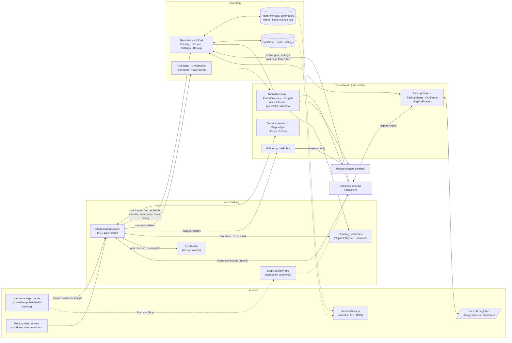

# Passo — Technical Planning

> Companion to [VISION.md](VISION.md). This document defines the architecture, the design of the tracking engine, and the delivery phases.
> It is written to be read by humans and by Claude Code.
>
> Keep the phase checklists up to date: tick the boxes as work is merged.

---

## 1. Tech stack

| Concern | Choice |
|---|---|
| Language | Kotlin (latest stable 2.x), with the Compose compiler Gradle plugin |
| Build | Gradle with Kotlin DSL; version catalog (`gradle/libs.versions.toml`); convention plugins in `build-logic/` |
| JDK | Toolchain 21, `jvmTarget` 21 |
| SDK levels | `minSdk 34`, `targetSdk 37`, `compileSdk 37` |
| UI | Jetpack Compose, Material 3 in Chiaro's design language (its generated schemes, dynamic color on request), edge-to-edge |
| Widget | Jetpack Glance (`glance-appwidget` + `glance-material3`), latest stable (1.2.x at the time of writing) |
| Architecture | MVVM with unidirectional data flow; coroutines and `Flow` |
| Dependency injection | Hilt (`hilt-work` only if WorkManager is ever introduced) |
| Persistence | Room for step data and tracker state; DataStore (Preferences) for settings and profile |
| Navigation | Navigation 3 if stable at setup time, otherwise Navigation Compose with type-safe routes |
| Charts | Custom Compose `Canvas` components in `core:designsystem` (no third-party chart library) |
| Time | `java.time` |
| Testing | JUnit 5 or JUnit 4, Turbine, Truth or AssertK, Robolectric (Room and receivers), Compose UI tests, Glance unit test utilities |
| Quality | Android Lint, ktlint (via Spotless) or detekt; Baseline Profiles in Phase 7 |
| CI | GitHub Actions: build, unit tests, lint, formatting, and a forbidden-permission check on the merged manifest. A release workflow on version tags builds the signed APK and publishes it to GitHub Releases |
| License | GPL-3.0. Every new dependency must have a GPL-3.0-compatible license (Apache-2.0, MIT, BSD are fine) |

Always pick the **latest stable** versions at setup time and record them in the version catalog. Avoid alpha versions unless a phase needs them.

---

## 2. Project structure

```
passo/
├── app/                    # Application, MainActivity, navigation, DI entry points
├── build-logic/            # Convention plugins (android-library, compose, hilt, room…)
├── core/
│   ├── model/              # Pure Kotlin data classes (no Android deps)
│   ├── domain/             # Pure Kotlin: StepAccountant, calculators, streaks/records, outings, backup format
│   ├── data/               # Room DB, DAOs, DataStore, repositories
│   ├── tracking/           # StepTrackingService, sensor source, receivers, notification
│   ├── designsystem/       # M3 theme, typography, shared components, charts, icons
│   └── testing/            # test-only: the accessibility checks and the page walk the UI tests share
├── feature/
│   ├── today/
│   ├── history/
│   ├── insights/           # records, streaks, totals
│   ├── settings/           # Settings, your data (export, import), the step calibration
│   ├── onboarding/
│   ├── sessions/           # the Outings page and the outing editor (Phase 10)
│   ├── ways/               # the Ways and the city walks (Phase 11)
│   ├── year/               # Your year on foot (Phase 12, planned)
│   └── guide/              # the guide, in Chiaro's shape
├── widget/                 # Glance widget(s), receiver, update coordinator
├── docs/                   # ADRs, formulas, battery test notes
├── VISION.md
├── PLANNING.md
└── CLAUDE.md
```

Rules:

- `core:model` and `core:domain` are pure Kotlin/JVM modules. All business logic lives there and is unit-tested without Android.
- Feature modules depend on `core:*`, never on each other.
- `app` wires everything together.

---

## 3. Architecture overview

Reviewed at Phase 7 (25 Sep 2026) against the code: the Phase 1 diagram showed the tracking
path alone; the app now also has outings, in-process live state, pushed widget updates, goal
alarms, the tile, the export and import, and the calibration.


```mermaid
flowchart LR
    subgraph PHONE["Android"]
        SENSOR["Hardware step counter<br/>(non-wake-up, batched in the hub)"]
        BCAST["Boot, update, screen,<br/>shutdown, time broadcasts"]
        ABK["Android backup<br/>(allowlist, ADR 0007)"]
        SAF[/"Files, through the<br/>Storage Access Framework"/]
    end

    subgraph TRACKING[":core:tracking"]
        SVC["StepTrackingService<br/>(FGS type health)"]
        SURF["Counting notification<br/>StepsTileService · shortcuts"]
        GOALS["GoalNotifier<br/>(inexact alarms)"]
        PROBE["StepCounterProbe<br/>(calibration page only)"]
    end

    subgraph DOMAIN[":core:domain (pure Kotlin)"]
        ACC["StepAccountant → StepLedger<br/>SessionTracker"]
        READ["TodayOverview · PeriodOverview · Insights<br/>WalkDetector · TypicalDayCalculator"]
        POLICY["WidgetUpdatePolicy"]
        BK["BackupCodec · BackupMerge · CsvExport<br/>StepCalibration"]
    end

    subgraph DATA[":core:data"]
        REPO["Repositories (Flow)<br/>Tracking · Session · Settings · Backup"]
        DB[("Room: minutes, summaries,<br/>tracker state, outings, log")]
        DS[("DataStore: profile, settings")]
        LIVE["LiveSteps · LiveSession<br/>(in process, never stored)"]
    end

    UI["Compose screens (:feature:*)"]
    WIDGET["Glance widgets (:widget)"]

    SENSOR -->|"samples with timestamps"| SVC
    BCAST --> SVC
    SVC <--> ACC
    SVC -->|"one transaction per batch:<br/>minutes, summaries, state, outing"| REPO
    REPO <--> DB
    REPO <--> DS
    SVC -->|"stored + buffered"| LIVE
    SVC -->|"WidgetUpdates"| POLICY
    POLICY -->|"screen on only"| WIDGET
    SVC -->|"screen on, 5 s at most"| SURF
    SVC -->|"goal reached, on samples"| GOALS
    REPO --> READ
    LIVE --> READ
    READ --> UI
    READ --> WIDGET
    READ --> SURF
    UI -->|"profile, goal, settings:<br/>past days frozen first"| REPO
    UI -->|"outing commands (intents)"| SVC
    UI <-->|"export, import"| BK
    BK <--> REPO
    BK <--> SAF
    SENSOR -.->|"Start and Stop"| PROBE
    PROBE -.-> UI
    DB -.-> ABK
    DS -.-> ABK
```

**The write path, and its one writer.** Only the service writes steps. The sensor's samples go
through `StepAccountant` (deltas into minutes, §4.4) and `StepLedger` (the buffer and its write
triggers, §4.5); `SessionTracker` measures the outing under way from the same deltas. A batch
is written by `TrackingRepository.persist` in **one** Room transaction: the minutes, the
summaries of the days they touch, the tracker state, the log lines and the outing. The same
repository is the only way to change the profile or the goal, and the import's only way in: one
lock orders all of them, so a day is frozen before a new profile or goal can reach it (§5,
ADR 0003) and no batch lands inside an import.

**The read path is computed, not stored.** The screens, the widgets and the notification read
the repositories' `Flow`s and derive everything in `:core:domain`: today's sentence and pace
(`TodayOverview`), the periods (`PeriodOverview`), records and streaks (`Insights`), walks and
the usual day. Nothing of it runs in the background or is cached in a table (§5, §6).

**Live state stays in the process.** Between two writes the service publishes today's stored
plus buffered count (`LiveSteps`) and the outing as it stands (`LiveSession`). Today, the tile
and the widgets add it to what is stored (`withPending`, `byDayWithLive`), so every surface
shows the same count and it never goes back during a write. It is never persisted: the
database is the truth after any crash.

**Surfaces update only when someone can see them** (§7, §8, §9). The service tells the widgets
through `WidgetUpdates` (declared in `:core:data`, so the service never depends on `:widget`),
and `WidgetUpdatePolicy` decides now, later or not at all; with the screen off, only a change
of tracking state or of a setting repaints. The notification follows the screen; the tile reads
only between `onStartListening` and `onStopListening`. Goal reached rides on the samples; the
evening reminder and the weekly summary are one inexact alarm each (`GoalNotifier`), after a
catch-up with the sensor (`TrackerLink`).

**Control has two doors.** Pause and resume go through `TrackingControl` (Settings' switch,
Today's card, a paused widget's or tile's tap): a pause stops the service, which writes its
buffer as it goes; a resume forgets the baseline, then starts the service from the activity,
where a foreground service may start (a widget's tap opens the app to do it). An outing's
start, pause, resume, stop and "keep going" are intents to the running service
(`SessionControl`), from the screens, the notification's actions, the launcher's shortcuts and
the evening reminder's "Walk now".

**Data in and out, by the reader or by Android** (Phase 7, ADR 0011; ADR 0007). The reader's
export writes the whole history as JSON, or a table as CSV, to a file the system's picker
chose; the import reads one back and merges it (`BackupMerge`: every minute at its larger
count, never deleting). Android's backup copies the database and the settings file, nothing
else; a tracker state from another installation is dropped (`adoptTrackerState`). Passo itself
has no network access either way.

**The calibration reads the counter directly** (`StepCounterProbe`), only while its page is on
screen: the counter is cumulative, so its values at Start and Stop measure the walk whatever
happened in between, independently of the service.

`:app` wires the graph (Hilt), holds the activity and the navigation (Navigation 3: the three
tabs, Settings, the Outings page and editor, the calibration), and starts the service when the
app is opened.

---

## 4. Step tracking engine (core design)

This is the riskiest part of the app. Build it first, test it in the field, and don't build UI on top of it until it is proven.

### 4.1 Why a foreground service

- `TYPE_STEP_COUNTER` is **cumulative since boot** and **resets to 0 at every boot**.
  - Steps taken while the app isn't running are still counted by the hardware. They're only lost if the device reboots before the app reads them.
- Since Android 9, `ACTION_SHUTDOWN` is delivered **only to receivers registered at runtime**, so a live process is needed to save the last value before power-off.
- Since Android 9, apps in the background don't receive sensor events. A worker waking up periodically can't reliably read the sensor.
- A foreground service of type `health` is the documented mechanism for continuous fitness tracking.
  - Prerequisites: the `FOREGROUND_SERVICE_HEALTH` permission in the manifest, and the runtime permission `ACTIVITY_RECOGNITION`.
  - The service can be started from `BOOT_COMPLETED`. `BOOT_COMPLETED` and `MY_PACKAGE_REPLACED` are exemptions from the background-start restriction, and `health` is not among the types Android 15 forbids from a `BOOT_COMPLETED` receiver (`dataSync`, `camera`, `mediaPlayback`, `phoneCall`, `mediaProjection`, `microphone`). `ACTIVITY_RECOGNITION` is not a while-in-use permission, so it does not block a start from the background either. Established from the documentation in Phase 1 (§15).

### 4.2 Service lifecycle

| Trigger | Action |
|---|---|
| App opened (activity in foreground) | Start the service if it isn't running and permissions are granted |
| `BOOT_COMPLETED` (manifest receiver) | Start the service |
| `MY_PACKAGE_REPLACED` (manifest receiver) | Start the service after an app update |
| Service `onStartCommand` | `startForeground(FOREGROUND_SERVICE_TYPE_HEALTH)` and register the sensor listener; return `START_STICKY` |
| `ACTION_SHUTDOWN`, `QUICKBOOT_POWEROFF` (runtime receiver) | `goAsync()`, then `sensorManager.flush()`, wait for `onFlushCompleted` (at most about 1.5 s), then persist synchronously |
| `ACTION_SCREEN_ON`, `ACTION_USER_PRESENT` (runtime) | Re-register with low latency, flush, refresh notification and widget |
| `ACTION_SCREEN_OFF` (runtime) | Persist the buffer, then re-register with high latency |
| `ACTION_TIME_CHANGED`, `ACTION_TIMEZONE_CHANGED` (runtime) | Persist the buffer, recompute today's local date, refresh the surfaces |
| User toggles "Pause tracking" | Persist, unregister, `stopSelf()` |

If the user or the OEM stops the service, no data is lost as long as the device doesn't reboot in the meantime, because the counter is cumulative. The UI and widget then show a "Tracking paused" state with tap-to-resume. The limitation is that a force-stopped app doesn't receive `BOOT_COMPLETED` until the user opens it again; this is documented in the FAQ.

### 4.3 Sensor registration strategy

| Screen state | Sensor | `samplingPeriodUs` | `maxReportLatencyUs` |
|---|---|---|---|
| Off | Non-wake-up `TYPE_STEP_COUNTER` | `SENSOR_DELAY_NORMAL` | High, `SCREEN_OFF_LATENCY` (default 10 min) |
| On | Same sensor | `SENSOR_DELAY_NORMAL` | Low, `SCREEN_ON_LATENCY` (default 0 to 2 s) |

- A non-wake-up sensor never wakes the application processor. Events wait in the hardware FIFO and are delivered the next time the processor is awake.
- If the FIFO overflows, intermediate events are dropped, but the **total stays correct** because the counter is cumulative. Only minute-level attribution gets coarser.
- **Non-wake-up, decided from the platform documentation** (`docs/adr/0002-sensor-reporting.md`): the wake-up variant would only bound the loss on an *abrupt* power loss, and would pay for it with a wakeup per report window, every day. A device that has only a wake-up step counter still gets it.
- `sensor.fifoMaxEventCount`, `fifoReservedEventCount`, vendor, name and wake-up mode are written to the diagnostics log at every service start, with whether the phone has a wake-up counter (and its FIFO) and which step detectors it has (read, never registered).
- Some phones have no FIFO at all (`fifoMax=0`, the owner's Samsung, Oct 2026): with the screen off the counter's events are dropped while the processor sleeps, and its latest value arrives in a clump when the phone next wakes. The total stays exact; the attribution of §4.4 lays the clump over the minutes it took.

### 4.4 Accounting algorithm (`StepAccountant`, pure Kotlin)

Input for each sensor event: `counterValue` (total since boot), `eventElapsedNanos` (the event timestamp), plus an injected `SystemSnapshot(bootCount, elapsedRealtimeNanos, wallClockMillis, zoneId)`.
`bootCount` comes from `Settings.Global.BOOT_COUNT`.

```
state = TrackerState(bootCount, lastCounterValue, lastSampleElapsedNanos, lastSampleWallMillis)   // persisted in Room

delta = when {
    state == null                       -> 0                   // first run ever: baseline, don't count steps from before install
    snapshot.bootCount != state.bootCount -> counterValue      // new boot session: counter restarted from 0
    counterValue < state.lastCounterValue -> counterValue      // sensor/HAL reset without reboot
    else                                -> counterValue - state.lastCounterValue
}

eventWall = snapshot.wallClockMillis - (snapshot.elapsedRealtimeNanos - eventElapsedNanos) / 1e6
if (eventWall is in the future or before the lower bound) eventWall = snapshot.wallClockMillis   // guard against buggy timestamps

lowerBound = if (same boot session) state.lastSampleWallMillis else bootWallMillis

// Attribute delta to minute buckets, by the milliseconds each minute holds of the stretch walked:
//  - the stretch ends at eventWall and lasts delta / DEFAULT_CADENCE (≈110 spm), never before
//    lowerBound; a delta faster than that is spread evenly over [lowerBound, eventWall]
//  - one rule for every gap: a lone step lands in its own minute; a clump handed over at once
//    (a sensor with no FIFO, whose events are dropped while the processor sleeps) is laid over
//    the minutes it was walked in, never 170 steps in one minute and 25 in the next
//  (until Oct 2026: a gap ≤ 2 min put everything in the eventWall minute, §15)
// Sanity: if delta > MAX_CADENCE (250 spm) × gapMinutes + 50 → cap, log a diagnostics anomaly

newState = state.copy(bootCount, lastCounterValue = counterValue, lastSampleWallMillis = eventWall)
```

Output: a list of `(epochMinute, localEpochDay, steps)` increments, plus the new state.
All wall-clock and time-zone logic is injected, so the algorithm can be fully unit-tested.

### 4.5 Persistence rules

- Keep an in-memory buffer of minute increments in the service.
- Flush the buffer to Room in **one transaction** that also updates `TrackerState` and today's `DailySummary`. Flush when any of these happens:
  - a minute boundary is crossed while events are flowing
  - the screen turns off
  - shutdown
  - `onDestroy`
  - 100 or more buffered steps
- Invariant: the steps stored in Room plus the stored `lastCounterValue` are always consistent.
  - If the process dies with an unflushed buffer, the next sample recomputes the delta from the stored `lastCounterValue`. Nothing is double-counted and nothing is lost; only the minute attribution may shift.

### 4.6 Edge cases (all need unit tests)

| Case | Expected behavior |
|---|---|
| First install mid-day | Baseline at the current value. Today starts from 0 and the UI explains this once. |
| Nightly shutdown | The shutdown flush saves the last value. After boot, the first sample has a new `bootCount`, so `delta = counterValue`. |
| Abrupt power loss or crash | Steps since the last delivered batch are lost (bounded by the latency window). Documented. |
| Walking across midnight | Event timestamps split the steps between days. The gap rule splits long gaps proportionally. |
| Time-zone change | Buckets are stored in UTC `epochMinute` together with the `localEpochDay` computed at write time. Days already recorded are never re-bucketed. |
| Manual clock change | Same as a time-zone change. Timestamps come from elapsed realtime, so they are monotonic. |
| Sensor jumps (buggy HAL) | Capped by `MAX_CADENCE` and logged. |
| A counter with no FIFO, handing steps over in clumps | Each clump laid back over the time it took at 110 spm, minute by minute: no false minute of running, the total exact. |
| `ACTIVITY_RECOGNITION` revoked | The service stops. The UI, notification and widget show "Permission needed". |
| No step counter sensor | The APK from GitHub installs on any device, so a blocking explanation screen is **required**. `uses-feature required=true` stays in the manifest for a future Play listing, where it filters these devices. |
| Counter float precision | Values are `Float`; convert with `toLong()`. Exact up to 2^24 steps per boot session, which is far beyond realistic use. |

---

## 5. Data model

### Room

```kotlin
@Entity(tableName = "tracker_state")          // single row, id = 0
data class TrackerStateEntity(
    @PrimaryKey val id: Int = 0,
    val bootCount: Int,
    val lastCounterValue: Long,
    val lastSampleElapsedNanos: Long,           // monotonic: gaps are measured on this clock (§15)
    val lastSampleWallMillis: Long,
    val updatedAtMillis: Long,
)

@Entity(tableName = "minute_steps", indices = [Index("localEpochDay")])
data class MinuteStepsEntity(
    @PrimaryKey val epochMinute: Long,         // UTC minute
    val localEpochDay: Long,                    // local date at write time
    val steps: Int,
)

@Entity(tableName = "daily_summary")
data class DailySummaryEntity(
    @PrimaryKey val localEpochDay: Long,
    val steps: Int,
    val distanceMeters: Double,
    val activeKcal: Double,
    val activeMinutes: Int,
    val briskMinutes: Int,
    val goalSteps: Int,                         // goal in effect that day
    val finalized: Boolean,                     // true after the day is over
)

@Entity(tableName = "diagnostics_event")      // ring buffer, ~500 rows
data class DiagnosticsEventEntity(
    @PrimaryKey(autoGenerate = true) val id: Long = 0,
    val wallMillis: Long,
    val type: String,                           // BOOT, SHUTDOWN_FLUSH, ANOMALY, SERVICE_START…
    val detail: String,
)
```

- Size estimate: about 300 minute rows per day, roughly 110k rows per year, a few MB. Keep minute data indefinitely; it's needed for hourly charts and recalculation.
- Today's `DailySummary` is recomputed from today's minute rows at every flush.
- Past days are **frozen**, so changing the profile doesn't silently rewrite history. Settings offers **"Apply profile to past data"**, which recomputes every summary from the minute rows.
- Use Room auto-migrations with exported schemas (`room.schemaLocation`) committed to the repo.
- **Schema v4 (Phase 11):** `way_journey`, a way the reader started (the way, its start day and instant, its state `ACTIVE` / `FINISHED` / `LEFT`, the day it ended, how far its stages were told). No distance: what was walked is the days' own estimates from the start, read with them (`docs/adr/0014-ways.md`).
- **Schema v5 (Phase 11, part two):** `session.walk` (the city walk an outing walks, by name; null for every other outing) and `session.walkFromMeters` (where along the walk it began). A walk's journey is a `way_journey` row like a way's; its progress is its outings', read with them (`docs/adr/0015-city-walks.md`).
- **No tables for walks or the typical day.** Both are computed on read from `minute_steps` (§6.1, §6.2). Add a cache table only if profiling shows a need.
- **Schema v2 (Phase 10), an auto-migration adding two tables and touching nothing else:**
  - `session_plan`: the reader's outings (name or null, goal kind and value, intensity, milestones as a bit set, vibrate, position, last started).
  - v3: `voice` (`OFF`, `HEADPHONES`, `ALWAYS`) on both, default `OFF` (the voice, ADR 0010).
  - `session`: each outing walked, with its goal copied at the start (frozen like a day), its state (`ACTIVE`, `PAUSED`, `FINISHED`) and end reason, its totals (steps, time in motion, time at its pace, estimated distance and energy), its last step and last measured moment, the milestones already told. The one under way is written in the step batch's transaction (§4.5).

### DataStore (Preferences)

- Profile: height, weight, sex (optional), step length mode (auto, manual or calibrated), walking step length, running step length.
- Goal, units, first day of week, theme, dynamic color, notification opt-ins, reminder time and threshold, tracking enabled.
- The last day whose goal was seen reached (not a setting: the record that keeps "goal reached" once a day).
- Walk detection enabled (default on), minimum walk duration (5, 10 or 15 min; default 10), typical-day line shown (default on), Today's "Start an outing" button shown (default on).
- Whether the outing presets were written once (so deleting them is final), and the last finished outing whose card Today has put away.

---

## 6. Derived metrics (`core:domain`)

All constants live in one file (`MetricsConstants.kt`) with comments that cite their sources. All defaults are to be validated.

- **Default walking step length:** `height × 0.415` (`× 0.413` when the profile says female). If height is unknown, 0.70 m.
- **Running step length:** default `walking × 1.3`, user-editable. It applies to minutes with a cadence of at least `RUNNING_CADENCE` (140 spm).
- **Distance:** the sum over minutes of `steps × stepLength(cadence)`.
- **Active calories (net):** the sum over minutes of `distanceKm × weightKg × k(cadence)`.
  - `k_walk ≈ 0.5 kcal/kg/km`, rising slightly for brisk cadences: flat up to 100 spm, then linearly to 0.6 just below 140 spm (Phase 2, §15).
  - `k_run ≈ 1.0 kcal/kg/km`.
  - Default weight if not set: 70 kg.
  - Net means basal metabolism is not included. The UI calls this "active calories".
  - Alternative considered: MET-based tables by speed. Rejected because it is less robust for sparse minutes.
- **Active minutes:** count of minutes with at least `ACTIVE_MINUTE_THRESHOLD` (40) steps.
- **Brisk minutes:** count of minutes with at least 100 steps.
- **Average cadence:** steps in active minutes divided by the number of active minutes.
- **Streak:** consecutive finalized days with `steps ≥ goalSteps`, plus today if its goal is already met.
- **Records:** best day, ISO or locale week, month, and longest streak.

### 6.1 Walk detection (`WalkDetector`, pure Kotlin)

Input: the minute buckets of one local day, plus the settings. Output: a list of `Walk(start, end, steps, distanceM, activeKcal, avgCadence, type)`.

```
1. Mark each minute as "moving" if steps ≥ WALK_MINUTE_THRESHOLD (60).
2. Merge moving minutes into runs, bridging gaps of up to WALK_MAX_GAP_MINUTES (2) non-moving
   minutes (traffic lights, doors). Steps inside a bridged gap belong to the walk.
3. Discard runs shorter than the minimum duration setting (default 10 min).
4. For each remaining run compute the metrics with the same calculators as §6.
5. type = RUN if avgCadence ≥ RUNNING_CADENCE, else WALK.
   (Optional refinement: MIXED if both walking and running minutes exceed 30% of the walk.)
```

- A walk crossing midnight is split at midnight, like every other daily metric.
- Constants live in `MetricsConstants.kt` next to the others.
- Cost: one linear pass over at most 1,440 rows, only when the day detail or Today screen is visible. No background work.
- Accuracy depends on minute attribution (§4.4). With a working FIFO it's minute-accurate; after a FIFO overflow or a service restart, walk boundaries may be off by a few minutes. This is acceptable and documented.

### 6.2 Typical day curve (`TypicalDayCalculator`, pure Kotlin)

- Take the same weekday over the last `TYPICAL_DAY_WEEKS` (4) weeks, skipping days with fewer than 500 steps (phone left at home, tracking paused).
- For each day, build the cumulative curve in 15-minute slots (96 points).
- The typical curve is the mean of those curves, slot by slot. It is shown only if at least 2 valid days exist.
- "Ahead or behind" = today's cumulative value minus the typical value at the current slot. It is shown as a short label, for example "+1,240 vs usual".
- Computed when the Today screen opens and then once every 15 minutes while it stays visible. It never runs in the background.

---

## 7. Widgets (Glance)

Two widgets since Phase 4 (owner's request), in Chiaro's dress so a Passo card and a Chiaro card on one home screen read as one family: «At a glance» (Chiaro's «Colpo d'occhio», with today's ring where the weather glyph was) and «In words» (Chiaro's «In parole»: the day in type, with two small marks). Decisions and reasons: `docs/adr/0005-widgets.md`.

### Configuration

- `SizeMode.Exact`: every form is read off the size the launcher really granted.
- **One size spec for both cards** (`WidgetProviderTest`): default placement 4×1 (`targetCellWidth` 4, `targetCellHeight` 1, where Chiaro's pair opens), minimum one cell (`minResizeWidth`/`minResizeHeight` 40 dp), `resizeMode="horizontal|vertical"`, and **no maximum**: Launcher3 turns a dp maximum into cells on every grid profile and keeps the smallest, so no value means "four cells" everywhere (ADR 0005). Each layout has a form for any grant instead.
- `updatePeriodMillis = 0`; `configure` is the per-widget settings screen, `reconfigurable|configuration_optional`.
- Reference grants the layout tests measure against (Chiaro's): one row ≈ 85 dp tall, two cells ≈ 159 dp, three ≈ 250, four ≈ 340; two rows ≈ 189 dp.

| «At a glance» form | When | Content |
|---|---|---|
| DOT | narrower than 120 dp | The ring with the count inside (compact where the language shortens thousands) |
| NARROW | one row | Ring, count, «of 10,000 steps» |
| WIDE | one row with a sentence column (4 cells) | The same, and the day's sentence at the far edge; or mirrored, the ring on the right |
| TALL | two rows and up | Ring in the top corner; count, sentence and goal from the bottom |
| PANEL | two rows and up, three cells or wider | The row on top, today's steps by hour under it: 24 bars built from boxes, current hour highlighted |

| «In words» form | When | Content |
|---|---|---|
| LINE | one row, one or two cells | «Steps today», the count, the share of the goal where it costs the number nothing |
| ROW | one row, three cells and up | The count on the leading side; the sentence, the goal and the distance and calories at the far edge |
| STACK | two rows and up | The eyebrow on top; the count large, the sentence and the facts at the bottom; «the day in figures» with height to spare |
| PANEL | two rows and up, four cells | The count beside the words, on one baseline; the day in figures under both |

### Rendering

- Colours are resolved at render time against the ground the card really has (Chiaro's ink rule, `widgetInk`), never left to the launcher's day/night resolution: white inks on one of Chiaro's six card colours, the dress's own inks on light or dark, and below 50% solidity the wallpaper's hint decides. Material 3 dynamic color when the reader turned wallpaper colours on in the app.
- **The ring is a bitmap** painted at the size shown, capped at 416 px a side (at most 0.7 MB, about 50 KB in a row), one per card: far under the Android 17 RemoteViews bitmap cap. Vector levels were rejected (5% steps for the arc and the notch). The bars are boxes.
- Previews: a static `previewLayout` of the default card, and generated previews on Android 15+ (`providePreview`), published once per app version.
- Tapping a card opens the Today screen. A paused card opens the app asking it to resume (the service is started from the activity). A card without the permission or stopped by the system opens the app, which fixes or restarts it.

### Update strategy (battery-aware)

- Push-based from `StepTrackingService` through `WidgetUpdates` (interface in `:core:data`, `WidgetUpdateCoordinator` in `:widget`), decided by `WidgetUpdatePolicy` (pure, `:core:domain`). There is **no periodic polling**.
  - Screen on or user present: flush the sensor, then update immediately.
  - While the screen is on: update at most every 60 s, and only if the steps changed (a trailing timer, cancelled at screen-off).
  - Day rollover (detected by the screen-on ticker), goal reached: update immediately.
  - Settings or profile changed, tracking started or stopped, an outing started, paused or ended: update immediately, with the screen off too (one repaint, and a stopped service cannot repaint at the next screen-on).
- While an outing is under way, both cards say it in the sentence's place («Brisk walk: 12 of 20 min»), as the tile's line does (Phase 10).
  - Screen off: no updates.
- The widget reads the repository plus the service's in-process buffer (`LiveSteps`), exactly as Today does, so it shows persisted truth and the steps not written yet.

---

## 8. Notifications and Quick Settings tile

- **Channel `tracking`** (low importance, silent, `setOnlyAlertOnce`): the ongoing foreground service notification.
  - Content: collapsed, today's steps; expanded, the way to the goal (or when it was reached), the share of the goal with the active minutes, the estimated distance and calories, and a progress bar to the goal.
  - Updated only while the screen is on, at most every 5 s. Both forms are built in the same update; today's minutes are read again only after a write.
  - How it shows (in full, minimized, off) is the reader's, on the system's channel page: Settings reads it and opens that page (§15).
- **During an outing** (Phase 10) the `tracking` notification is the outing's: its name, its sentence, «12 of 20 min», the pace against the outing's, the steps and the estimates, Pause/Resume and Stop. Android 16+: `ProgressStyle` with the milestones as points, promoted to a Live Update (`POST_PROMOTED_NOTIFICATIONS`); below, `BigTextStyle` and a progress bar. Updated as the day's form is (screen on, every 5 s at most), plus once at each milestone.
- **Channel `sessions`** (default importance, no sound, no vibration of its own): an outing's goal reached, with "Keep going" for 15 minutes; an outing ended by a long stillness, with "Resume" for as long. The milestones on the way are Passo's own vibration patterns, played only while this channel is on.
- **Channel `goals`** (default importance, opt-in): goal reached once per day, the evening reminder (with "Walk now": an outing for the rest of the day), the weekly summary.
  - Goal reached rides on the service's samples. The reminder is an inexact `setAndAllowWhileIdle` with a wakeup, the summary an inexact `RTC` alarm without one; both armed again at every start of the process, every change of what they depend on, every clock or zone change, and every firing. No exact alarm permission (Phase 6, §15).
- **Channel `ways`** (default importance, Phase 11): a stage reached on the way under way, and its end. Told by the days being written (`WayNotifier`), never by a timer; touching it opens the Ways page.
- If `POST_NOTIFICATIONS` is denied, the foreground service still runs; its notification only shows in the system's task manager. Explain this in onboarding; don't block on it.
- **QS tile (`TileService`):** reads today's steps from `onStartListening()` to `onStopListening()`, following the live count meanwhile. It costs nothing when the panel is closed.

---

## 9. Battery rules (non-negotiable)

1. No accelerometer. No continuous `TYPE_STEP_DETECTOR` unless measurements prove it's cheap.
2. No wakelocks held by the app, except inside `goAsync()` for the shutdown flush, and the one of §9.7: an outing with signals on a phone whose step counter cannot wake it.
3. No exact alarms, no `REQUEST_IGNORE_BATTERY_OPTIMIZATIONS`, no periodic workers for tracking.
4. Nothing runs on a timer while the screen is off. All screen-on tickers are coroutines tied to the screen state.
5. Database writes are batched (§4.5).
6. Each phase that touches the service ends with a battery check:
   - `adb shell dumpsys batterystats --charged <pkg>`
   - `adb shell dumpsys sensorservice` (confirm batching is active)
   - Doze simulation: `adb shell dumpsys deviceidle force-idle`
   - Battery Historian for the longer field tests
7. **The one exception (Phase 10, `docs/adr/0009-sessions.md`):** while an outing the reader started is counting, the wake-up step counter (if the phone has one besides the usual one) reports within 30 s, and 2 s in the 40 s before a change of an interval outing (Phase 13, `docs/adr/0013-interval-walks.md`), so its signals reach a phone in a pocket on time: about two brief wakes a minute while walking, a few more in each of an interval outing's last 40 s before a change, none while still, no wake lock or timer of the app's own. Paused, over or with no outing, the registration is the usual one. An outing ends by itself (goal, 15 min still, 1 h paused, 4 h), noticed at a step or a screen-on, never by a timer.
   *Amended 4 Oct 2026 (owner, after the first interval walk; `docs/adr/0013-interval-walks.md`):* on a phone with **no** wake-up step counter, an outing that tells its signals (vibration or voice, and the outings' channel on) holds a partial wake lock while it counts, so the counter's steps arrive as they are taken and every signal with them; the screen stays off; let go at a pause, the end or the service's, bounded at 4 h 10 min; logged when taken and let go. No timer: the signals still ride on the steps. An outing with no signal, a paused one, and every phone with a wake-up counter never hold it. About 1 to 3% of a battery an hour, to be measured.
8. OEM task killers: onboarding shows a battery tip, with a button to the app's own settings page, only when `Build.MANUFACTURER` is on a known list (`OemTips`). Samsung is not on it (§15).

---

## 10. Permissions and manifest

| Permission / element | Type | Why |
|---|---|---|
| `ACTIVITY_RECOGNITION` | Runtime | Read the step counter; prerequisite for the `health` foreground service |
| `POST_NOTIFICATIONS` | Runtime | Show the tracking and goal notifications (optional) |
| `FOREGROUND_SERVICE` | Normal | Foreground service |
| `FOREGROUND_SERVICE_HEALTH` | Normal | Foreground service of type `health` |
| `RECEIVE_BOOT_COMPLETED` | Normal | Restart tracking after boot |
| `VIBRATE` | Normal | An outing's signals, in their own patterns (Phase 10) |
| `POST_PROMOTED_NOTIFICATIONS` | Normal | The outing under way as a Live Update on Android 16+ (Phase 10) |
| `<queries>` for `TTS_SERVICE` | Manifest | Lets Android 11+ show Passo the text-to-speech engine, for the outings' voice (ADR 0010). Not a permission |
| `WAKE_LOCK` | Normal | An outing's signals on a phone whose step counter cannot wake it: the processor kept awake while the outing counts (§9.7, ADR 0013). Also brought by WorkManager, held by the job while a widget card is drawn |
| `ACCESS_NETWORK_STATE` | Normal | Brought by WorkManager, which Glance runs its widget sessions on (Phase 4): it lets nothing leave the phone without `INTERNET`. Passo's own code does not use it |
| `android:allowBackup="true"` + `dataExtractionRules` | Manifest | Android's backup and device transfer carry the step history, the profile and the settings, an allowlist (`docs/adr/0007-backup.md`). No permission: Android sends the copy, not Passo |
| `<uses-feature android:name="android.hardware.sensor.stepcounter" android:required="true"/>` | Feature | Documents the requirement; filters devices on a future Play listing. It does not block APK installs, so the app also checks the sensor at runtime |

**Forbidden:** `INTERNET`, `ACCESS_*_LOCATION`, `REQUEST_IGNORE_BATTERY_OPTIMIZATIONS`, `SCHEDULE_EXACT_ALARM`, `USE_EXACT_ALARM`, `HIGH_SAMPLING_RATE_SENSORS`, `BODY_SENSORS`.

A CI task checks the merged release manifest and fails on any forbidden permission. Libraries that add one must be removed or patched with `tools:node="remove"`.

---

## 11. Delivery phases

Each phase ends with a merged PR, green CI and its acceptance criteria met.
Phases 1 and 4 need **field testing on a physical device**; an emulator is not enough for sensors or batching.

### Phase 0 — Foundations

- [x] Create the repo; add `README.md`, `LICENSE` (GPL-3.0 full text), `.gitignore`, `.editorconfig`
  - *Deviation:* the repo is `fiorenzobrioni/passo`, not `passo-android`: the sibling repos carry the bare app name.
- [x] Short GPL-3.0 notice in the README and in the app's About screen (added in Phase 3)
  - README in Phase 0; the About group of Settings in Phase 3.
- [x] Gradle setup: version catalog, `build-logic` convention plugins, module skeleton (§2)
- [x] Hilt, Compose, Material 3 theme with dynamic color, and an empty `MainActivity` with an edge-to-edge `Scaffold`
- [x] `strings.xml` for `values/` (English) and `values-it/`; `locales_config.xml` for per-app language
- [x] CI: build, unit tests, lint, formatting, forbidden-permission check
  - Plus the tag-triggered release workflow (Phase 8's, brought forward), so the signing path is exercised from the start.
- [x] Generate the **release keystore** now; store it outside the repo with an offline backup, and add it to GitHub Actions secrets. Never commit it. This key signs every future release and must be reused if the app ever goes on Google Play.
  - Created by the owner on 26 Sep 2026 (RSA 4096, valid to 2056) and stored in the four secrets Chiaro uses (`KEYSTORE_BASE64`, `KEYSTORE_PASSWORD`, `KEY_ALIAS`, `KEY_PASSWORD`). Checked from a one-off workflow run: the secrets decode, the keystore opens, Gradle signs the release APK with it. The temporary key that stood in until then is deleted; no release was ever signed with it. SHA-256 `8B:40:22:8A:8D:EF:E3:E3:F1:6E:FE:1A:DC:C0:4C:C7:F5:B5:82:E4:18:F0:15:E8:27:B9:59:D5:BF:39:7F:B5`.
- [x] `CLAUDE.md` (see §13)
- [x] `docs/adr/0001-foundations.md`: the Phase 0 decisions and their reasons

**Acceptance:**
- CI is green.
- The app launches.
- Adding `INTERNET` to any manifest fails CI.
  - Verified locally: `INTERNET` and `ACCESS_COARSE_LOCATION` added to `:core:tracking`'s manifest made `checkForbiddenPermissions` fail, naming both.

### Phase 1 — Tracking engine (highest risk)

- [x] `core:domain`: `StepAccountant` with test-driven unit tests covering every case in §4.6
  - Plus `StepLedger`, the service's buffer as pure Kotlin: the write triggers of §4.5 and the restore of a batch whose write failed, with its own tests.
- [x] `core:data`: Room schema v1 (§5), DAOs, `TrackingRepository` with the transactional flush
  - One `@Transaction` writes the minute increments, the tracker state, the summaries of the touched days and the log lines; Robolectric tests on an in-memory database.
- [x] `core:tracking`: `StepSensorSource` (wraps `SensorManager` and exposes a `Flow` of events plus `flush()`)
  - Samples and flush completions share one ordered channel, so a flush is complete only once every sample it delivered has been accounted.
- [x] `StepTrackingService` (`health` type): registration strategy (§4.3), screen, shutdown and time receivers (§4.2), in-memory buffer
- [x] `BootReceiver` and `PackageReplacedReceiver`
  - *Deviation:* the start from boot on Android 14 to 17 is established from the documentation, not on devices (§4.1, §15).
- [x] Minimal notification (static text plus today's steps)
- [x] Minimal permission request for `ACTIVITY_RECOGNITION` and `POST_NOTIFICATIONS`
  - With the blocking explanation for a phone without a step counter (§4.6). A placeholder screen in `feature:onboarding`, replaced by the real onboarding in Phase 3.
- *Removed from the plan (owner's decision, §15):* the diagnostics screen and the wake-up vs non-wake-up experiment. The sensor choice is made from the platform documentation (`docs/adr/0002-sensor-reporting.md`); the diagnostics **log** (§5) stays, with no screen.

**Acceptance:**
- [x] All accounting unit tests pass.
- [x] A 3 to 5 day field test on at least one physical device, with nightly full shutdowns and without opening the app, shows no lost steps.
- [x] `batterystats` shows no app wakelocks or alarms while the screen is off.
- [x] Tracking resumes after a reboot without opening the app.
- *Confirmed by the owner on their phone (1 Oct 2026)*, over several days of daily use with nightly full shutdowns, before v1.0.0. By construction the service holds no wakelock and sets no alarm, and nothing in it runs on a timer with the screen off; the boot start follows the documented exemptions (§4.1).

### Phase 2 — Profile, settings, metrics

- [x] DataStore settings and profile repository
  - `UserPreferencesDataSource` stores only the fields that differ from their default and reads back anything out of range as the default; `SettingsRepository` is what the screens use. A profile or goal change goes through `TrackingRepository`, which freezes the past first (§15, `docs/adr/0003-daily-summaries.md`).
- [x] Calculators in `core:domain`: distance, calories, active and brisk minutes, cadence, with unit tests
  - `MetricsCalculator`, `StepLengths`, `ProfileLimits`, `DaySummaries`; every constant in `MetricsConstants.kt` with its source.
- [x] `DailySummary` recomputation for today; freezing past days; "Apply profile to past data"
  - Open days are recomputed at every write; the first write after midnight finalizes the day; late steps on a finalized day add only their own share. "Apply profile to past data" is `SettingsRepository.applyProfileToPastDays()`; its button comes with the Settings screen (Phase 3).
- [x] Units (metric and imperial) with formatting helpers, and locale-aware number formatting
  - `MeasureFormatter` and `UnitConversions` in `core:domain` (numbers only); the unit symbols are string resources in `core:designsystem` (`Measure.text()`, `Resources.format`).

**Acceptance:**
- [x] Calculator tests cover defaults, edge cases (0 steps, missing profile) and unit conversion.
- [x] Changing the weight updates today only, unless "Apply to past data" is used.
  - Both on a real Room database (`TrackingRepositoryTest`), including a day still open at the change and late steps after it.

### Phase 3 — Today screen and onboarding

Built in Chiaro's design language (owner's request): its colors, typefaces, shapes, motion and principles, `docs/adr/0004-design-language.md`.

- [x] Navigation shell: Today, History, Insights, Settings
  - *Deviation:* Today and Settings only (Navigation 3, Settings from the gear, Chiaro's page transition). The bottom bar arrives with its second tab in Phase 5: tabs that lead nowhere would be the screen lying about the app (Chiaro's rule).
- [x] Today: progress ring, metric cards, live updates while visible (low-latency sensor registration while the app is visible)
  - The ring also carries a notch where a usual day stands at this hour. Live: the service publishes today's stored-plus-buffered count to an in-process `LiveSteps`, read only while Today is collected; the sensor already reports within 1 s with the screen on (§4.3). Tiles: distance and calories (estimates, with what they rest on), active and brisk minutes (the brisk ones against the day's share of the WHO's 150 a week), average cadence with its bands (drawn only when there are active minutes).
- [x] Today: day trend sparkline (cumulative steps, goal line, dashed typical-day line, "ahead/behind" label), drawn with a small custom Compose `Canvas`
  - Read with a finger (tap to pin, drag to scrub, a haptic tick per hour); the rest of the day shaded; the usual line goes on past now; draws itself in along time. The "ahead/behind" is the headline sentence and the readout above the chart.
- [x] `TypicalDayCalculator` in `core:domain` with unit tests (§6.2)
  - With `DayCurve` and `TodayOverview` (the headline's choice, the pace, the brisk share, the cadence band), all unit-tested.
- [x] Tracking status banner: permission missing, paused, sensor missing
  - Missing permission and pause are cards on Today with the button that fixes them; a missing sensor is the blocking screen of §4.6, before anything else.
- [x] Onboarding: welcome, profile (skippable), goal, permissions, OEM tips
  - The OEM page only on the makers in `OemTips` (§9 rule 7), with the app's own settings page; never `REQUEST_IGNORE_BATTERY_OPTIMIZATIONS` (§10). The dontkillmyapp.com link and Samsung were dropped later (§15).
- [x] Settings screen (profile, goal, units, theme, language, typical-day line, pause tracking)
  - Plus palette, typeface and wallpaper colors (Chiaro's appearance group, with its live preview), "Apply profile to past data", privacy, the GPL-3.0 notice and the credits (Phase 0's pending About item). First day of the week, walk detection and notifications wait for the features they drive.
- [x] Complete Italian and English strings; plurals; content descriptions (the sparkline gets a spoken summary, e.g. "6,200 steps, 1,240 more than usual at this time")

**Acceptance:**
- [x] A fresh install through to tracking takes under 1 minute.
  - Confirmed by the owner on a Samsung Galaxy S24 Ultra. The shortest path: Get started, Skip, Continue, Allow (and the two system dialogs), Start counting.
- [x] Every state in the status banner can be reproduced and recovered from.
  - UI tests for permission and pause with their buttons; resuming forgets the baseline (§15).
- [x] The typical-day line is hidden with fewer than 2 valid days and appears automatically afterwards.
  - `TypicalDayCalculatorTest`; the line and the notch follow the value, and the caption says when it will appear.
- [x] UI tests cover onboarding and Today.
  - Compose tests on Robolectric for Today, onboarding and Settings; they also write screenshots to each module's `build/screenshots`.

### Phase 4 — Widget

Two widgets, in Chiaro's dress (owner's request): «At a glance» and «In words», `docs/adr/0005-widgets.md`.

- [x] Glance widget, receiver and `appwidget-provider` XML (sizes from §7)
  - *Deviation:* two widgets, one size spec (default 4×1, minimum 1×1, no maximum: ADR 0005 has why a dp maximum cannot mean four cells).
- [x] Five responsive layouts (1x1, 2x1, 2x2, 3x1/4x1, 4x2) with `GlanceTheme`
  - Five forms for «At a glance» (DOT, NARROW, WIDE, TALL, PANEL), four for «In words» (LINE, ROW, STACK, PANEL), picked from the exact grant, with the budgets pinned by `GlanceLayoutTest` and `WordsLayoutTest`. *Deviation:* colours resolved per card with Chiaro's ink rule rather than `GlanceTheme`, whose day/night the launcher resolves (Chiaro's device reports).
- [x] 4x2 hourly mini-bars (24 `Box`es, heights normalized to the day's busiest hour, current hour highlighted)
  - Four groups of six, because Glance drops the eleventh child of a container; hours to come are a baseline.
- [x] Spike on the progress ring rendering (bitmap vs vector levels), within the Android 17 RemoteViews bitmap limit
  - Bitmap, painted at the size shown and capped at 416 px a side (§7, ADR 0005).
- [x] `WidgetUpdateCoordinator` wired to the service (§7 update strategy)
  - The rules are `WidgetUpdatePolicy` in `:core:domain`, unit-tested; the service reports through `WidgetUpdates`.
- [x] Paused and "permission needed" states; tap actions
  - Plus "stopped by the system" and "not set up yet" (`CountingState`); a paused card's tap resumes from the activity (`TrackingControl`, now also behind Settings' switch and Today's card).
- [x] Generated preview (API 35+) and a static fallback preview
- [x] Per-widget settings (not planned; owner's request): background, Chiaro's six colours, opacity, content switches, the ring's side, with the real card as a live preview.

**Acceptance:**
- [x] All sizes are legible on at least 2 launchers (e.g. Pixel Launcher and One UI), in light and dark themes.
  - Confirmed by the owner on the device (25 Sep 2026). Every form at every reference size, in every dress, is also drawn by `WidgetGalleryTest` into `widget/build/screenshots`.
- [x] The widget updates within about 5 s of the screen turning on.
  - Confirmed by the owner on the device; by construction too (a repaint right after the screen-on flush).
- [x] The logs show no widget updates while the screen is off.
  - Confirmed by the owner on the device; pinned by `WidgetUpdatePolicyTest`.

### Phase 5 — History and insights

Built in Chiaro's design language, like Phase 3 (owner's request: a clean implementation, above all in UI and UX); decisions in `docs/adr/0006-history-and-insights.md`.

- [x] `WalkDetector` in `core:domain` with unit tests (§6.1): gaps bridged, short runs discarded, walk vs run, midnight split, empty day
  - Plus §6.1's optional MIXED type (walking and running minutes each at least 30% of the walk). The average cadence is over the whole walk, pauses included ("35 minutes, 3,420 steps, 98 spm").
- [x] Day detail: hourly bar chart, walks marked on the chart, list of walks with their metrics
  - The walks are shaded over their minutes and marked in a lane under the axis; the list gives time, length, type, steps, distance, cadence and calories. A past day shows the estimates it froze with (§5). Today's walks are also listed on Today.
- [x] Settings: walk detection toggle and minimum duration
  - Plus the first day of the week (follow the phone, Monday, Sunday, Saturday), which History's weeks and the week record now use.
- [x] Week, month and year charts with the goal line; swipe or paging between periods
  - A segmented choice of scale; periods paged with a swipe or the arrows, from the first recorded day to today, with "Latest" to come back. The goal line steps with each day's own goal; a year's bars are each month's average day. A bar opens its day (or, in a year, its month).
- [x] Calendar heatmap of goal completion
  - In the month page: how close each day came to its own goal in one hue, a met day in the goal's color with a check, today ringed; a day opens.
- [x] Insights: averages, totals, lifetime distance, records, streaks
  - One sentence first (`InsightsHeadline`: best day today, a running streak, the last week against the one before, or the average so far); the streak with the last seven days; best day, week, month and longest streak, each opening in History; averages over the last 7 and 30 complete days and since the first; totals.
- [x] Chart components in `core:designsystem`, built with Compose `Canvas`: bar chart (hourly, weekly, monthly, yearly) with goal line, calendar heatmap. Shared axis, label and accessibility helpers (each chart exposes a spoken summary and per-bar semantics)
  - `BarChart`, `CalendarHeatmap` (composable cells rather than a canvas, so each day is a real touch target and node), `WalkList`, shared date formatting (`format/Dates.kt`).
- [x] Navigation shell, completed: the bottom bar with Today, History and Insights (Phase 3's deviation), Material's fade through between tabs, Back to Today.

**Acceptance:**
- [x] The year view with 365 days of data renders in under 16 ms per frame on a mid-range device.
  - Confirmed by the owner on the device (25 Sep 2026). By construction too: twelve bars from at most 366 rows, computed once per change off the main thread.
- [x] Records and streak tests pass, including goal changes across days.
  - `InsightsTest`, `PeriodOverviewTest`.
- [x] Walks detected on field-test days match what the user remembers (start and end within a few minutes).
  - Confirmed by the owner on the device (25 Sep 2026), with the default thresholds.
- [x] With walk detection off, no walk UI appears anywhere.
  - Walks are null all the way to the screen when it is off (`TodayUiState.walks`, `DayDetail.walks`); `HistoryScreenTest` checks the day page.

### Phase 6 — Goals and system surfaces

Built with the owner's request of Phases 3 and 5 (a clean implementation, above all in UI and UX); decisions in `docs/adr/0008-goals-and-system-surfaces.md`.

- [x] Goal-reached notification (opt-in, once per day, triggered from the service)
  - Noticed on the samples the service receives anyway (no wake of its own), told once a day by claiming the day in the settings file first (`GoalReached`, `UserPreferencesDataSource.claimGoalNoticeDay`): days only move forward, so a restart, a time zone that brings back yesterday or a lower goal cannot tell it twice. A day seen reached with the notification off is claimed too. It says the minute the goal was met and the streak it extends.
- [x] Evening reminder (inexact window alarm, configurable time and threshold)
  - Time on the clock dial (20:00 by default); threshold "until the goal is met" (default), below 75%, below half. It says the steps left and the brisk walk they take, after catching up with the sensor's batch (`TrackerLink`). Silent when the count is not live (paused, stopped, no permission), when it comes over two hours late or past midnight, and never armed for a day already at its goal. *Deviation:* `setAndAllowWhileIdle` (as Chiaro's reminders) rather than `setWindow`: one wake either way, and Doze would hold a window alarm until a maintenance window, too late for a walk (§15).
- [x] Weekly summary notification (optional)
  - On the first day of the week at 9:00, the week that ended as History shows it (`WeeklySummary` over `PeriodOverview`): a sentence first (the goal every day, more or fewer steps than the week before, or the days at the goal), then the steps and the daily average, the days at the goal, the best day and the estimates. A non-wakeup alarm: posted the first time the phone is awake after 9:00.
- [x] Quick Settings tile
  - `StepsTileService`: the count and the share of the goal while counting, the reason otherwise (paused, not counting, no permission), read between `onStartListening` and `onStopListening` and live while the panel is open. A tap opens Today; a paused tile's tap asks to resume, as the widget's. Settings adds it with the system's own prompt (`requestAddTileService`).
- [x] Rich ongoing notification (progress bar, distance), throttled while the screen is on
  - Brought forward (owner's request): expanded with `BigTextStyle`, from the same `TodayOverview` as Today and the widgets, without the usual day. Plus the Settings row for how it shows (§15).
- Plus: Settings' Notifications group, with a card when Android would drop what is turned on (the permission refused, the app's notifications or the goals' channel off) and the button to the page that fixes it; turning one on asks for the permission where Android still can.

**Acceptance:**
- [x] No duplicate goal notifications across reboots or time-zone changes.
  - By construction (a claimed day, days only forward) and pinned by `GoalReachedTest`, `UserPreferencesDataSourceTest` and `GoalNotifierTest` (a second process on the same store tells nothing). To confirm on the device.
- [x] The tile reads data only while the Quick Settings panel is open.
  - By construction: its only reads live in a scope opened by `onStartListening` and cancelled by `onStopListening`. To confirm on the device.
- [x] Battery check at the end of the phase (§9, §12). Expected: one alarm a day with a wakeup, only with the evening reminder on; nothing else new with the screen off.
  - Confirmed by the owner on the device (29 Sep 2026), in the field.

### Phase 7 — Data, calibration and polish

Export, import and calibration built with the owner's request of Phases 3, 5 and 6 (a clean
implementation, above all in UI and UX); decisions in `docs/adr/0011-export-import-and-calibration.md`.

- [x] Export to CSV and JSON, import from JSON (Storage Access Framework)
  - A "Your data" group in Settings: a backup to one JSON file (every minute with its day, the frozen summaries, the outings and their plans, the profile and the settings; the diagnostics log out, never back in; no tracker state), three CSV tables for a spreadsheet (days, minutes, outings), and the import. `BackupCodec`, `BackupMerge` and `CsvExport` in `:core:domain`, `BackupRepository` in `:core:data`, the file picker's `CreateDocument`/`OpenDocument` in the screen: no storage permission.
  - *Decided:* the import **merges** and never deletes (every minute at the larger of its two counts, the file's own days as it froze them, this phone's frozen days taking only the added steps' share, plans and outings matched), so a new phone that already counted keeps its steps and the same file imported twice changes nothing. It is previewed before anything is written, with its profile and settings as one choice. Outcomes are cards, not toasts.
- [x] `data_extraction_rules.xml` and `full_backup_content` for Auto Backup and device transfer
  - Brought forward to Phase 5 (owner's request), `docs/adr/0007-backup.md`. `full_backup_content` is not needed: it is read only below Android 12, and minSdk is 34. Backup and restore confirmed by the owner on the device (25 Sep 2026); the export round trip is still Phase 7's.
- [x] Step length calibration wizard (walk a known distance, start/stop, compute and save)
  - "Measure your step" (Settings' profile, and a button in each step-length dialog): the walking or the running step, a distance picked (50 m to 2 km, or yards), Start, the count while the page is looked at, Stop, the length with what it came from and what it changes, Save. The hardware counter is read directly (`StepCounterProbe`) only while the page is on screen, and flushed at Stop; `StepCalibration` refuses fewer than 30 steps or a length the app would not accept, with its arithmetic, and says a pace that does not match the step. A walking step is stored as measured (`StepLengthMode.CALIBRATED`).
- [x] The guide (owner's request, 25 Sep 2026; §15): `:feature:guide`, a tour of the three screens and the outings in Chiaro's shape, from the top of Settings and from Today's first-day card
- [x] Accessibility pass (TalkBack, font scale 200%, contrast, touch targets)
  - `docs/adr/0012-foldables-and-accessibility.md`. A test-only module, `:core:testing`: `assertAccessible()` (every control labelled, every control 48 by 48dp for a finger, as Compose's widened touch areas actually share the space) runs on every state the screen tests draw, and every screen is walked top to bottom at twice the text size on a 360dp phone (`walkPage()`). `ContrastTest` pins every text ink on every ground at 4.5:1, both dresses, both themes.
  - Found and fixed: the calendar's numbers (2.6:1 mid-ramp, 3.8:1 on uncounted days; the ramp's stops now per theme), the widget's colour swatches (36dp, now 48dp targets), and at twice the text size tiles breaking words (`TilePair`), a chart's title squeezed by its key, chart labels overrunning their margins (`chartMargins`), clipped segmented buttons (`SegmentLabel`), a cut date, a time broken in two, the guide's ring spilling its count. Dense targets (a chart's bars, a month's days, Material's clock dial) are exempt from the size only (`DENSE_TARGETS_TAG`).
- [x] Adaptive layouts for foldables
  - *Owner's decision (29 Sep 2026):* **no tablet layout** (Google Fit and Samsung Health have none; Passo is a phone app); foldables yes, at low risk. One centred column at most 640dp wide (`pageGutter()`), grounds, bars and glow still spanning the window, lists still scrolling and swiping from the edge; below 640dp (every phone upright, a folded foldable) the layout is exactly as before. The display cutout and a side navigation bar are now respected on a phone on its side. No second layout, no navigation rail, no new dependency (§15). In the README with its own screenshot (`today-foldable.png`, an open Pixel 9 Pro Fold), at the owner's request.
- [ ] Baseline Profiles; R8 full mode; startup check

**Acceptance:**
- [x] Export followed by import on a clean install reproduces the history exactly.
  - `BackupRepositoryTest`, between two real Room databases and settings files: every summary, minute, outing, plan, the profile and the settings (not the other phone's first-run state or tracker state), through the encoded file. To confirm on devices, through a file app and a cloud folder (owner).
- [ ] The accessibility scanner reports no critical issues.
  - The Scanner's touch-target and label checks run in every screen test and pass, and the theme's contrast is pinned by `ContrastTest`. The Scanner app itself, over the main screens on a device, is the owner's (with a TalkBack walk and the app on a foldable, opened and folded while on screen).

### Phase 8 — Release on GitHub

- [x] App icon (adaptive + monochrome for themed icons), final package name
  - The icon is done (25 Sep 2026, owner's choice among four drawings): Chiaro's ring with a shoe print where Chiaro has its sun, drawn by `tools/draw_launcher_icon.py` (§15). The package name `com.callbackdev.passo` is confirmed by the owner (29 Sep 2026).
- [x] Versioning: semantic version tags `vX.Y.Z`; `versionCode` derived from the version (e.g. `major × 10000 + minor × 100 + patch`)
  - Done in Phase 0: `passo.versionName` in `gradle.properties`, code derived in `app/build.gradle.kts`, and `release.yml` refuses a tag that does not match.
- [x] `CHANGELOG.md` ("Keep a Changelog" format); release notes in English and Italian
  - The file and its format exist since Phase 0. The `## [1.0.0]` section is the release notes, short, in English only (§15); the phase-by-phase record moved to `docs/CHANGELOG-1.0.0.md`.
- [x] Release workflow (GitHub Actions, triggered by a `v*` tag):
  - build the release APK with R8, signed with the keystore from secrets
  - attach the APK, its SHA-256 checksum and the R8 mapping file to the GitHub Release
  - mark `-beta`/`-rc` tags as pre-releases
  - Done in Phase 0; signed with the real key from secrets since 26 Sep 2026 (the temporary-key fallback is gone).
- [x] README: screenshots, features, install instructions (allowing installs from the browser or file manager), how to verify the checksum, and the **signing certificate SHA-256 fingerprint** so users can check the APK is genuine
  - The fingerprint and the checksum check since the key was created (26 Sep 2026); the README rewritten in the family's shared structure on 1 Oct 2026 (§15), with them under "Install".
- [x] README: updates. The app has no network access, so it can't check for updates itself; point users to GitHub's "Watch → Releases" notifications or to Obtainium, an app that tracks GitHub releases
- [ ] Test the full install and update path: install v1.0.0 from the Release, then update to a newer build over it, with data preserved

**Acceptance:**
- Pushing a tag produces a signed release with APK, checksum and notes, with no manual steps.
- Installing a newer release over an older one keeps all data.

### Phase 9 — Google Play (optional, later)

Kept open, not planned yet. Notes to avoid closing the door:

- [ ] Enroll in Play App Signing **with the existing release key** (upload your own key during enrollment), so builds from GitHub and from Play share the same signature and users can move between them without reinstalling
- [ ] Build an AAB in addition to the APK
- [ ] Privacy policy (e.g. on GitHub Pages): no data collected or shared
- [ ] Play Console:
  - foreground service permission declaration (`health` use case, with a demo video)
  - health apps declaration, if required
  - Data safety form
  - content rating
- [ ] Store listing in Italian and English, with screenshots and a feature graphic
- [ ] Internal test track, then closed testing (check the current tester requirements for personal developer accounts), then production


### Phase 10 — Outings (walks with a goal)

Added to v1.0 at the owner's request (25 Sep 2026), after Phase 6 and before Phases 7 and 8; decisions in `docs/adr/0009-sessions.md`. VISION.md's workout non-goal narrowed to a workout suite. Name: «Uscite» / "Outings".

- [x] Model and engine (`:core:model`, `:core:domain/sessions`): one goal (steps, distance, minutes in motion, the rest of the day) and an optional cadence (free, 100, 130, 140); `SessionTracker` fed every accounted delta: time in motion from the gaps between steps (at most 1.5 s a step), the cadence of the last 30 s, distance and energy per step at that cadence, milestones told once (the highest of several crossed at once), the goal ending it, "Keep going" for 15 min with the steps since, the ends by itself; `SessionPlans` (presets, estimates for the editor, the start that copies the goal), `SessionHeadline`, `DayOutings`.
- [x] Storage: schema v2 by auto-migration (`session_plan`, `session`), `SessionRepository`, the presets written once, the outing under way written in the step batch's transaction (`TrackingDao.writeBatch`), `LiveSession` for the screens. Migration test from v1.
- [x] Service: commands as intents (`SessionControl`: start, rest of the day, pause, resume, stop, keep going), the wake-up counter during an outing only, the signals (`SessionHaptics`: 1, 2, 3 short, 1 long), the counting notification as the outing's (collapsed and expanded, `ProgressStyle` and Live Update on Android 16), the goal's notification on the `sessions` channel, an outing picked up after a restart, closed when counting is paused.
- [x] The Outings page (`:feature:sessions`): the plans with what they come to and their signals, Start, the outing under way, a paused count or silenced signals stated with the way back, the notification permission asked in context at the first start. The editor: name, goal (picked, never typed; quarter miles in miles), pace, the estimate with the reader's step, the signals, "Try them", save, delete, discard asks.
- [x] Today: "Start an outing", the outing's card (under way, paused, just over with "Keep going" and Close); Today's and History's lists show an outing in place of the walk found in its minutes, with its goal and its outcome, and History's chart marks it.
- [x] The launcher's long press (the three last started), the evening reminder's "Walk now", both widgets and the Quick Settings tile saying the outing while it is under way (owner's request).
- [x] Settings: an Outings group, with the page's own door ("Your outings") and the switch for Today's button (owner's request, 25 Sep 2026; §15).
- [x] Strings in English and Italian.
- [x] On a device (owner): an outing with the screen off (signals on time, the vibrations felt and told apart), the Android 16 Live Update, a reboot and a forgotten outing, and the battery check of an outing (§9).
  - Confirmed by the owner in the field (29 Sep 2026).
- [x] The voice (second iteration, owner's choice; `docs/adr/0010-voice.md`): per outing off, headphones or always (out loud only when the ringer is on); the start, each chosen signal with what is left and the pace, the goal with what it came to, every amount in words in English and Italian; the system's engine with an offline voice only, over ducked music; "Hear it" and a missing voice stated in the editor. Schema v3 (`voice` on both tables, default off).
- [x] On a device (owner): the voice with and without headphones, with music playing, and with the screen off and no music (the one case ADR 0010 leaves to measure).
  - Confirmed by the owner in the field (29 Sep 2026).

**Edge cases** (the engine's in `SessionTrackerTest` and `SessionPlansTest`, the storage's in `SessionRepositoryTest`; a restart and a paused count are the service's, by construction, to check on the device):

| Case | Expected behavior |
|---|---|
| Standing still, then one step | The step adds 1.5 s, not the stillness |
| A merged batch (steps without their own timestamps) | Credited with its steps' worth of time, never the whole gap |
| Several milestones crossed by one batch | Only the highest is told; all are marked told |
| The goal reached | The outing ends there; later steps are counted aside for "Keep going" (15 min) |
| No step for 15 min | Ends at its last step, when the next step or the screen notices; told then (two long pulses, the voice), with "Resume" for 15 min from that moment, the steps since counted aside and the stillness not |
| The steps since an end by stillness cross a milestone or the goal | Told when "Resume" reopens it; the goal ends it again |
| A finished outing's card closed | "Keep going" / "Resume" withdrawn, on the card and in the notification |
| Paused for an hour | Ends where it was paused |
| Open for four hours | Ends at its last step |
| Fewer than 30 steps | Not kept |
| The process killed during an outing | Picked up from the last batch; the steps meanwhile arrive with the next sample |
| Counting paused during an outing | The outing ends |
| The rest of a day already met | Cannot start (under 100 steps left) |
| A plan edited or deleted later | Past outings keep the goal they were walked with |

### After v1.0

Three phases asked for by the owner after the v1.0.0 release (1 Oct 2026). They are written
now so that the order can be chosen; the owner decides which comes first, and each becomes a
minor release (`1.x.0`). None needs a new permission or a new dependency, and none touches the
everyday tracking path. What was weighed and dropped is in §15 (route maps with GPS, the peak
cadence, the weekly rhythm).

### Phase 11 — The Ways («I Cammini»)

VISION.md's "virtual journeys", in the shape of the pilgrim ways: the reader picks one of four
ways and the day to count from, and the estimated distance walked since then moves a point
along it. Each stage reached is a stamp in a credential, with the day it was reached. **A map
with no location:** the way is drawn, and the reader's place on it is their distance, never
where they are. Everything is computed on read from the days already stored; nothing new runs
while the screen is off. Name: «Cammini» / "Ways". Decisions in `docs/adr/0014-ways.md`.

**The four ways**, as mapped on OpenStreetMap (a way's length is its line's, which is what the
point moves along). A spread of lengths, so that one is finished in weeks and one takes
half a year, at an ordinary 5 km a day. The Francigena is its Italian part only (owner, 1 Oct
2026: from Canterbury, 2,000 km, is too long for everyday walkers). The Camino Portugués joined
them later as the fifth (below, «Phase 11, later»):

| Way | From, to | About | At 5 km a day |
|---|---|---|---|
| Via degli Dei | Bologna, Florence | 123 km, 9 stages | 4 weeks |
| Camino Portugués (the fifth, added later) | Porto, Santiago de Compostela | 245 km, 12 stages | 7 weeks |
| Via di Francesco | La Verna, Assisi, Rome | 434 km, 22 stages | 3 months |
| Camino de Santiago, the French Way | Saint-Jean-Pied-de-Port, Santiago de Compostela | 768 km, 34 stages | 5 months |
| Via Francigena, the Italian part | Great St Bernard Pass, Rome | 1,020 km, 46 stages | 7 months |

- [x] The ways' data, written by a script (`tools/build_ways.py`, re-run, never hand-edited, like the launcher icon): for each way its stages (a key, the name's resource, latitude and longitude, the official distance from the start), the line drawn, simplified to a few hundred points, and the outline of the countries behind it (Natural Earth, public domain, simplified). Output: Kotlin in `:core:domain/ways`. The line is the way's OpenStreetMap relation, simplified (owner, §15): the script reads an export saved by hand into `tools/`, never the network at build time; the data is under ODbL, credited in About and in the guide («© OpenStreetMap contributors»), and the derived file says so in its header.
- [x] Domain (`:core:domain/ways`, pure, tested): `WayProgress` (from the day totals since the start: the distance walked, the stage reached, the place between two stages, the day each stage was reached, the day it was finished), `WayProjection` (equirectangular around the way's middle latitude, fitted to a box), `WayForecast` (the arrival at the reader's average of the last 28 days, said as an estimate, only with 7 or more days walked), `WayAnnouncement` (the stage just reached, told once).
- [x] The distance is the days' own: each finished day's frozen `distanceMeters`, today's live one. A way never keeps a total of its own, so it cannot disagree with History; "Apply profile to past data" and an import move it, on read, and the guide says so.
- [x] Storage: a `way_journey` table (id, way key, start day, state `ACTIVE` / `FINISHED` / `LEFT`, finish day, how far the stages were told), schema v4 by auto-migration, with its migration test. The stamps' days are computed, not stored. The backup carries the journeys.
  - *Deviation:* as an added field (`ways`), with no new format version: the codec's rule is that added fields do not raise it (an older reader skips them). An import adds the file's ways by their start instant; one under way comes in under way only if this phone walks none, otherwise as left on the day the file was written.
- [x] The service: a stage reached rides on the step samples, as the goal reached does (today's distance crossing the next stage's mark); one notification, the furthest stage when a batch crosses several, on a new `ways` channel, on for a way the reader started, and theirs to silence. Never a timer.
  - `WayNotifier`, started with the process like the goal alarms, watches the days the service writes, only while a way is under way; the stage is claimed in the database before it is told. Touching it opens the Ways page.
- [x] `:feature:ways`, the Ways page: the four, with their length, stages and the time they would take at the reader's pace. Starting one: from today, from 1 January, from the first day Passo counted, or a chosen day. A start in the past places the reader at once (the "you would already be in Siena" moment), with the stamps of the stages behind and no notification for them.
- [x] The way under way: the map (Canvas: the outline, the whole line faint, the part walked in the accent, the reader's point, the stages as dots, a stage's name on touch), its sentence («Past Siena: 231 km to Rome»), the forecast, the stages with their days (the map's accessible equivalent), the credential (one stamp per stage reached, drawn in code: the place, the day, a tilt fixed for each stage; a generic stamp, never an official one). Leaving a way asks first; a finished or left way keeps its credential in "Your ways".
- [x] Insights: a card for the way under way (the small map and the sentence); with none, the door to the Ways page.
- [x] The places: every stage's name in English and Italian (Florence / Firenze); about ten notable places for each way, with one checked sentence each in both languages, its source noted in the script.
- [x] The guide: a chapter (a way moves with the estimated distance; measuring the step makes it truer; what moves it back).
- [x] Strings in English and Italian; UI tests with `assertAccessible()` and `walkPage()`; README screenshots (the map, the credential), CHANGELOG.
- [ ] On a device (owner): a backdated start, a stage notification on a walk, the four ways drawn in both themes and on an open foldable.

**Acceptance:** starting a way from 1 January places the reader at once with every stamp
behind; a stage reached on a walk is told once, during the walk; History, Insights and the way
agree on the distance for any period.

**Edge cases** (`WayProgressTest`, `WayAnnouncementTest`):

| Case | Expected behavior |
|---|---|
| A start in the past | Placed at once; the stamps behind carry their days; no notification for them |
| A start before the first day counted | Moved to the first day counted (a day without data would add nothing, and the date would read as one walked with Passo) |
| A day without steps | The point does not move |
| A batch, or a backdated start, crossing several stages | One notification, the furthest stage |
| The last stage reached | Finished that day; the distance beyond is not carried to another way |
| The profile applied to past data, an import | Recomputed on read; stamps may change day; a way finished stays finished, its last stops reached on the day it ended |
| The way left | Kept as left with its stamps; another can start |
| A change of time zone | Days are local days, as everywhere else |

#### Phase 11, part two — City walks («Passeggiate in città»)

Asked for by the owner (1 Oct 2026), after the Ways' first part, whose data script and map it
reuses. A walk through a city, in one outing or a few: an outing whose goal is the route, whose
signals are the places, and whose voice, if the outing speaks, says each place as the reader
reaches it. **Imaginary, and said so:** the reader walks where they are (the neighbourhood, a
park, a treadmill), and the route moves with the outing's estimated distance, never with a
location. Nothing new for the battery: it is an ordinary outing (ADR 0009).

**The cities:** Milan, Rome, Paris, London, Madrid (owner). **Milan and London first**; the
others one a release, each when its content is checked.

**A city can have more than one walk** (owner's question): the unit is the *walk*, grouped by
city, from the first line of code, so London's second walk is data, not a feature. On screen a
city with one walk is one row; the second level (the city's walks) appears only when a city has
two. The first release has one walk a city.

- [x] The walks' data, by the same script as the ways (`tools/build_ways.py`): each walk drawn once in a router built on OpenStreetMap data (BRouter), its GPX saved into `tools/` by hand, simplified by the script; its places (a key, the name's resource, latitude and longitude, the distance along the walk, measured by the script); behind it the city's water and largest parks from OpenStreetMap (the Thames, the Tiber, the Seine, the Navigli and the Darsena, the Manzanares), never a street grid (revised by the owner on 2 Oct 2026: the main streets, faint, ADR 0015 decision 3). ODbL, credited as for the ways. Between 8 and 12 km a walk, about twenty places (revised by the owner on 2 Oct 2026: two lengths, about 5 km and about 10 km, the city's to choose; ADR 0015 decision 10).
- [x] Indicative walks, decided with the owner when each is drawn: Milan (the Duomo, the Galleria, La Scala, Brera, the Castello Sforzesco, Parco Sempione, the Arco della Pace, Sant'Ambrogio, the Columns of San Lorenzo, the Darsena and the Navigli); London (Westminster, the Elizabeth Tower, Trafalgar Square, the South Bank, the London Eye, Tate Modern, the Millennium Bridge, St Paul's, Borough Market, Tower Bridge, the Tower of London).
- [x] The places' sentences: written for Passo, never copied (not from Wikipedia either), each checked against two sources and noted in the script; in English and Italian; one sentence of at most about twenty words, made to be heard; nothing that goes stale (no opening hours, prices or "now showing").
- [x] Domain (`:core:domain/ways`): `CityWalkProgress` (the distance done on a walk, summed from the outings walked on it since it was started; the place reached; the next one and how far), the places crossed by a batch (each named once; the voice says the names in order and the last one's sentence).
- [x] Storage: the Ways' table with a kind (way or walk), and on `session` a nullable walk key and the distance the outing started from; the backup carries both. A walk's progress is computed from its outings, never kept apart.
- [x] The outing: a new goal kind, a walk, its goal the distance left; the 25, 50 and 75% signals off (the places are the signals: one short pulse and the voice); the notification's line is the next place («Next: the Duomo, 600 m»); the goal is the walk's end. Stopped halfway, the walk waits: "Continue from Piazza Navona" starts the next outing where the last one ended; starting again from the beginning asks first; leaving it asks too, and puts it back to its start, its outings kept (owner, 2 Oct 2026; ADR 0015 decision 11).
- [x] Screens: the Ways page in two parts, «Cammini» and «Città»; a city's walk with its map (the water, the parks, the route, the places, the point), its places with the day each was reached, Start or Continue. During the outing, its card on Today and the Outings page carries the small map (drawn only while the screen is on). A finished walk stays in "Your ways" with its places and its day.
- [ ] Your year on foot (Phase 12) names the cities walked that year.
- [x] Strings in English and Italian; tests (`CityWalkProgressTest`: a walk over three outings, several places in one batch, the end, a restart); UI tests; a README screenshot (London's map during a walk); CHANGELOG.
- [ ] On a device (owner): Milan walked in one outing and London over two, with the voice through headphones and with the screen off; on a treadmill once.

Built as `docs/adr/0015-city-walks.md` records: a walk is a `WayId` of kind `WALK`; the routes
come from BRouter and are committed in `tools/walks/`; progress is `WalkDays` over the walk's
outings, computed on read (no `CityWalkProgress` class: `WayProgress` does it, with the outings'
days in place of the days'); the outing is a distance goal with the walk's places as its signals
(`SessionSignal.Places`), schema v5.

**Edge cases:**

| Case | Expected behavior |
|---|---|
| A walk over several outings | Each outing starts where the last ended; the places already reached are not told again |
| Two places crossed by one batch | Both named, in order; the last one's sentence |
| The walk's end | The outing's goal: the goal's long vibration and "Keep going" |
| An outing ended by stillness halfway | The walk waits at that distance; "Resume" or "Continue" later |
| Restart from the beginning | Asks; the earlier outings stay in History, the walk counts from zero |
| The voice off | The pulse, and the place in the notification |

#### Phase 11, later — The fifth way, and the other cities

Asked for by the owner (2 Oct 2026), after the city walks. The set first stopped at five ways
and five cities; the owner lifted that limit the same day, and Lima and Cusco followed, one walk
a city for now.

- [x] **The Camino Portugués from Porto** (about 240 km, the second most walked way to
  Santiago), as the fifth way: its OpenStreetMap relation and its stages in
  `tools/ways_content.py`, the locator of Portugal and Spain, its places' sentences checked as
  the others were. The data shape, the map and the credential need nothing new.
- [x] **Rome, Paris and Madrid**, one a release, each when its walk is drawn and its places'
  sentences checked, after Milan and London.
  - *Deviation:* all three in the same unreleased version (owner, 2 Oct 2026: "implement the
    phase"), each drawn and checked on its own; holding one back is data only (its line in
    `WALKS`, its enum constant and its route). Confirmed by the owner (2 Oct 2026): the three
    cities ship together.
- [x] **Lima and Cusco** (owner, 2 Oct 2026, from a proposal): one walk each. Lima's is its
  historic centre (the owner's other places, Miraflores, Barranco and the Costa Verde, are 10 km
  south: a second walk one day, with the city's second level and the sea the script cannot draw
  yet); Cusco's climbs from the Plaza de Armas to Sacsayhuamán and comes down to the Qorikancha.
- [x] **Porto, Amsterdam and Prague, the first short walks** (owner, 2 Oct 2026, from a
  proposal): three European countries not yet on the page, each about 5 km, after the rule of
  two lengths (ADR 0015 decision 10). Porto's begins at the cathedral, where the Camino
  Portugués begins, and crosses the Douro to the Serra do Pilar; Amsterdam's goes from
  Centraal Station along the canals to the Westerkerk; Prague's comes down from the Castle over
  Charles Bridge to Wenceslas Square. Ten cities: the ceiling of one flat list.
- [x] **The cities by continent** (owner, 5 Oct 2026, from a proposal): past ten cities one
  list no longer reads, and more are planned around the world. The Ways page has a row a
  continent (its small map, its cities, how many walked, the ones under way), each opening the
  continent's page: its map with the cities as points, then the cities as before. Europe (the
  eight European cities) and the Americas (Lima and Cusco); `docs/adr/0015-city-walks.md`
  decision 12.
- [x] **Berlin and Vienna, Europe's ten** (owner, 5 Oct 2026, from the proposal): two long
  walks, so Europe has seven of about 10 km and three of about 5. Berlin's goes from the Wall
  Memorial on Bernauer Straße by Museum Island, Checkpoint Charlie and the Brandenburg Gate to
  the Victory Column (10.5 km, 13 places); Vienna's from the Upper Belvedere round the Ring and
  by St Stephen's, over the Danube Canal to the Prater's wheel (9.7 km, 13 places).
- [x] **The coast, and New York and Rio** (owner, 5 Oct 2026): the script builds a city's land
  from OpenStreetMap's coastline, and the map is cut out of the sea (ADR 0015 decision 13). New
  York's walk goes from Central Park by Times Square, the Empire State and Washington Square to
  the Brooklyn Bridge (11.6 km, 13 places); Rio's from the Museum of Tomorrow through the
  centre and Lapa, along Flamengo Park and Botafogo, to the Sugarloaf's cable car (11.1 km,
  12 places).
- [ ] **About ten cities a continent** (owner; the continents proposed, to be confirmed): about
  seven of 10 km and three of 5 km, the city choosing its length. The Americas, proposed (5 Oct
  2026): New York and Rio (done), Mexico City, Buenos Aires and San Francisco, long; Québec,
  Havana and Cartagena, short (Washington, Montréal, Boston's Freedom Trail and Valparaíso if
  one does not work out). Then Asia and Oceania, and Africa, each continent added with its
  first cities. Cities only.
- [ ] On a device (owner): the Camino Portugués drawn in both themes; Rome, Paris, Madrid,
  Berlin, Vienna, Lima, Cusco, New York, Rio, Porto, Amsterdam and Prague each walked once, with
  the voice; the continents' maps and the two coastal cities in both themes.

Built as the content of the first two parts, with nothing new in the code: the fifth way is the
Caminho Português's main relation (12786090), whose line the script takes from Porto's
cathedral to Santiago, 245.3 km with 12 stages and Valença as a place; its locator is the
Camino Francés's (Spain and Portugal on one peninsula, `IBERIA` in the script). Rome (9.6 km,
15 places, the Colosseum to St Peter's), Paris (10.4 km, 14, Place des Vosges to the Eiffel
Tower) and Madrid (9.6 km, 14, the Temple of Debod to the Puerta de Alcalá) are routed by
BRouter and committed in `tools/walks/`; behind them the Tiber, the Seine, the Manzanares and the
Retiro's pond, and the cities' largest parks. Every sentence was checked in two Wikipedias where
they agree (English and Italian, French, Spanish or Portuguese), and rewritten where they do not
(the Spanish Steps lose their count of steps: 135 in one, 136 in the other). The Ways page lists
the cities in the owner's order: Milan, Rome, Paris, London, Madrid, then Lima and Cusco. Lima
(10.1 km, 15 places, Plaza San Martín to the Parque de la Reserva) crosses the Rímac to the
Alameda de los Descalzos and back, three places more than proposed so that it reaches 8 km;
Cusco (9.4 km, 12 places) has no water, since its rivers run in channels and the Huatanay begins
south of the map, and one place without a sentence (the San Pedro market: no source to check one
against). Both share a locator of Peru. Porto (5.3 km, 10 places), Amsterdam (5.2 km, 9) and
Prague (5.2 km, 9) are the same content in the shorter length; the Ways page lists them after
Madrid, so Europe stays together. Their sentences were checked in two Wikipedias each (English
and Portuguese, Dutch or Czech), and where those disagree the number goes (the steps of the
Clérigos tower, the tiles of São Bento, whether the Powder Tower ever held powder); the Ribeira
has none, with no second source found. Porto's first sentence names the Camino Portugués,
which in Passo starts from that cathedral. Amsterdam's canals are hundreds of water areas cut
at every bridge, so the script reads them from the street tiles it already fetches
(`water_from_tiles`); Prague's Old Town adds its longer lanes, as Milan's and Rome's centres
do. The other walks' data is kept as committed: a fresh fetch moved the Via di Francesco by a
metre and a few of Paris's streets (OpenStreetMap edits since), not part of this change.

### Phase 12 — Your year on foot («Il tuo anno a piedi»)

A year told as a story: full-screen pages, one thing each, made from the days already stored.
Private: computed on the phone, shared only if the reader shares a page, through an app they
pick. Name: «Il tuo anno a piedi» / "Your year on foot".

- [ ] **When.** By hand at any time: Insights has a "Your year" row for the year so far and for every past year with 30 or more days counted, and History's year view opens its own year. In season, from 1 December to 31 January, it is the first card of Insights, and Today shows one card, once, that the reader closes (owner, 1 Oct 2026). No notification.
- [ ] Domain (`:core:domain/year`, pure, tested): `YearInReview`, the pages and what each says, from the day summaries, the minutes (for the hour), the outings and the ways. A page with nothing to say is left out (no outings, no outings page). A year counted in part says so («Since 1 October») and compares averages per day counted, never totals.
- [ ] The pages, in order:
  1. The year in steps and in distance (estimated), and that distance as a way (the Ways' data: «more than the Camino de Santiago», or «half of the Via Francigena»).
  2. The months: twelve bars (`BarChart`), the best one named.
  3. The best day: its date and weekday, its steps, and the outing or the walk that made it.
  4. The rhythm: the weekday and the hour the reader walks most (from the minutes). This is where the weekly rhythm lives, once a year (§15).
  5. The goal: the days it was met, the longest streak of the year, the calendar (`CalendarHeatmap`).
  6. The outings: how many, the time in motion, the longest; the intervals, once Phase 13 exists.
  7. The way: the distance walked on it this year, the stamps earned.
  8. Against the year before, when both have 30 days or more counted.
  9. The close: one sentence chosen from what happened (ADR 0010's rule: variety from the facts, never a phrase at random).
- [ ] `:feature:year`: a full-screen pager (Compose foundation, no new dependency): touch to go on, swipe back, the progress marks at the top, a fade under reduced motion. TalkBack reads each page as one sentence; at twice the text size a page scrolls.
- [ ] Share or save a page: drawn into an image (Compose's `GraphicsLayer` to a bitmap, 1080 by 1920, the reader's theme and palette, Passo's name small at the foot), handed to the share sheet through a `FileProvider` in the cache (androidx.core, already in), or saved through the Storage Access Framework. The image holds no name, no place, and nothing the page does not show.
- [ ] Strings in English and Italian (plurals for every count); UI tests (`assertAccessible()`, `walkPage()`); a README screenshot; CHANGELOG.
- [ ] On a device (owner): the share sheet with two or three apps, the image in both themes.

**Acceptance:** a year with data opens by hand from Insights and from History; every number on
a page matches History for the same period; a page shared as an image reads alone.

**Edge cases** (`YearInReviewTest`): a year counted in part; a leap year; ties for the best day
or month (the earlier one); a year with no outings and no way (pages left out); fewer than 30
days counted (not offered); the year before with too few days (no comparison); the current year
before December (offered by hand as «so far»).

### Phase 13 — Interval walk («Camminata a intervalli»)

The Japanese Interval Walking Training (Nemoto et al., *Mayo Clinic Proceedings*, 2007):
sets of 3 minutes of slow walking followed by 3 minutes of fast walking, five sets or more, as an
outing. **In minutes** (owner's request), faithful to the protocol. The live part is the hard
one: a change of interval must be felt on time with the phone in a pocket and the screen off,
and Passo has no timer then. The analysis and the options are in
`docs/adr/0013-interval-walks.md` (accepted 1 Oct 2026: option A, adaptive latency; it amends
ADR 0009 and §9.7 in the change that builds it).

- [x] The plan: a new goal kind, intervals: slow minutes and fast minutes (1 to 5, 3 by default), sets (3 to 10, 5 by default), the fast pace (brisk 100 by default, vigorous 130, running 140). It starts slow, as the protocol does. The goal is the end of the last set. The 25, 50 and 75% signals are off for this kind: the changes are the signals. A fourth preset, «Camminata giapponese» / "Japanese walking", 5 × (3 + 3).
- [x] The clock: the minutes are minutes in motion, as every outing's (ADR 0013): a stop at a traffic light does not eat a fast interval.
- [x] Domain (`:core:domain/sessions`): `IntervalSchedule` (where each change falls), the tracker's splits (each interval's steps, time in motion and time at its pace), the change found inside a batch from the steps' own timestamps; several changes in one batch tell the latest only.
- [x] The signals: two new vibrations, "faster" and "slower", unlike the five there are now (1, 2, 3 short; the goal's long one; the stillness's two long ones), chosen with the owner in the editor's "Try them". The voice, if the outing speaks: «Veloce, 3 minuti», «Lento», «Ultima serie veloce», and at the goal how many fast intervals were at pace.
- [x] The sensor during an interval outing (ADR 0013, option A): the wake-up counter at 30 s, and at 2 s from 40 s of motion before each change; a change told at the report that reaches it, or at the one whose predicted change falls before the next report; back to 30 s after. ADR 0009, §9.7, VISION.md's battery criterion and CLAUDE.md's invariant amended in the same change. With the screen on, the ticker the screen already allows (§9.4) shows the countdown to the next change.
- [x] The notification: on Android 16 the `ProgressStyle` bar in segments, slow and fast in two colours, with a point at each change, and the title saying the interval («Veloce · 1:40»); below, the expanded text says the same.
- [x] The result: each fast interval's cadence against its pace, and the sentence («4 fast intervals of 5 at pace»); the card, History and Today's list show it. Storage: a `session_interval` table (outing, index, slow or fast, steps, time in motion, time at pace), by an auto-migration; the backup carries it.
- [x] A phone without a wake-up step counter: the kind stays, and the editor says that the changes come on time only with the screen on (ADR 0013).
- [x] The diagnostics log: one row per change told, with how late it was against the step that crossed it, so the field test measures the delay instead of guessing it.
- [x] Strings in English and Italian; tests (`IntervalScheduleTest`, the tracker's, the editor's UI); CHANGELOG; the guide's outings chapter.
- [ ] On a device (owner): a 30-minute interval outing with the screen off: each change felt, its delay read from the log, the battery check of §9 (numbers in `docs/battery/`).
  - *First run, 4 Oct 2026* (`docs/battery/2026-10-04-interval-walk.md`): 3 sets on the owner's
    Samsung, which has no wake-up step sensor of any kind. The changes into a slow interval came
    on time, those into a fast one 33 to 127 s late, the goal about 49 s late: option A cannot
    do better there. It also showed the outing pricing its distance with the running step on
    clumped samples (fixed: the cadence over the time in motion). The goal is now logged too.
    The owner's decision for such phones (same day): the processor kept awake while an outing
    with signals counts (§9.7 amended, ADR 0013). Still to do: a second walk with it, its delays
    and the battery check.
  - *Second run, 5 Oct 2026* (`docs/battery/2026-10-05-interval-walk.md`): with the processor
    kept awake, every change told 1.3 to 2 s ahead, the wake lock let go at the stop; the
    system's battery page showed Passo at 0% for the day. One change fell during a phone call
    and was not heard: a sentence due during a call is now said when it ends. The log keeps one
    row an interval outing (and one for the wake lock), not one a change.

Built as planned, with these choices made on the way (none changes the ADR):

- *The editor:* a "Kind" choice at the top, «One goal» or «Intervals», rather than a fifth
  segment in the goal row (five labels do not fit a small phone, nor twice the text size).
  Intervals open with two short paragraphs on what the Japanese walk is and how Passo walks it
  (the owner's request, 3 Oct 2026); then the slow minutes, the fast ones and the sets, each with
  a step down and up (three sliders would crowd the page), the outing's shape as blocks, its
  length, and "As the study did it" back to 5 × (3 + 3). The fast pace is never free; the shares
  of the goal are not offered. A plan keeps its sets with any kind (`slowMinutes`, `fastMinutes`,
  `sets`, defaults 3, 3, 5), so switching away and back loses nothing; its value is the minutes
  of all the sets.
- *The preset* is named in the reader's language like the others: «Camminata giapponese» /
  "Japanese walking" for the protocol's three and three minutes, «Camminata a intervalli» /
  "Interval walk" for any other cut. Installations seeded before it get it once, after their
  own plans (`interval_preset_seeded`), unless they already made an interval plan.
- *The vibrations* are proposed, for the owner to confirm in "Try them" on a device: "faster" is
  four quick taps (70 ms on, 80 ms off), "slower" a long pulse and a short one (450, 250, 120 ms).
  Neither is a count, a single long pulse or two long ones.
- *The voice:* «Veloce, 3 minuti», «Lento», «Ultima serie veloce, 3 minuti»; the start says the
  sets and «Si comincia piano»; the goal says how many fast intervals were at pace.
- *At pace* means the fast interval's own cadence (its steps over its time in motion) at or above
  the pace; only fast intervals walked for at least half their length are judged, so the last one
  of an outing stopped seconds into it says nothing either way. The outing's time at pace is its
  fast minutes' only.
- *The countdown* on a screen carries on from the last step for at most 5 s
  (`COUNTDOWN_GLIDE_MILLIS`): the counter hands over steps in clusters, and a countdown that waited
  for each would stutter; a longer stop holds it. It never shows the next interval before its
  change is told.
- *Several changes in one batch:* the tracker cuts the splits at every change and keeps the
  latest; the service tells it once the batch of samples is all in (a job dispatched after it),
  so a burst of samples crossing two changes is felt once.
- *The result* is on the outing's card (a bar per fast interval, its cadence, the pace's line),
  in the outing lists of Today and History («4 fast intervals of 5 at pace»), in the CSV
  (`intervals`, `fast_at_pace`) and in the backup file (`intervals`, `splits`: added fields, no new
  version). Storage: schema v6, the sets on `session_plan` and `session`, the splits in
  `session_interval`, by an auto-migration.

**Acceptance:** with the screen off and the phone in a pocket, every change is felt within the
delay ADR 0013 promises, on the owner's phone; the battery cost of a 30-minute interval outing
is measured and within the ADR's estimate.

**Edge cases** (`IntervalScheduleTest`, `SessionTrackerTest`):

| Case | Expected behavior |
|---|---|
| A stop during a fast interval | The interval waits: minutes in motion |
| One batch crossing two changes (a long stillness of the reports) | Only the latest is told; both splits are right |
| Paused, resumed | The interval goes on where it was |
| 15 min without a step | Ends as every outing, with "Resume" |
| The last change | Is the goal: the goal's long vibration, not "slower" |
| A fast interval below its pace | Counted, said as below pace, never hidden |
| The screen turned on mid-interval | The countdown appears at the right value |

---

## 12. Testing strategy

- **Unit (JVM):** `StepAccountant`, calculators, streaks and records, formatting. Use a fake clock and system snapshot. This is where most of the test effort goes.
- **Robolectric:** Room DAOs and transactions, receivers, the notification builder.
- **Compose UI tests:** onboarding, Today, Settings (with its data rows), the step calibration, History, Insights, the Outings page and its editor. Each state they draw also passes `assertAccessible()` (`:core:testing`), and each screen is walked at twice the text size on a 360dp phone and on an open foldable (Phase 7, `docs/adr/0012-foldables-and-accessibility.md`).
- **Contrast:** `ContrastTest`, every text ink on every ground, both dresses and themes, at 4.5:1.
- **Glance:** unit tests for the layout chosen at each size.
- **Manual device protocol** (`docs/testing/device-protocol.md`):
  - reboot
  - full shutdown overnight
  - Doze
  - time-zone change
  - revoking the permission
  - stopping the app from the system's task manager
  - app update
  - low battery
- **Battery:** the §9 checks at the end of Phases 1, 4 and 6, with the numbers logged in `docs/battery/`.

---

## 13. Working with Claude Code

### `CLAUDE.md` (create in Phase 0; keep it short)

Include:

- A one-paragraph project summary and links to `VISION.md` and `PLANNING.md`.
- Commands:
  - `./gradlew assembleDebug`
  - `./gradlew test`
  - `./gradlew lint`
  - `./gradlew spotlessApply`
  - the forbidden-permission check task
- The module map and dependency rules (§2).
- **Invariants:**
  - Never add `INTERNET`, location or other forbidden permissions (§10).
  - Business logic goes in `core:domain`, with unit tests.
  - Never poll or run timers while the screen is off.
  - Don't change the tracking engine without updating the tests for the §4.6 edge cases.
  - All user-facing strings go in resources, in both English and Italian.
  - No new third-party dependency without approval; its license must be GPL-3.0-compatible. Charts are custom Compose `Canvas` code, never a chart library.
- Code style: Kotlin official style, no `!!`, `Flow` over `LiveData`, immutable UI state.

### Workflow

1. One phase at a time. Start each session in **plan mode**, pointing to the phase section: *"Read PLANNING.md §11 Phase 1 and §4, propose a plan."*
2. Use one branch and PR per coherent chunk (e.g. `phase-1/accountant`, `phase-1/service`). Keep PRs small.
3. Write tests first for `core:domain` logic, and ask Claude Code to run them before finishing.
4. After each merge, tick the checkboxes in this file and record decisions as ADRs in `docs/adr/`.
5. Field-test the device-dependent phases yourself; paste the diagnostics logs back to Claude Code when something is off.

---

## 14. Risks and mitigations

| Risk | Impact | Mitigation |
|---|---|---|
| OEM task killers stop the service | Steps lost if a reboot happens while the service is stopped | Onboarding guidance; paused state in the widget and UI; the counter is cumulative, so no loss without a reboot |
| Buggy sensor timestamps on some devices | Wrong minute or day attribution | Timestamp validation and fallback to the arrival time; diagnostics log |
| Small or zero FIFO on low-end devices | Coarser minute attribution | Totals stay correct; the gap distribution heuristic |
| Lost or leaked release signing key | Users can't update without uninstalling (and losing data); a future Play listing can't reuse the key | Keystore created in Phase 0, kept outside the repo with an offline backup, stored only in GitHub Actions secrets |
| Play policy review of the `health` foreground service (only if Phase 9 happens) | Delay of a Play release | Continuous step tracking is the documented use case; prepare the declaration and video early |
| Users dislike the persistent notification | Uninstalls | Low-importance, useful content (live steps); explain why in onboarding; the user can minimize the channel |
| Abrupt power loss | Steps since the last batch are lost | Bounded by the latency window (10 min with the screen off), and only for steps the processor has not been awake for since; the wake-up variant was weighed and rejected (`docs/adr/0002-sensor-reporting.md`) |
| The wake-up step counter during an outing costs more than planned, or a phone lacks it | Battery, or late signals | Only while an outing counts, two wakes a minute at most while walking, ending by itself; without the sensor the page says signals can be late. To measure on a device (§9) |
| Android 17 RemoteViews bitmap cap | Widget crash | One ring bitmap per card, capped at 416 px a side (0.7 MB); the bars are boxes; test on API 37 |

---

## 15. Decisions log and open questions

### Decided

- Name: **Passo** (final).
- Package namespace: **`com.callbackdev.passo`**, the developer namespace of Chiaro and Saldo (Phase 0). Repository `fiorenzobrioni/passo`.
- Toolchain at setup (Phase 0, latest stable): Gradle 9.8.0, AGP 9.4.1 with built-in Kotlin, Kotlin 2.4.20, KSP 2.3.12, Compose BOM 2026.09.00, Hilt 2.60.1, Room 2.8.5, DataStore 1.2.1, Glance 1.2.0. Details and reasons in `docs/adr/0001-foundations.md`.
- Navigation: **Navigation 3** (1.2.0 was stable at setup), used from Phase 3.
- Java 21 as source/target level, **without** a Gradle toolchain: the JDK running Gradle already is a 21, and a toolchain would make every build look for or download another one.
- Tests: **JUnit 4** + Truth + Turbine + coroutines-test; Robolectric where Android is needed (it and the Compose test rule run on JUnit 4).
- Formatting: ktlint via Spotless, code style `intellij_idea` (the Kotlin coding conventions), rules in `.editorconfig`.
- The forbidden-permission gate checks the **merged** manifest of every variant (`:app:checkForbiddenPermissions`, wired to `check`), so a library adding a permission is caught too.
- Only English and Italian resources ship (`localeFilters`); without it the APK carried the AndroidX libraries' 80-odd languages.
- Signing as in Chiaro: the debug keystore is committed for good (`passo-debug` / `android`); the real release key never enters the repo. Until it existed, a committed **temporary** release key signed tag builds, forced to pre-release; retired on 26 Sep 2026 (see the next entry below).
- `failOnNoDiscoveredTests` is off for Android unit tests: Hilt generates test-source stubs, so Gradle 9 failed the skeleton modules that have Hilt and no tests yet.
- License: **GPL-3.0**.
- Charts: custom Compose `Canvas` components; no third-party chart library.
- Distribution: signed APKs on **GitHub Releases**; Google Play possibly later (Phase 9); no F-Droid.
- First day after install: pre-install steps from the current boot session are **not** counted.
- **Phase 1: no diagnostics screen and no wake-up vs non-wake-up experiment** (owner's decision: no device available for measurements now). The sensor is the non-wake-up step counter, chosen from the platform documentation; reasons in `docs/adr/0002-sensor-reporting.md`. The diagnostics log (§5) is kept: it costs a handful of rows a day, written with the steps, and it is what makes a field problem readable later (an export in Phase 7, or a hidden screen if one is ever wanted).
- **Start from boot, from the documentation** (Phase 1): `BOOT_COMPLETED` and `MY_PACKAGE_REPLACED` are background-start exemptions; Android 15's `BOOT_COMPLETED` restriction does not cover the `health` type; `ACTIVITY_RECOGNITION` is not a while-in-use permission. To be confirmed on a device with the Phase 1 acceptance checks.
- `TrackerState` also stores **`lastSampleElapsedNanos`** (§5): the gap between two samples of one boot session is measured on the monotonic clock. Measured on the wall clock, setting the clock back an hour would make the gap negative, and the jump cap would cut real steps to 50 (a unit test covers it). A reboot is recognized by the boot count, and also by the elapsed clock going backwards, for devices whose boot count is missing.
- Screen-on report latency: **1 s**; screen-off: **10 min** (§4.3). The shutdown flush waits at most **1.5 s**.
- The buffer is written when a sample establishes a baseline, a new boot session or a counter reset, or is capped as an anomaly, as well as on the triggers of §4.5: those states are what every later delta depends on.
- Until Phase 2, `daily_summary` rows carry only `steps` and a provisional goal (`DEFAULT_GOAL_STEPS`, 8 000); no day is finalized, so Phase 2 computes the metrics of every day recorded before it.
- `gradle/google-maven-mirror.init.gradle.kts`: an **opt-in** init script (never applied by the build) that puts Google's mirror of Maven Central first, for sandboxes where Maven Central answers HTTP 429, as the Claude Code cloud environment does. Used for the Phase 1 builds there; CLAUDE.md says when to add it.
- Italian plurals carry the CLDR `many` form too (exact millions), identical to `other`: lint asks for it.
- **Phase 2: summaries, the profile and the frozen past** (`docs/adr/0003-daily-summaries.md`). An open day is recomputed from its minutes at every write; the first write after a day is over finalizes it with the profile and goal in effect until then. A profile or goal change first finalizes the open past days with the old values, then stores the new ones, then recomputes today, under one lock with the service's writes. Steps that reach a finalized day late add only their own share (the difference they make to their minute, priced with the current profile), so the rest of the day never changes. Only "Apply profile to past data" rewrites finalized days.
- Schema v1 is kept in Phase 2: the average cadence is not stored, because it does not depend on the profile and a screen can compute it from the day's minutes.
- The daily goal is a setting (`UserSettings.dailyGoalSteps`, default 8 000, accepted 500 to 100 000); the Phase 1 constant `DEFAULT_GOAL_STEPS` is gone.
- **Energy cost by cadence:** 0.5 kcal/kg/km below 100 spm, rising linearly to 0.6 just below 140, 1.0 from 140 (ACSM walking and running equations; the brisk rise from the classic energy-speed curves). Flat below 100 on purpose: in one-minute buckets a low count is mostly a minute walked in part, not a slow gait.
- **Profile limits:** height 0.5 to 2.5 m, weight 20 to 350 kg, walking step 0.2 to 1.5 m, running step 0.2 to 2.5 m. A value outside is treated as not given (the default applies) and is not stored.
- **Sex** changes only the height ratio of the default step length (0.413 instead of 0.415); with no height it changes nothing.
- **Units:** "System" (the default) follows the phone's region, not the app's language: the United States, Liberia, Myanmar and the United Kingdom walk in miles, everyone else in kilometres. Numbers are formatted in the app's language. Values are always stored metric.
- **Formatting:** `core:domain` formats the number (locale digits, fixed decimals per magnitude so a live value does not change width, distances rounded down so a distance is never shown as covered before it is); the unit symbol is a string resource in `core:designsystem`, in English and Italian.
- DataStore stores only the fields that differ from their default, so an improved default reaches everyone who never moved away from it; a stored value that cannot be read back (out of range, an unknown enum name from a newer build) reads as the default.
- The Maven Central mirror init script also points **Robolectric** at the mirror (`robolectric.dependency.repo.url`): Robolectric downloads its `android-all` jar itself, at test time, and got HTTP 429 in the cloud sandbox too.
- **Phase 3: Chiaro's design language** (`docs/adr/0004-design-language.md`, owner's request): Chiaro's two generated dresses (Vivid default, Paper), its semantic pass pair for a met goal and its warm ramp for effort, Google Sans (default) / Inter / system with Chiaro's bundled OFL files, its shapes, springs, reduced motion and page transition. Dynamic color is **off** by default, as in Chiaro (Phase 2 had it on).
- The shell has **no bottom bar until Phase 5**: Today and Settings (from the gear). A bar with History and Insights leading nowhere would be the screen lying.
- **Live count while visible**: `LiveSteps`, published by the service with what it already computes for the notification (stored + the batch being written + buffered), read only while Today is collected. The minutes on screen are the stored ones plus the buffered ones; the count never goes back during a write.
- **Pause means "don't count these"**: resuming forgets the tracker's baseline (`TrackingRepository.forgetBaseline`), so the first sample after a pause is a new baseline; otherwise the cumulative counter would add every step of the pause at once. A pause survives a reboot: the boot and update receivers read the setting before starting.
- The typical day is also the **ring's notch**; the headline compares with it (ahead, behind, or on pace within 5% or 150 steps) and the second line says what is left in minutes of brisk walking (100 spm).
- **Brisk minutes are shown against the day's share of the WHO's 150 a week** (22), since the 2020 guidelines count every minute of moderate activity; cadence in words by the CADENCE-adults bands (100 and 130 spm).
- Onboarding stores nothing until the end, and the profile only if its page was not skipped. The battery page appears only for the makers in `OemTips` and opens the app's own settings page (where Android 14+ keeps "Unrestricted"), never the forbidden exemption request.
- Icons are drawn in the app (`PassoIcons`), no icon library.
- **README screenshots** (`docs/screenshots/`): drawn by the `ReadmeScreenshots` tests from realistic sample days, in English, only with `-PupdateScreenshots` (so an ordinary test run never rewrites a committed image). Owner's rule: regenerate them when a change alters what they show, and add one when a phase brings something worth showing.
- **Phase 4: two widgets in Chiaro's dress** (`docs/adr/0005-widgets.md`, owner's request): «At a glance» (the ring, the count, the sentence, the day by hour) and «In words» (Chiaro's «In parole»), one size spec (default 4×1, minimum 1×1, no maximum), Chiaro's card, six colours, opacity and ink rule, per-widget settings with a live preview.
- **Widget progress ring: a bitmap** (the §7 spike), painted at the size shown, capped at 416 px a side; the 21 vector levels would have put the arc and the usual-day notch on 5% steps.
- **Widget repaints are pushed and decided by a pure policy** (`WidgetUpdatePolicy`): at screen-on, at most once a minute while it stays on, at once for a new day or a met goal, never with the screen off, except one repaint each for a change in tracking or a setting.
- **The widget's count is Today's**: `TodayOverview` over the stored minutes and the service's buffer; the merge (`withPending`) and the usual day (`TrackingRepository.typicalDay`) moved to `:core:data` so both read one implementation.
- **A count that is not moving says so on the card** (`CountingState`: paused, stopped by the system, no permission), in the sentence's place; a paused card's tap opens the app asking it to resume (`TrackingControl`, which Settings and Today now use too), because the activity may start the foreground service and a broadcast may not.
- `LiveSteps.serviceRunning`: whether the service lives in this process, so a card drawn by a process the system restarted without it says "Not counting" instead of a number that has stopped.
- **PassoColors.attention**: Chiaro's freshness ink, for "not live right now".
- **Glance 1.2.0 on WorkManager 2.10.5** (device report, 25 Sep 2026: both cards stuck on Glance's loading spinner). Glance asks only for WorkManager 2.7.1 (2021), which is what resolved; it is now pinned to Chiaro's 2.10.5, proven under Glance widgets on the owner's phone, and with it both cards draw there (confirmed by the owner, same day). Glance stays on the latest stable, newer than Chiaro's 1.1.1 (owner's choice). WorkManager's `WAKE_LOCK` and `ACCESS_NETWORK_STATE` stay as it declares them, as in Chiaro (§10).
- **A widget never waits forever**: the read behind a card is bounded (10 s) and cannot throw; a failure is logged under `PassoWidget` and drawn as "Today's steps can't be read right now", and the next repaint tries again.

- **Phase 5: History, Insights and walks** (`docs/adr/0006-history-and-insights.md`): everything computed on read in `:core:domain`, only while a screen is visible; each day measured against its own goal; a counted day is any day from the first recorded one to today, zero if nothing was recorded; averages over complete days; past days with their frozen estimates, walks priced with the current profile; today live in every tab (`byDayWithLive`).
- **One bar chart for hours, days and months** (`BarChart`): the world's scale, the goal as a line that steps with each day's goal, a day to come drawn as nothing and a day of zero as a stub, tap and scrub like Today's chart, one screen-reader node per bar.
- **The bottom bar** (Today, History, Insights), with Material's fade through and Back to Today; Settings from each tab's gear. History pages from the first recorded day to today; its charts and Insights' records are the way down to a month or a day.
- **Walk types**: a run from an average 140 spm over the walk; mixed when walking and running minutes are each at least 30% of it (§6.1's refinement, `MIXED_WALK_SHARE`).
- **Backup, decided** (owner's question, `docs/adr/0007-backup.md`): `allowBackup` was already true by default, backing up everything. Now declared, with an allowlist (the database and the settings file) for cloud backup and device transfer alike. The tracker state travels inside the database, and the service drops it on the first start of an installation that did not write it (`TrackingRepository.adoptTrackerState`, keyed on the app's first-install time stored with the settings), so a restore never adds another phone's counter. The no-`INTERNET` rule is unchanged (Android sends the copy); the app's wording now says Passo "sends nothing", and Settings says what Android's backup does. Auto Backup skips an app with a running foreground service, so the cloud copy is taken mostly while counting is paused; `backupInForeground` was rejected, since it would let the backup kill the service.
- **Walk detection thresholds kept** (60 steps a minute, pauses of up to 2 minutes, 10 minutes by default): the walks found on the owner's field-test days matched the ones walked (25 Sep 2026).
- **Battery tip: no Samsung, no external guide** (owner's question, 25 Sep 2026): Samsung is off the `OemTips` list. Since One UI 6 (Android 14, which is Passo's minSdk, so every Samsung that can install it) Samsung has committed, with Google, to letting the foreground services of apps that target Android 14 and declare their type run as intended; Passo's service is typed `health`. The tip would warn about a problem those phones no longer have. The page keeps its text and the button to the app's own settings page (where Android 14+ keeps "Unrestricted") on the other makers, but no longer links to dontkillmyapp.com: a community page, dated, out of style with the app and the only place Passo sent anyone to the web, for a step the button already covers.
- **The counting notification: no in-app switch** (owner's request, 25 Sep 2026): Android raises a foreground service's notification on a channel the app made `IMPORTANCE_MIN` or `NONE` back to `LOW`, unless the reader set that importance (`NotificationManagerService`, the FGS/UIJ importance check). So an app switch that moves it to a quiet channel would not work; only the reader can minimize it or turn it off, on the channel's system page, and Android keeps that choice. Settings reads the channel (`CountingNotification.visibility`) and opens its page; nothing is stored by the app. Turned off, the service still runs and Android lists it among the active apps. The expanded form is `BigTextStyle` rather than a custom layout: the system template follows the phone's theme and every maker's notification shade, and costs nothing beyond the update it rides on. The app starts the service again whenever it is opened, and `startForeground` posts the notification again: the service posts the last content it built, not the bare count, so the expanded form does not vanish until the next step (owner's report: after swiping it away, it came back without it).
- **The launcher icon: Chiaro's ring, Passo's step** (owner's request and choice, 25 Sep 2026, over four drawings: one shoe print, one bare foot, two bare feet, two prints on a round-capped ring). The ring is Chiaro's (radius 21, stroke 10, the same warm white ground), in a sweep of greens from a fresh start to the deep green of a met goal, the day filling up clockwise. Where Chiaro has its sun (upper right) Passo has a shoe print, mirrored to the upper left, in the amber of Chiaro's sun, cutting the ring with a gap as the sun does and walking the way the ring fills: the two badges read as a pair, and the mark in the ring's gap becomes the family's signature. One print rather than two, and a sole rather than a bare foot: toes and a second print turn into dots below 48 px, and the sole still reads at 32. The two layers are written by `tools/draw_launcher_icon.py` (standard library only; the cut is an offset outline, restated as nested clips because VectorDrawable has no stroke-to-path) and are not edited by hand; the themed layer is the same drawing as shapes.
- **Phase 6: goals and system surfaces** (`docs/adr/0008-goals-and-system-surfaces.md`, owner's request of a clean implementation, above all in UI and UX). Goal reached is noticed by the service on the samples it already has, and told once a day by claiming the day in the settings file (days only forward); the evening reminder and the weekly summary are one inexact alarm each, re-armed from a watch on the settings for the life of the process, from the clock and zone broadcasts and at each firing. All three are off by default and opt-in in Settings, which says when Android would drop them.
- **Evening reminder alarm: `setAndAllowWhileIdle` with a wakeup**, not §8's `setWindow`: the cost is the same single wake, and a window alarm is held by Doze until a maintenance window, which can put a reminder to walk past the time it could be walked. It is armed only while counting is on and never for a day already at its goal; it says nothing when the count is not live, when it comes over two hours late or after midnight. The weekly summary does not wake the phone (`RTC`).
- **Evening reminder threshold**: until the goal is met (default), below 75%, below half. A goal met is never reminded.
- **The reminder reads the count after a flush** (`TrackerLink`): with the screen off the sensor hub holds up to ten minutes of steps, and a reminder that forgot the walk just finished would be wrong at the worst moment.
- **The weekly summary** comes on the first day of the week at 9:00, and is the week History shows (`WeeklySummary` over `PeriodOverview`), so the two never disagree; a week with no steps sends nothing.
- **The Quick Settings tile** lives in `:core:tracking` with the counting notification; Settings adds it with `requestAddTileService` and says where it stands only once the system has answered.
- `Trend.of` and its 5% band moved to the `Trend` enum, shared by Insights and the weekly summary.

- **Phase 10: Outings** (`docs/adr/0009-sessions.md`, owner's request after reviewing the proposal, 25 Sep 2026): walks with one goal and an optional cadence, measured from the steps, with vibration signals and the counting notification as the outing's. Built now, in v1.0. VISION.md's non-goal narrowed to "a workout suite" rather than removed: the rest of workout tracking stays out.
- **Outings: one quantity per goal**, never two (Apple Watch, Samsung Health and Fitbit do the same): "halfway" and its vibration need one meaning. A pace is a cadence, never minutes per kilometre (no GPS); no calorie goal; no workout type (the step length already follows the cadence).
- **Outings: the wake-up step counter during an outing only**, with a 30 s latency: the one exception to §9 and ADR 0002, bounded by the walk the reader chose, costing nothing while still. Outside an outing nothing changed.
- **Outings: time is time in motion**, from the steps (at most 1.5 s credited per step, the active-minute pace): no timer runs, and a stop does not count. It ends by itself at the goal, after 15 min without a step, 1 h paused, or 4 h; noticed at a step or a screen-on.
- **Outings: vibrations in counts** (1, 2, 3 short, 1 long at the goal), as notification vibrations, silenced with the outings' channel. The milestones are not notifications (the counting one moves); the goal is, with "Keep going".
- **Outings: the counting notification becomes the outing's**, never a second ongoing one; on Android 16 a `ProgressStyle` Live Update. Robolectric cannot start API 36 on the build's JRE, so that form is checked on a device.
- **Outings: the notification permission is asked in context**, at the first start without it, not in onboarding (which already asks it): `VIBRATE` and `POST_PROMOTED_NOTIFICATIONS` are normal permissions, granted at install.
- **Outings: an outing replaces the walk found in its minutes** in Today's and History's lists, and is listed whatever the walk-detection switch says.
- **Outings on the widgets and the tile** (owner's question during the phase): in the sentence's place, no new element, so the widgets' layout arithmetic is unchanged; «Brisk walk: 12 of 20 min», wrapping at the colon with the progress kept whole.

- **Outings: the voice's tone and variety** (owner's question, ADR 0010): classic, with one earned "Well done" at the goal and an invitation, not a verdict, below the pace; variety from what happened (the pace kept, the day's goal brought), never a phrase at random. No male/female picker: the engine does not tell voices apart, so Passo uses the voice chosen in the system's settings and links there ("Change voice").
- **Outings: the voice** (`docs/adr/0010-voice.md`, owner's second iteration): off by default, per outing; headphones only, or out loud too when the ringer is on; the system's engine with an offline voice in the app's language, never network synthesis; navigation-guidance audio ducking the music; bound only while an outing that speaks lasts. No wake lock: whether a sentence can wait for the next wake with the screen off and no music is left to the device test, and a short wake lock, if needed, is the owner's decision.

- **Phase 7: export, import and calibration** (`docs/adr/0011-export-import-and-calibration.md`, owner's request of a clean implementation, above all in UI and UX). One JSON backup and three CSV tables through the Storage Access Framework; an import that merges and never deletes, previewed first; the step measured by walking a known distance, with the hardware counter read directly while the page is on screen.
- **The backup format is kotlinx.serialization in `:core:domain`**, the library already in the catalog for the navigation routes (not a new dependency), over DTOs apart from the model. `format` and `version` say what a file is; a newer version asks for an update, a broken file says it is damaged, anything else is not a Passo backup.
- **Import merges by the larger count per minute, never the sum**: two phones in one pocket walked one minute. A day only the file has is taken as the file froze it (the round trip is exact); a frozen day of this phone takes only the added steps' share (`withLateSteps`), keeping its goal. Idempotent by construction.
- **CSV: fixed English headers with units in their names, RFC 4180, UTF-8 with a BOM**, distances in the reader's units; a field that starts like a formula is written as text.
- **The calibration does not use the tracking service**: the counter's values at Start and Stop are exact whatever the service, a pause or midnight did in between. Its listener lives only while the page is visible (no wake-ups, no wake lock); Start survives the process being stopped (`SavedStateHandle`).
- **§3 reviewed at Phase 7**: the diagram and its paths now describe the app as built (outings, live state in the process, pushed widget updates, goal alarms, the tile, the two doors of control, data in and out, the calibration).

- **Today's "Start an outing" is the reader's to take away** (owner's question, 25 Sep 2026): a switch in a new Settings group, Outings, on by default. A reader who never walks with a goal should not see the invitation every day; the one on the fence still meets it. The switch hides the button only: an outing under way (started from the launcher's long press or the evening reminder) still shows its card, because hiding it would be the screen lying. The button was the only door to the Outings page inside the app, so the group opens with one of its own, "Your outings", which stays whatever the switch says. The evening reminder's "Walk now" is left as it is: it belongs to the reminder, which has its own switch, and one setting reaching into another's notification would be harder to predict than either. The choice travels with the backup, like the typical-day line.

- **The guide, in Chiaro's shape** (owner's request, 25 Sep 2026): `:feature:guide`, a tour of the three screens and the outings, what each one answers, and the things a screen cannot say out loud (steps arrive in batches and still land in their minute, a shutdown loses nothing, walks are found when you look, a day keeps its goal and its estimates, a streak waits for midnight, Passo wakes the phone only for an outing, what Android's backup is), closing on where the numbers come from. Chiaro's two rules hold it: it never teaches a control and never justifies an absence. It teaches with the app's own components (the ring with its notch, two metric tiles, History's bar chart with a goal that steps), each captioned as an example and drawn in the reader's units and first day of the week. Its own module, not a part of Settings: it reads nothing but the settings and belongs to no screen. The doors: a card at the top of Settings, as in Chiaro, where it stays for the day the question arrives, and an action on Today's first-day card, the one day the questions come on their own; no second one-time card on Today, which already has one. The widgets' chapter gets its own icon (`PassoIcons.Widgets`) rather than borrowing one that says something else.

- **The real release key, and the temporary one retired** (owner, 26 Sep 2026): the owner created the key and put it in GitHub Secrets under the four names Chiaro's `release.yml` reads. `release.yml` now takes Chiaro's shape: it decodes `KEYSTORE_BASE64` and passes the rest as `ORG_GRADLE_PROJECT_PASSO_*`, with no fallback, and fails by name when a secret is missing (a missing one used to mean the temporary key, now it would mean an unsigned or wrongly signed release). Passo's own gates stay (tag against `passo.versionName`, formatting, permissions, the checksum). `keystore/temporary-release.keystore` is deleted: no tag was ever pushed, so nobody has a build signed with it. The fingerprint is published in the README.

- **Outings: an end by stillness is told, and can be taken back** (owner's field test, 27 Sep 2026: a walk stopped for a chat past halfway, closed by the 15 minutes without a step, noticed only on opening the phone). The end is noticed at the first steps after the stop, so it is told then, where the reader walks on: two long pulses (unlike the counts and the goal's single one) and, if the outing speaks, one sentence; the notification says it with "Resume", for 15 minutes from that moment, like the goal's "Keep going", and so does Today's card. Resumed, the steps since are counted and the stillness is not (each step at most 1.5 s); a milestone or the goal those steps crossed is told then. Not for a pause left an hour, the four-hour limit or the reader's own stop. Closing the finished card now withdraws "Keep going" and "Resume", in the notification too: closed means over. The editor's "Try them" has it too («Long stop» / «Sosta», not «Pausa», which is the reader's own button): the one signal that comes unexpected is the one most worth feeling beforehand. No timer, no wake lock, no new registration: everything rides on a step batch or a touch, as before.
- **The outing editor with the keyboard up**: drawn edge to edge, the window no longer shrinks for the keyboard, so the Save bar pads for the keyboard as well as the navigation bar, and the list above ends where it begins; the last settings stay within reach while the name is typed (`PlanEditorScreenTest`).

- **The shell on Chiaro's back stacks** (owner's request, 28 Sep 2026, from Scova's Phase 1): the three tabs were an `AnimatedContent` behind a `BackHandler`, so back from History or Insights swapped to Today only when the finger lifted, with nothing to preview. They are now keys on Navigation 3 back stacks, one per tab (`PassoNavigationState`, Chiaro's `ChiaroNavigationState` shape): Today's stack under the selected tab's, so every back, the tab's included, shows the page underneath while the finger moves; at Today's root the system previews leaving the app. What stays: each tab keeps its place (a saveable-state decorator per stack), a record in Insights still opens its period in History, a tap on the bar keeps Material's fade through (back slides, as every other page), pages opened over a tab still cover the bar, and the ViewModels stay scoped to the activity. What changes on screen: the bar is drawn over the pages, as in Chiaro, and slides away under Settings and the pages opened from it instead of leaving with the tab page; the tab pages leave its measured height free at the bottom, as the `Scaffold` did. `PassoNavigationStateTest` pins what back does; the gesture itself is a device check.

- **No tablet layout; foldables as one centred column** (owner, 29 Sep 2026): Passo is a phone app, and the apps it would be compared with (Google Fit, Samsung Health) have no tablet layout either. A foldable goes on walks, so an open one gets a page column at most 640dp wide in the middle of the screen, with the grounds (the window, the bars, Today's glow) still spanning it and every list still scrolling and swiping from the edge. Chosen over a two-pane layout or a navigation rail because below 640dp nothing changes at all, which keeps the risk to the phone layout at zero, and because both would need a second layout to keep and a new dependency (`docs/adr/0012-foldables-and-accessibility.md`).
- **The accessibility pass is automated where it can be** (Phase 7): the Scanner's touch-target and label checks run in every screen test (`:core:testing`, a test-only module), contrast is a unit test over the theme, and every screen is walked at twice the text size. Not Google's Accessibility Test Framework itself: a new dependency, for checks the semantics tree already answers. A control's 48dp is measured the way Compose actually hands out touches (a small control's widened area, shared halfway with a neighbour), and dense targets (a chart's bars, a month's days, Material's clock dial) are exempt from the size only, because each is reached one by one with TalkBack. The fixes it led to change nothing at the standard text size except the calendar's colours (the ramp's middle had no ink at 4.5:1) and the widget swatches' spacing.
- **Today's chart across the whole card, and 12 more dp above the fold** (owner, 29 Sep 2026, from a phone where the hour labels fell under the bar): the day trend drops the 44dp gutter on its right, so the day runs from edge to edge of the card like the text above and below it, and the axis ends with its own label («24», or «12 AM»: `axisHour(24)`). The goal's number moves onto its line at the left, under it: the small hours, where no running total has climbed yet, so neither today's line nor the usual day's ever crosses it (above the line when the day has gone so far past the goal that there is no room under it). The right end would be the obvious place and the worst one: the usual day ends there, often near the goal. History's bars keep their gutter: there the right end is the latest bar, the goal steps with each bar, and the scale line needs the room. The 12dp come from spacing only, no element changes size: the header's 4dp top padding (the gear's 48dp already gives it air) and the 8dp spacer under the sentence, which also evens the gaps around "Start an outing".
- **The README in the family's shared structure** (owner, 1 Oct 2026, before v1.0.0): Passo, Chiaro and Saldo now share one README layout (header with the same badges and a download link, what the app is, screenshots in one three-column table with one-line captions, features as one-line bullets, principles, install with checksum, fingerprint and updates, roadmap, build, tech stack, structure, documentation, the family, license). The "early development" note and "What is coming" are gone with the release; privacy and battery are rows of the principles table. Chiaro's and Saldo's release workflows now publish the APK's `.sha256` too, so the three install sections say the same thing.
- **v1.0.0** (owner, 1 Oct 2026): `passo.versionName` is `1.0.0` (versionCode 10000). The owner ran the Phase 1 field checks on their own phone over several days, with nightly shutdowns, before the tag. The release notes are in **English only**, a deviation from Phase 8's "English and Italian": the family writes its release notes in English (Chiaro's CHANGELOG, Saldo's notes from 2.3.0), and the app itself speaks both. The `[Unreleased]` record, written phase by phase, moved to `docs/CHANGELOG-1.0.0.md` (as Chiaro did for its 1.0.0), so the release page reads as a short list of what is in the app.
- **The release page is the CHANGELOG section alone** (owner, 1 Oct 2026, after v1.0.0): `release.yml` no longer appends GitHub's generated list of pull requests, as Saldo's never did, so the three apps' release pages read the same. A tag without its CHANGELOG section now fails the release instead of publishing an empty page.

- **Route maps with GPS stay out** (owner, 1 Oct 2026, after weighing it): recording an outing's route, drawing it and exporting it as GPX would need `ACCESS_FINE_LOCATION` in the manifest, even if off by default. That turns "Passo cannot" into "Passo promises not to", against principles 1 and 3, the non-goals and the build's own gate; the database is in Android's backup allowlist, so routes would travel there; GPS is the most expensive sensor, far beyond ADR 0009's exception; and OpenTracks already does it, offline and without `INTERNET`. The Ways (Phase 11) give the map without the location.
- **After v1.0: three phases, in the owner's order** (owner, 1 Oct 2026): the Ways (Phase 11, four ways made well), Your year on foot (Phase 12, reachable by hand at any time, not only in December), the interval walk (Phase 13, in minutes, faithful to the protocol; its sensor policy in `docs/adr/0013-interval-walks.md`).
- **The peak cadence and the weekly rhythm dropped as features** (owner, 1 Oct 2026: noise): the first is a number that needs a lesson before it means anything, against "one sentence before any number"; the second is a chart for the curious, opened once. The weekday and hour the reader walks most survive as one page of Your year, once a year, where they are a story and not a screen to keep.

- **The Ways: OpenStreetMap lines, four ways, the Francigena's Italian part** (owner, 1 Oct 2026): each way's line is its OpenStreetMap relation, simplified, under ODbL (credited in About and the guide; the derived file published in the repo under ODbL, beside the GPL code), chosen over a schematic of stage towns because the true line is what makes the map worth opening. The four: Via degli Dei, Via di Francesco, Camino Francés, and the Via Francigena from the Great St Bernard Pass to Rome (about 1,000 km): from Canterbury, 2,000 km is too long for everyday walkers.
- **The interval walk: ADR 0013 accepted** (owner, 1 Oct 2026): option A (the wake-up counter at 30 s, at 2 s in the 40 s of motion before each change; no wake lock, no timer), minutes in motion, a phone without a wake-up counter told in the editor rather than the kind hidden, the fast pace at brisk 100 by default. Option B stays the documented next step if the field test finds the counter's own delay too long.
- **The interval walk, built** (Phase 13, 3 Oct 2026): as ADR 0013's option A, with the choices recorded under Phase 13 (the editor's "Kind", the preset's name and its one-time seeding, the proposed "faster" and "slower", a fast interval judged by its own cadence, the countdown's 5 s glide, the latest change told once a batch is in). §9.7, ADR 0009 decision 5, VISION.md's battery criterion and CLAUDE.md's invariant now name the 2 s in the 40 s before a change. The field test (owner, on a device) decides between A and B.
- **Steps laid over the time they took, at every gap** (owner's export, 3 Oct 2026): the owner's Samsung has a step counter with no FIFO and no wake-up variant (`fifoMax=0`, `wakeUpVariant=false` in the log). With the screen off it hands over a minute and a half of walking at once, and the old rule (a gap of up to 2 minutes all in the sample's minute) wrote 172, 25, 176 steps in three minutes walked at about 100: eleven false minutes of running on 3 Oct, with the running step length, so 5.11 km where about 4.71 were walked, and the calories with them. One rule now for every gap: the steps are laid back from the sample over the time they take at 110 a minute (never before the previous sample), or evenly over the gap when they are faster than that, shared between minutes to the millisecond. A step reported alone still lands in its own minute, so a phone with a FIFO sees no change; the totals were never affected. Days already stored are not recomputed (past days are frozen). The service's log line also says which step detectors the phone has, so that a phone without a wake-up counter can be judged for ADR 0013's option B from its own export.
- **An outing's cadence over the time in motion its steps took** (owner's first interval walk, 4 Oct 2026): on a phone that hands over a minute and a half of steps at once, the tracker's half-minute window held the whole clump, read it as about 300 a minute, and priced the outing with the running step (1.84 km for 2,057 steps, 0.89 m a step). Each sample's steps are now measured against the time in motion they took, plus the time since the last sample so that a stop still shows; on a phone that reports step by step nothing changes. The interval outing's goal is logged like its changes.
- **Signals on time on phones a step counter cannot wake: the processor kept awake** (owner, 4 Oct 2026, after the first interval walk). On the owner's Samsung no step sensor can wake the phone, so ADR 0013's option A told the changes into a fast interval 30 s to 2 minutes late, and C as written (awake only in the 45 s before a change) cannot start: nothing wakes the phone at the window's start, a timer does not run while it sleeps, and exact alarms are forbidden. So, on such phones only (`getDefaultSensor(TYPE_STEP_COUNTER, true)` is null), an outing with signals holds a partial wake lock for as long as it counts; the steps then arrive as taken and the signals ride on them as before, in minutes in motion, with no timer. Not a timer on the wall clock (the owner's first proposal): it would let a traffic light eat a fast interval. The editor says it in one plain line where the signals are chosen, a city walk's page under its voice (a walk always vibrates at its places), the Outings page in its footer, the guide in its battery paragraph; the Ways, which are not outings, are untouched; turning vibration and voice off turns it off. Amends §9.2, §9.7, ADR 0009 decision 5, ADR 0013, VISION's battery criterion and CLAUDE.md's invariant.
- **A signal hidden by a phone call is said when the call ends; the log kept small** (owner, 5 Oct 2026, after the second interval walk). Android gives a call the audio, so a sentence due during one was lost (a change to slow, in the test). `SessionSpeech` now keeps the latest such sentence while the phone's audio mode is not normal (a call, a VoIP call, a ringing phone; read from `AudioManager`, no permission) and says it when the mode returns to normal, within 15 minutes; for an interval walk still counting the service puts it in the words of the moment («Slow, 2 minutes left»), since the change it hid is minutes old. Nothing is listened to outside a hidden sentence. The owner uses the app day to day, so the log was made smaller: one `INTERVAL_CHANGE` row an interval outing (the changes told, the median and latest delay, the goal's), one `SIGNAL_WAKE` row at the release with how long it was held; the log stays a ring of 500 rows (tens of kilobytes).

- **City walks, as Phase 11's second part** (owner, 1 Oct 2026): an outing through a city, whose signals are its places and whose voice says them, imaginary and said so. Milan, Rome, Paris, London and Madrid; Milan and London first, the others one a release. Bound to outings rather than to the days, because a city is walked in one outing or a few, where a way takes months. The unit is the walk, grouped by city, so that a large city's second walk (London's, likely) is data and not a feature; a city shows its second level only once it has two walks. The real cost is the content (about twenty checked places a walk, in two languages), which is why the cities come one at a time.

- **Your year: one card on Today in December** (owner, 1 Oct 2026): shown once, closed by the reader, on top of the first card in Insights; no notification.

- **The Ways, first part** (Phase 11, 1 Oct 2026; `docs/adr/0014-ways.md`): the lines come from the relations through the Waymarked Trails API, chained by the shortest path over the main ways, simplified by `tools/build_ways.py`, which also writes the place strings; the content lives in `tools/ways_content.py`. A way keeps no distance: it is the days' own, computed on read. A finished way stays finished when its days are measured shorter later. A start is never before the first day counted. A stage is told by `WayNotifier`, which watches the written days only while a way is under way. The backup carries the ways as an added field, without a new format version. The map is `WayMapView` (Canvas) over Natural Earth; `PassoColors` gains `water`, because the dresses put their blue in different roles (Paper's secondary, Vivid's primary) and a sea in amber did not read as one. The ODbL credit is on the Ways page, in the guide, in Settings → Credits, in the README and in `licenses/`.
- **City walks, built** (Phase 11 part two, 2 Oct 2026; `docs/adr/0015-city-walks.md`): a walk is a `WayId` of kind `WALK`, sharing the ways' script, data shape, journey table, map and stamps. Routes drawn once with BRouter over OpenStreetMap and committed in `tools/walks/` (the build never asks a router); the cities' water, canals and parks from the OpenStreetMap API. Milan 9.3 km with 14 places, London 10.7 km with 17: fewer than the planned twenty, because every place is on the route and none was added to fill a count. An outing on a walk is a distance goal (the distance left) with no quarter signals; its places are told from its stored totals, so a restart tells nothing twice (schema v5: `session.walk`, `session.walkFromMeters`). Progress is the walk's outings since its journey began, computed on read (`WalkDays`); the tracking service finishes the journey at the goal. The voice is a setting of the walks' own (`walkVoice`, headphones by default), since a walk is not a plan. Parks are a new colour role (`PassoColors.park`); a city's map has land around it and no locator. The README gains London during a walk.
- **Three refinements after trying the walks** (owner, 2 Oct 2026): Today's first-day note goes as soon as the reader opens the guide from it (`UserSettings.firstDayNoteRead`, kept by this phone on import), and otherwise at the end of the day as before. A way finished or left, or a walk walked to its end, can be deleted from Your ways after a warning that it is for good (the days and outings stay; an older backup can bring it back, since an import never takes away); a way left before any of it was walked is not kept. A walk's page offers "Hear it" (the next place, as it will be told) and "Change voice", as the outing editor does; one sample rather than a touch on every place, whose sentences are already there to read (ADR 0015).

- **The Camino named as readers know it** (owner, 1 Oct 2026): «Cammino di Santiago» / «Camino de Santiago», with its variant, the French Way (the classic one and the most walked), in the route line. Its stored id stays `CAMINO_FRANCES`.

- **Five ways and five cities, then stop** (owner, 2 Oct 2026): the Camino Portugués from Porto becomes the fifth way, in a later step of Phase 11; the cities stay Milan, London, Rome, Paris and Madrid. More could be added one day, but none is planned.
- **No limit on ways and cities; one walk a city for now** (owner, 2 Oct 2026, replacing the decision above): Lima (its historic centre) and Cusco are the sixth and seventh cities. Lima's coast (Miraflores, Barranco, the Costa Verde) would be a second walk, which needs the city's second level on the Ways page and a sea built from the coastline in the script; left for later.
- **The fifth way and the other cities, built** (Phase 11, later, 2 Oct 2026; ADRs 0014 and 0015 updated): data only, through the same script. The Camino Portugués is listed second, by its length (245 km), with the French Way's locator, now named for the peninsula. Rome, Paris and Madrid come together rather than one a release (owner's confirmation), since none of Phase 11 is released yet; each was drawn and checked on its own, and one can be held back by removing its data. France gains a locator frame (unused by the city maps, which have none, but every walk carries one). Where two sources disagree on a number, the sentence does without it. A city's walk starts and ends at a place a reader would name (the Colosseum and St Peter's, Place des Vosges and the Eiffel Tower, the Temple of Debod and the Puerta de Alcalá); Rome's ends where the Francigena and the Via di Francesco end, under its own key, since a walk's place and a way's stage are named differently.
- **The main streets on a city's map** (owner, 2 Oct 2026, after a trial on Milan: "Milan is recognisable now"): ADR 0015's "never a street grid" is revised to the arteries and the streets that shape a centre, faint under the route, on the walk's own page only; every city has them. Details and the reasons in ADR 0015, decision 3.
- **Milan's and Rome's maps as full as the others'** (owner, 2 Oct 2026: "less detailed than the other cities"): not a stale build (a fresh fetch rebuilt them byte for byte) but OpenStreetMap's tagging: their centres are mapped mostly as residential streets, which no city drew, with few tertiary ones (Milan's centre has almost none). Both now add the residential, unclassified and living-street lanes at least 400 m long, which brings the drawn street length on the page from 19 (Milan) and 32 (Rome) to about 46 and 55, against London's 37, Lima's 44 and Paris's 47 (km of street per km of the box's side); all lanes would have made them the busiest maps. Cusco's map is unchanged. ADR 0015, decision 3.
- **The locator keeps clear of the ends' names** (Phase 11, later, 2 Oct 2026): on the Camino Portugués, a line running north up the middle of its map, every corner was equally free and the locator took the first, over Santiago's name. `WayMapView` now places a name's pill by one rule (`labelRect`) and the locator avoids the start's and the end's pills as it avoids the line; a touched stop's name is left out, or the locator would jump at every touch. The other four ways' maps are unchanged.
- **Two lengths of city walk: about 5 km and about 10 km** (owner, 2 Oct 2026, from a proposal): a short walk, 4 to 6 km, is about 7,000 steps at 5 km, within the default goal of 8,000, an hour or so walked in one outing, its stamp the same day; a long one, 8 to 12 km, stays as before. The length is the centre's own, chosen by the city (a compact centre is not padded to 10 km with places added to fill it), and the places come every 500 to 800 m or so (about 8 on a short walk, about 14 on a long one). Nothing new on screen: each row already gives the length and the places, and the walk's page the steps; no badge, filter or second list. No 20 km length: about four and a half hours at 4.5 km/h, past an outing's four-hour limit (`MAX_SESSION_MILLIS`), so a way in miniature rather than a walk in a city, on a map too wide for its places; decided when a walk asks for it, not before. Ten cities is a ceiling for one flat list: more would need grouping or the city's second level first. ADR 0015, decision 10.
- **A city walk begun can be left** (owner, 2 Oct 2026: "I find only Pause, End, Resume and Start again, and it stays under way"): a walk had no way out but its end, or Start again, which begins another outing at once. Its page gains "Leave this walk" where a way's Leave sits, between outings only, after asking; the journey is put down as Start again puts it down (not kept in Your ways, unlike a way left: a walk is an afternoon, and its outings keep the record), so the walk shows as not begun and its outings stay in History (ADR 0015 decision 11).
- **Porto, Amsterdam and Prague, the first short walks** (owner, 2 Oct 2026, from a proposal): three countries not yet on the Ways page, each a centre about 5 km across, so none is padded. Porto ties the cities to the ways (its walk begins where the Camino Portugués begins); Amsterdam is flat and compact, its canals on the map; Prague comes downhill from the Castle. One addition to the script, so that Amsterdam's canals can be drawn: a walk may read its water from the street tiles (`water_from_tiles`), since its hundreds of areas cut at every bridge cannot be listed by id. Phase 11, later.

- **Nothing on a card is cut** (owner, 5 Oct 2026, two screenshots from the owner's Samsung: «At a glance» 4×1 "Obiettivo raggiunto alle 14:…", «In words» 4×2 "9.6…"; and "the steps can pass 10,000: the longest wording must always fit, everywhere"). Three causes, all fixed in `:widget`. (1) **The face**: Glance sets a weighted `Text` with a `TextAppearanceSpan` whose family is the theme's device default (SamsungOne on a Samsung, Google Sans on a Pixel), and the cards measured in plain sans-serif; they now measure with the same span (`widgetPaint`, `text_faces.xml` copying Glance's private appearances), with the TextView's own line breaking, and budget every line 6% wider than measured (`FACE_MARGIN`). (2) **The count**: a hero's floor no longer outranks its column (`spThatFits`, taken last, with the rounding slack), so a count past ten thousand gets smaller, never cut. (3) **The words**: every sentence has a short form (`sentence(short = true)`: «Reached at 14:23», «+4,581 on usual», «15,000 to go»; an outing's without its name, `sessionBriefShort`), tried in order by `SentenceForms.fit` in every form of both cards; where neither fits, the day's sentence is left out (a status or an outing keeps its last form); the goal, the eyebrow and the day in figures are drawn whole or not at all, and the status footnote shrinks rather than cut. `WidgetFitTest` draws every form of both cards, both arrangements, English and Italian, at 100, 115 and 130% text, with counts to 99,999, a pause and an outing, every line 5% wider than measured, and finds nothing cut. At the reference grants the cards read as before but for a slightly smaller count on «In words» 2×2 (README screenshots regenerated) and the short form where the long one only just fitted.
- **The cities by continent** (owner, 5 Oct 2026: "start grouping the cities by continent, so we can add walks in other cities of the world", four continents of about ten cities, seven long and three short; "is it worth it, or noise?"). Worth it, now: ADR 0015 decision 10 had set ten cities as the ceiling of one list, and Passo had ten. A row a continent on the Ways page, each opening its page with a map of where its cities are (`ContinentMapView`, Natural Earth's land generated into `ContinentData.kt` by `tools/build_ways.py`), not a selector that would hide a walk under way on another continent. Only the continents with cities exist (Europe, the Americas): the build fails on an empty one. Proposed for the owner to confirm: Europe, the Americas, Asia and Oceania, Africa. Not grouped: the ways (five, all in Europe). Not mixed in: parks (part of their city's walk), mountain paths and natural sites (another map, another idea). `docs/adr/0015-city-walks.md` decision 12.
- **Berlin and Vienna, added without moving the other cities** (5 Oct 2026). Their places were found with Nominatim and routed by BRouter as before, their water and parks found by OpenStreetMap's map call at points on each river and park; every sentence checked in the English and German Wikipedias, and rewritten where they differ (the Karlskirche's vow came during the plague of 1713 in one, a year after it in the other: the sentence says neither) or where a detail was not in both (the New Synagogue's dome, the Rathausmann's metal). Berlin's Spree is mapped in several water areas, so the map lists them all, with the Landwehrkanal as a line; the Prater is woods and meadows, not a park area, so Vienna's map has the Ring's parks and the Belvedere's. `tools/build_ways.py fetch BERLIN_WALL_VICTORY ...` now fetches only the walks named, and the two walks' data was added to `WayData.kt` where a full run writes it: a full fetch would also have moved the other cities' streets with OpenStreetMap's edits since, as it did before (Phase 11, later), which is not part of the change. The three texts that counted the cities ("ten cities", in the guide, Insights' door and the Outings' door) no longer count them, so a new city does not make them wrong: the guide and Insights name the continents, the Outings' door only its first and last city (naming the continents there made the page two lines longer at twice the text size, and its page walk then stopped on the plan card's buttons half under the top bar).
- **The coast from OpenStreetMap, not Natural Earth** (5 Oct 2026, with New York and Rio): Natural Earth's coast is hundreds of metres off at a city's scale, so a walk on the sea keeps the coastline ways of its own street tiles and the script builds its land from them (the coastline has the land on its left; pieces cut by the map's box are closed along its edge counterclockwise; rings are islands). The two cities' tiles cover a square around the page, so a square thumbnail finds the coast to its edges. The other walks' data is untouched: a city not on the sea keeps its plain ground. Rio's continent check allows a coast within 30 km of the simplified Natural Earth land (under a dp on the Americas' map), since a city on the sea can fall just outside a shore simplified by 13 km. New York's sentences were checked in the English and Italian Wikipedias, Rio's in the English and Portuguese, with the year left out where they disagree (Central Park's opening, how long the Empire State stayed the tallest). The Glória church has no sentence (the two disagree on its age, and the imperial baptisms are in one only), as Cusco's market has none; the Palácio Universitário, first planned on the way to Urca, gave way to the Benjamin Constant Institute on the same avenue, the one of the two both Wikipedias describe.

### Open

- **The Ways on a widget?** Not in Phase 11; a natural line for «In words» later.

- Should a 7-day mini chart be offered in the 4x2 widget as an alternative to today's hourly bars (widget configuration)? Now a natural option on «At a glance»'s settings screen, once Phase 5 has the week.
