<div align="center">

# 👣 Passo

**Every step, counted. Kept on your phone, sent nowhere.**

A private, battery-friendly Android pedometer that counts every step, even if you never open the app.
Free, no account, no ads, no tracking, and no permission to use the internet at all.


</div>

> [!NOTE]
> Passo is in early development: Phases 0 to 6 and 10 of [the plan](./PLANNING.md) are built
> (the step tracking engine, the metrics, the Today screen, the first run, Settings, the two
> home-screen widgets, History, Insights and walks, the goal notifications, the Quick Settings
> tile, and outings: walks with a goal), and of Phase 7 the export, the import and the step
> calibration. It has run on a phone, but the multi-day
> field test of the tracking engine is still to do, and there is no usable release yet.

## Screenshots

<table>
  <tr>
    <td align="center">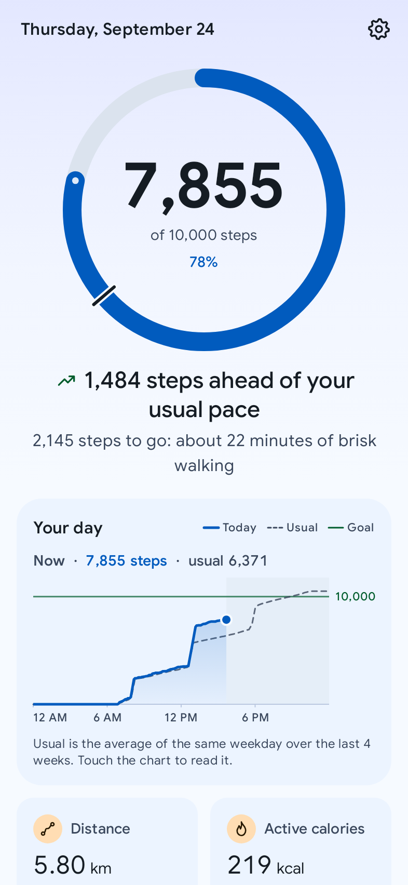</td>
    <td align="center">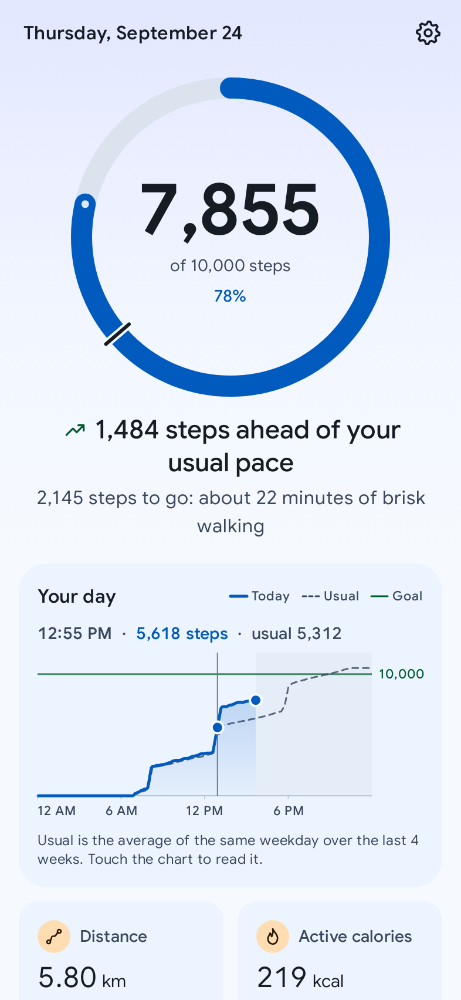</td>
    <td align="center">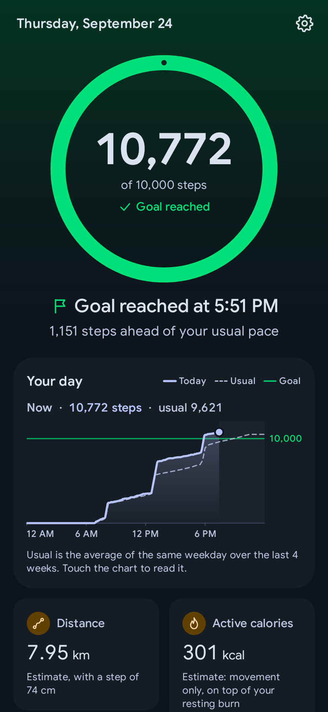</td>
  </tr>
  <tr>
    <td align="center"><b>Today.</b> The ring, with a notch where a usual Thursday stands by now, and one sentence on how the day is going.</td>
    <td align="center"><b>Your day.</b> Touch the chart to read it at any minute, against a usual day.</td>
    <td align="center"><b>Goal reached,</b> in the dark theme.</td>
  </tr>
  <tr>
    <td align="center">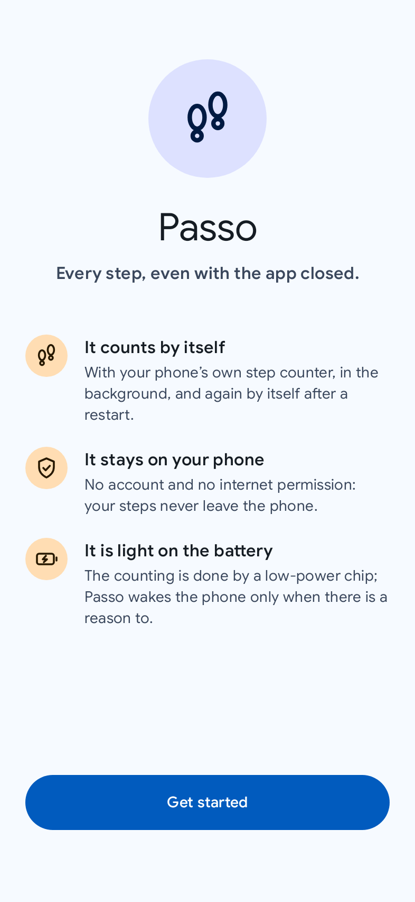</td>
    <td align="center">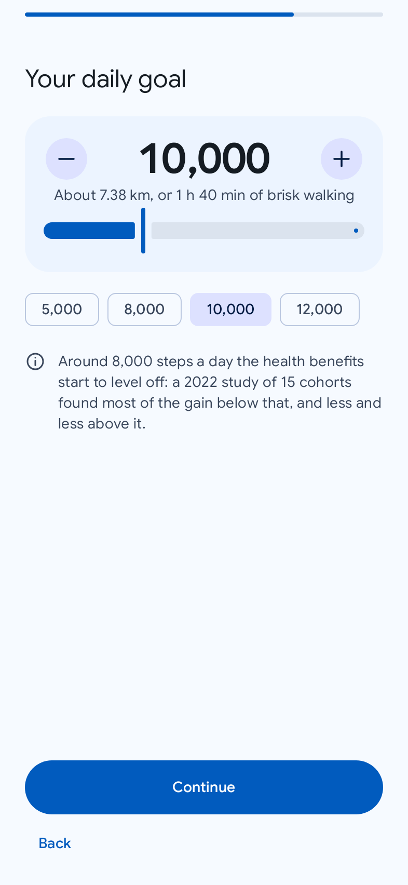</td>
    <td align="center">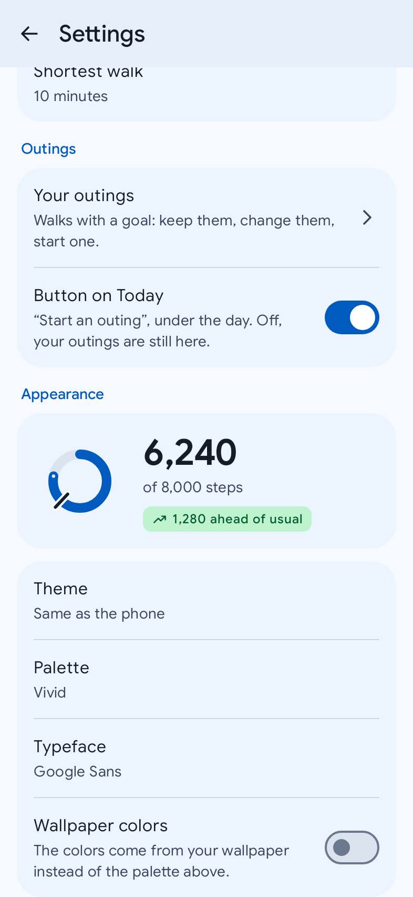</td>
  </tr>
  <tr>
    <td align="center"><b>First run.</b> Under a minute from install to counting.</td>
    <td align="center"><b>A goal</b> that says what it means in kilometres and minutes.</td>
    <td align="center"><b>Settings,</b> with the same palettes and typefaces as Chiaro.</td>
  </tr>
  <tr>
    <td align="center">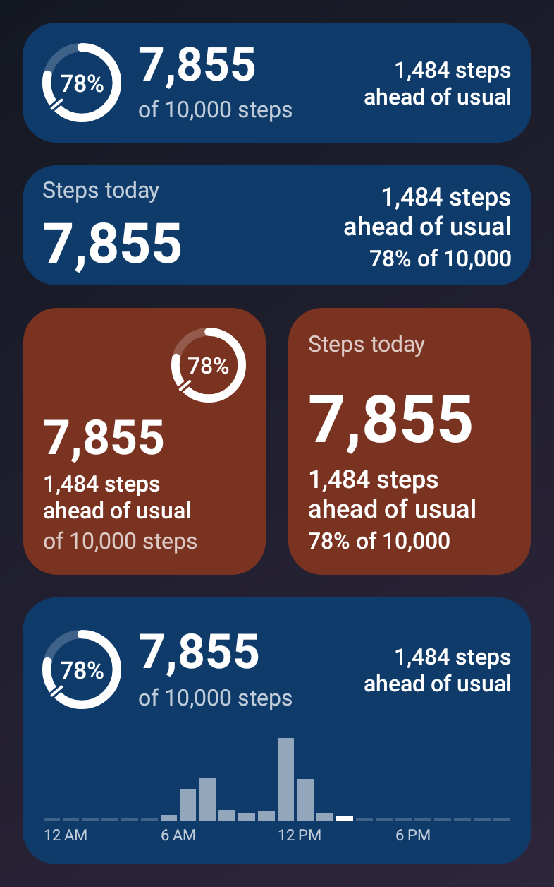</td>
    <td align="center">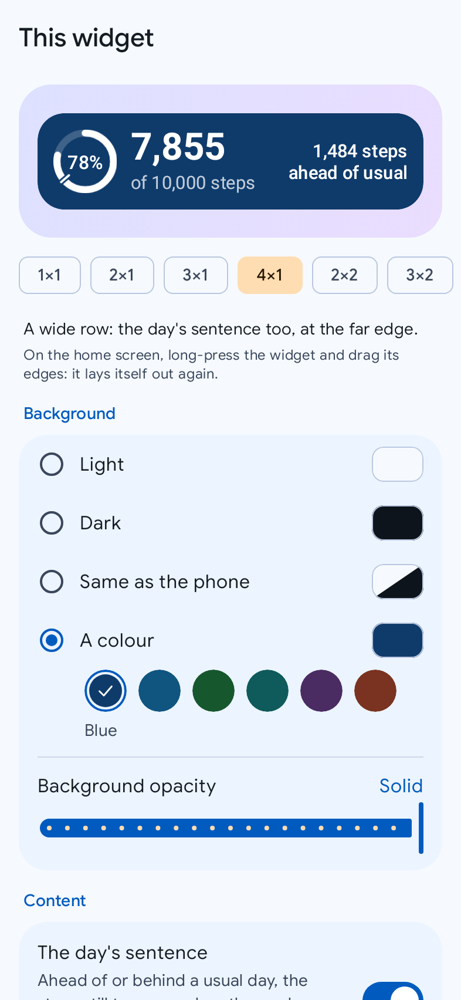</td>
    <td align="center">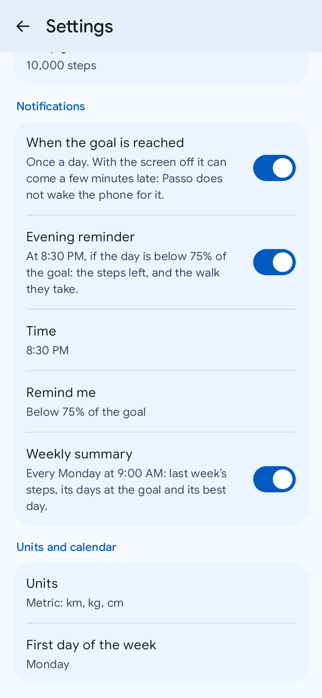</td>
  </tr>
  <tr>
    <td align="center"><b>Two widgets,</b> At a glance and In words, in the same dress as Chiaro's.</td>
    <td align="center"><b>Each widget its own look:</b> Chiaro's six colours, any opacity, what it shows.</td>
    <td align="center"><b>Notifications you choose:</b> goal reached, an evening reminder, a weekly summary.</td>
  </tr>
  <tr>
    <td align="center">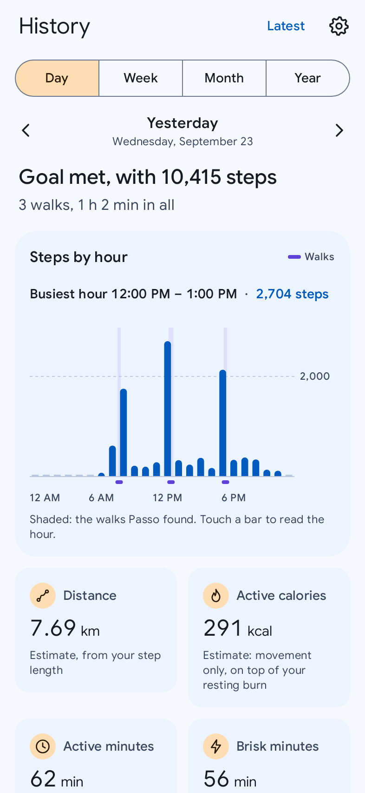</td>
    <td align="center">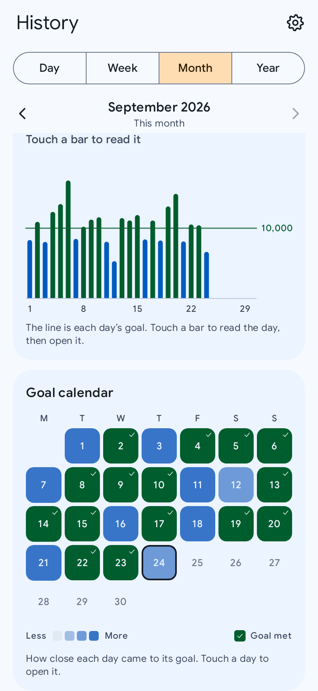</td>
    <td align="center">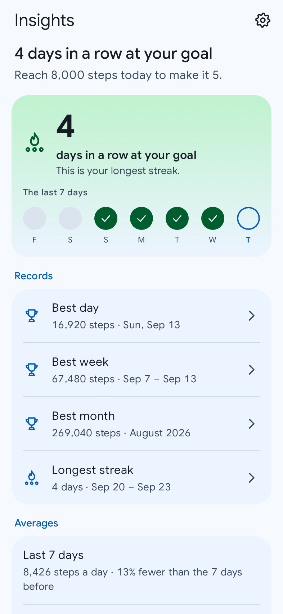</td>
  </tr>
  <tr>
    <td align="center"><b>A day in History,</b> hour by hour, with the walks Passo found on its own.</td>
    <td align="center"><b>A month,</b> against each day's goal, and the calendar of how close each day came.</td>
    <td align="center"><b>Insights:</b> the streak, the records (each opens its day, week or month) and the averages.</td>
  </tr>
  <tr>
    <td align="center">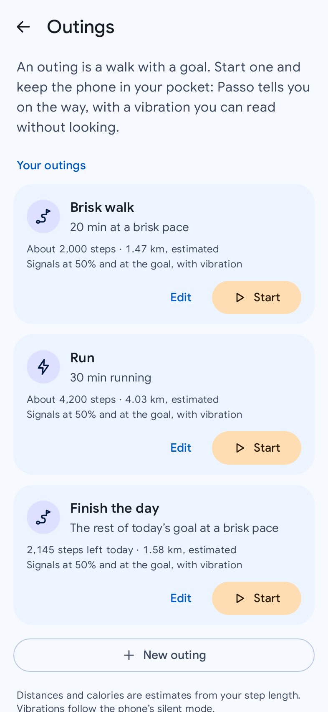</td>
    <td align="center">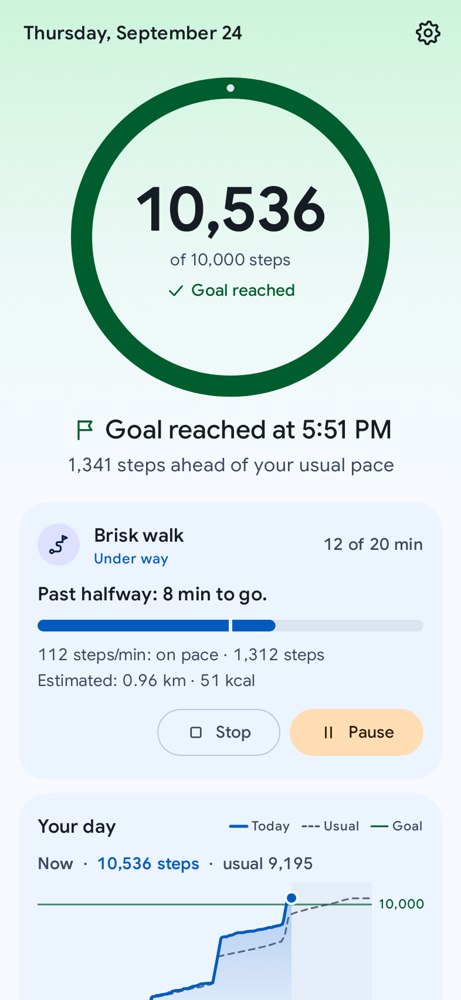</td>
    <td align="center">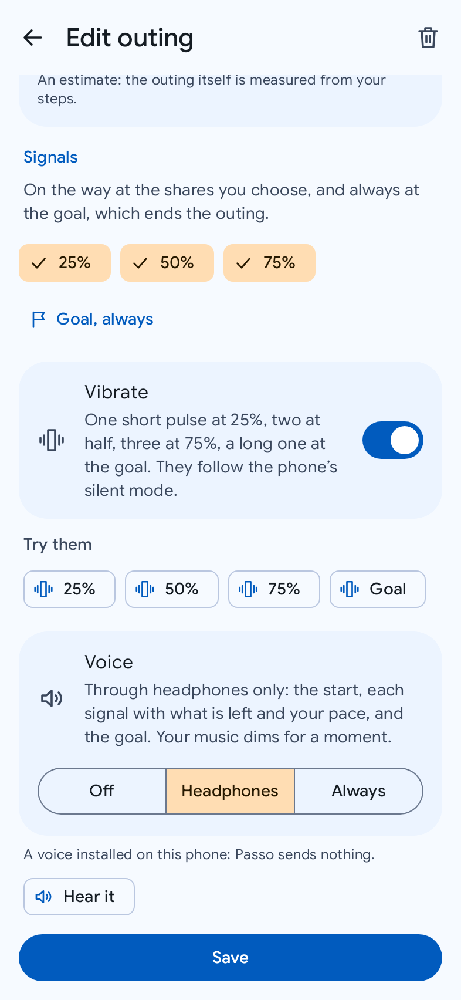</td>
  </tr>
  <tr>
    <td align="center"><b>Outings:</b> a walk with a goal, one touch from starting.</td>
    <td align="center"><b>Under way,</b> on Today and in the notification: where it stands, and your pace against its own.</td>
    <td align="center"><b>Signals you can feel or hear:</b> one, two, three short pulses, one long at the goal, and a voice in your headphones if you want it.</td>
  </tr>
  <tr>
    <td align="center">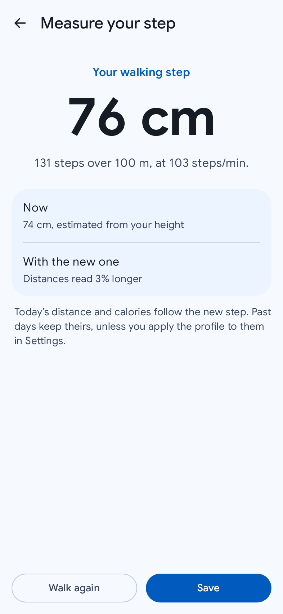</td>
    <td align="center">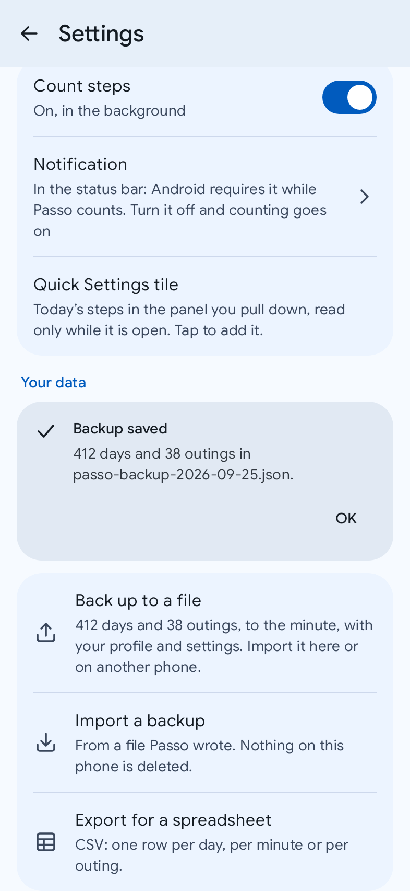</td>
    <td align="center">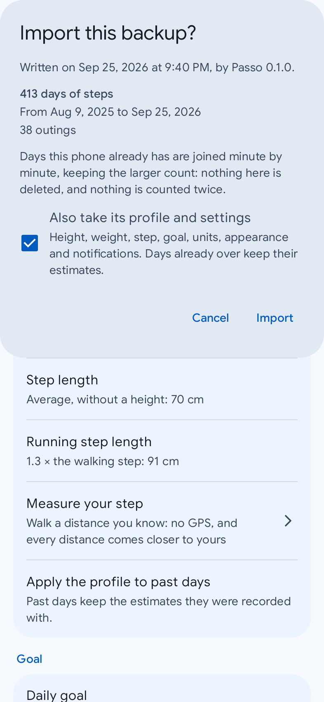</td>
  </tr>
  <tr>
    <td align="center"><b>Your step, measured:</b> walk a distance you know, no GPS, and see what it changes before you keep it.</td>
    <td align="center"><b>Your data, in a file you keep:</b> every minute, day and outing, or a table for a spreadsheet.</td>
    <td align="center"><b>An import shows what it holds first,</b> then joins it with what the phone has. Nothing is deleted.</td>
  </tr>
  <tr>
    <td align="center">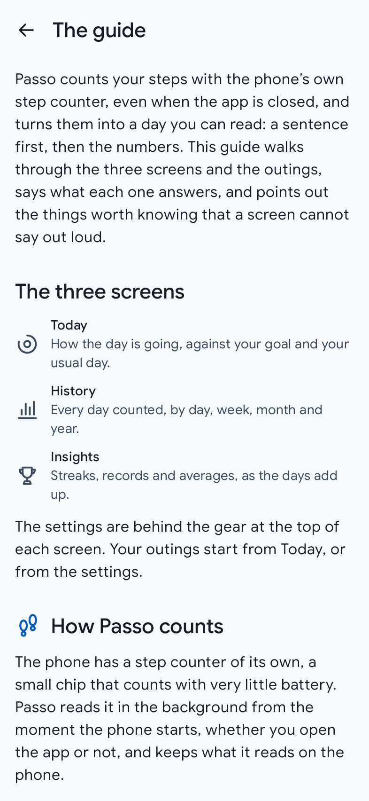</td>
  </tr>
  <tr>
    <td align="center"><b>The guide:</b> what each screen answers, and what a screen cannot say out loud.</td>
  </tr>
</table>

Drawn from the app's own screens with realistic sample days (the phone's status bar is not in
the picture). They are regenerated with `./gradlew test -PupdateScreenshots`.

## What Passo is

Most step counters are either a big health suite (accounts, cloud sync, sleep, food, heart
rate, a long list of permissions) or a thin front end that reads steps from another app and
breaks when that app changes. Passo does one thing. It counts steps with the phone's own
low-power hardware step counter, keeps the data on the device, and turns those steps into
useful numbers: distance, active calories, active and brisk minutes, goals, streaks, records,
and the walks you took, recognized on their own.

It keeps counting across reboots and full shutdowns without you ever opening it, and two
resizable home-screen widgets answer "how am I doing today?" at a glance.

## What it does now

- **Today**: steps and a progress ring toward your daily goal, with a notch where a usual day
  of the same weekday stands at this hour; one sentence on how the day is going and what is
  left to walk; a chart of the day you can read with a finger; distance, active calories,
  active and brisk minutes and average cadence, each with a line that says what it means. It
  counts live while it is open.
- **A short first run**: welcome, an optional profile, a goal, the one permission it needs,
  and a battery tip on the phones whose battery manager stops background apps.
- **History**: a day, a week, a month or a year at a time, swiped or stepped through from
  your first day. A day hour by hour, with its walks; weeks and months against each day's own
  goal, with how they compare with the one before; a year month by month; and a calendar of
  how close each day came to its goal. Touch a bar or a day to read it and open it.
- **Walks, found for you**: stretches of walking or running recognized in the steps already
  counted ("10:12 to 10:47, 3,420 steps, 2.6 km, 98 steps/min"), on Today and in History. No
  extra sensor, no background work, and a switch to turn them off.
- **Outings**: a walk or a run with a goal, started on purpose. One goal (steps, a distance,
  minutes in motion, or the rest of today's goal) and, if you want, a pace to keep (brisk,
  vigorous, running). On the way the phone vibrates at the shares you choose, in a count you
  can read in a pocket, and once, long, at the goal; if you want, a voice in your headphones
  says what is left and how your pace is going (a voice installed on the phone: Passo still
  sends nothing). The counting notification follows it, with Pause and Stop. Start one from
  Today, from the app icon's long press or from the evening
  reminder (never walk with a goal? Settings takes the button off Today); the widgets and the tile show it while it lasts, and the day's walks keep it
  afterwards with how much of its goal was done.
- **Insights**: the streak of days at your goal, your best day, week and month, averages over
  the last 7 and 30 days, and what it all adds up to since the first day.
- **Measure your step**: walk a distance you know (a running track, a football pitch) with
  the phone in your pocket, and Passo works out your walking or running step from the steps
  it counted. No GPS. It says what the new step changes before you keep it.
- **Your data, in files you keep**: a backup of everything (every minute, every day as it was
  recorded, your outings, profile and settings) to one file, or a table of days, minutes or
  outings for a spreadsheet. A backup imported here or on a new phone is shown first, then
  joined with what the phone already has: nothing is deleted, nothing is counted twice. You
  pick where the file goes, so Passo needs no storage permission.
- **Settings**: height, weight and step length, the goal, the notifications, metric or
  imperial units, the first day of the week, walks, outings, theme, palette and typeface,
  language, and a pause.
- **A guide**, as in Chiaro: the three screens and the outings, what each one answers, and
  the things a screen cannot say out loud (why the count can jump when you look at it, why a
  new goal leaves past days alone), shown with the app's own ring and charts. At the top of
  Settings, and on the first day.
- **Two home-screen widgets**, dressed like Chiaro's so the two apps sit side by side:
  **At a glance** (today's ring, the count, the day's sentence and, on a wide tall card, the
  day hour by hour) and **In words** (the same day in type alone: the count large, the
  sentence, the goal, distance and calories, and on a tall card the day in figures). Both go
  from one cell to as large as your launcher allows and lay themselves out for every size.
  Each one can be light, dark, follow the phone or wear one of six colours, at any opacity. A
  paused count says so, and a tap resumes it.
- **Notifications, each one if you want it**: the goal reached (once a day, with the streak it
  extends), an evening reminder at the time you pick when the day is behind (with the steps
  left and the walk they take), and a summary of the week that ended. The counting
  notification shows the day when you expand it.
- **A Quick Settings tile** with today's steps and the share of the goal, read only while the
  panel is open. Settings adds it with one tap.

## What is coming (v1.0)

- **Polish**: an accessibility pass, layouts for tablets and foldables, and a faster start.

Distance and calories are **estimates**, and Passo says so. The formulas are documented and
you can tune them: height, weight, your own step length, measured with a short calibration
walk.

## Private by design

- **No `INTERNET` permission.** Passo cannot send anything anywhere. The build fails if a
  network, location, exact-alarm or body-sensor permission ever appears in the app, from any
  library.
- **Your files are yours.** An export goes where you pick in Android's file picker, and an
  import reads only the file you open there: Passo asks for no storage permission.
- **Android's backup, decided.** If you turned on your phone's backup, Android (not Passo)
  keeps a copy of your step history, profile and settings in your Google account, encrypted
  with your screen lock, and moves them to a new phone. Nothing else is in it, and on the new
  phone counting starts cleanly, without adding that phone's earlier steps.
- **No account, no analytics, no ads, no crash reporters.**
- **No other health app needed.** No Health Connect, Google Fit or Samsung Health, no Google
  Play services: the phone's step counter is the only source.

## Easy on the battery

The step counter runs on a low-power chip that collects steps while the phone sleeps and hands
them over in batches. Passo keeps a small foreground service alive (Android requires it to
receive sensor data and to save the count before a shutdown), but it does not wake the phone
on a timer, and it updates the widgets and the notification only while the screen is on: the
widgets are told when something changed, at most once a minute, and never poll. The goal
notifications add at most one wake a day (the evening reminder, if you turn it on); the goal
reached rides on the steps Passo already receives, and the weekly summary waits for the phone
to be awake. During an outing, and only then, the step counter may wake the phone briefly
(about twice a minute while you walk, never while you stand still) so its signals arrive on
time. The target is at most about 1% of a day's battery.

## Building

Requirements: JDK 21 (the one bundled with Android Studio works) and the Android SDK.

```sh
./gradlew :app:assembleDebug        # debug APK in app/build/outputs/apk/debug/
./gradlew test                      # unit tests, every module
./gradlew :app:lintDebug            # lint, every module
./gradlew spotlessApply             # format the code
./gradlew :app:checkForbiddenPermissions
```

The architecture, the tracking engine and the phased plan are in [PLANNING.md](./PLANNING.md);
the product is described in [VISION.md](./VISION.md).

## Installing and verifying

Passo will be published as signed APKs on
[GitHub Releases](https://github.com/fiorenzobrioni/passo/releases), each with its SHA-256
checksum. The app has no network access, so it cannot check for updates itself: use GitHub's
"Watch, Custom, Releases" notifications, or [Obtainium](https://github.com/ImranR98/Obtainium).

Until the final signing key exists, releases are signed with a **temporary key** and marked as
pre-releases. A release signed with the final key will not install over one of them: uninstall
first. The signing certificate's SHA-256 fingerprint will be published here with the first
real release.

## The family

Passo is one of a small set of focused, single-purpose apps with the same look and the same
rules: [Chiaro](https://github.com/fiorenzobrioni/chiaro) (weather) and Saldo (personal finance).

## License

[GPL-3.0](./LICENSE) © 2026 Fiorenzo Brioni
